# C# Basics

In the previous chapter, we have approached solutions to problems
from a top-down fashion. Our emphasis was on conceptual
understanding of the problem, gathering requirements, performing
preliminary Object-Oriented Analysis and Design (OOAD), and
expressing OOAD artifacts in UML.

In order to realize a solution, the classes in the class diagram
need to be implemented using an object-oriented programming
language. A major objective for this chapter is to introduce a
subset of basic elements of the C\# programming language. We also
explain how to deal with runtime error conditions. Therefore,
objectives for this chapter are to:

- Introduce the concepts of syntax and semantics of
  programming languages.

- Introduce BNF (Backus-Naur Form) and Extended BNF (EBNF)
  notation to precisely specify grammars which govern the syntax of
  programming languages.

- Introduce .NET types and variables.

- Illustrate the distinction between value and reference
  types.

- Illustrate the basics of writing and compiling a few simple
  C\# programs.

- Explain ways of documenting C\# programs.

- Discuss operators, precedence, and associativity, and
  expression evaluation.

- Illustrate *exception handling* --- techniques for
  dealing with error conditions which are generated during program
  runtime.


## Syntax and Semantics {#SyntaxSemantics}
Consider the English language. There is a grammar associated with
it. Given a sentence in the language, the rules of the grammar are
used to check its *syntactic* correctness. In other words,
the rules of the grammar specify how the various syntactic
constructs of the language --- parts of speech --- can be combined
to form syntactically valid sentences or strings. *Semantics*
refers to the meaning of sentences in the language. It is possible
that a sentence is syntactically correct but semantically
meaningless. For example, *The lush green forest is replete
with colorless green trees* is a syntactically correct but
semantically meaningless sentence.

Like the English language, syntax and semantics are associated
with programming languages. The *syntax* of a programming
language specifies how to construct syntactically correct
programs. In other words, the syntax specifies the structure of
strings in the language. At the highest level, a computer program
is just one syntactic unit, which may be comprised of other
syntactic units. Unlike English, grammars associated with
programming languages are concise, precise, and formal. They need
to be *concise* so that the grammar can be succinctly
described and easily understood; *precise* so that there is
no ambiguity in their specification; and *formal* so that
they are amenable for checking the syntactic correctness of
programs by a compiler. BNF or EBNF are used to describe grammars
of programming languages.

Semantics of a programming language describe the meaning of its
syntactic units or strings. There are two types of semantics:
denotational and operational. *Denotational semantics* is a
technique for describing the meaning of computer programs in terms
of mathematical functions by treating the programs and its
syntactic units as functions. The properties of functions are
proved by using the mathematical theory of functions, and
especially domain theory. In contrast, *operational
semantics* employs a set of rules which specify how the state of a
computer changes while executing a program or a syntactic unit.
The state of a computer is modelled by a number of components ---
stack, heap, various CPU registers. Each rule specifies certain
*pre-conditions* on the contents of some components and their
new contents (i.e., *post-conditions*) after the application
of the rule.


```{r EBNF, echo = FALSE, warning = FALSE, results = 'asis'}

options(knitr.table.format = "html") 

library(knitr)
library(kableExtra)

# column 1 vector
Input <- c("digital :=", "letter :=", "identifier :=")

# column 2 vector
Notation <- c(" 0 | 1 | ... | 9", "_ | a | b | c | ... | z | A | B | ... | Z","letter {letter | digit} | @ {letter | digit}")


# create data frame
EBNF <- data.frame(Input, Notation,stringsAsFactors = FALSE)

library(knitr)


 kable(EBNF, caption = "EBNF notation for C# identifiers") %>%
   kable_styling(bootstrap_options = c("striped", "hover"))

```

## BNF and EBNF {#EBNF}
BNF (Backus-Naur Form) is a syntactic meta-language (i.e., a
language about a language). The meta-language is a formal notation
for specifying the grammar that describes the syntax of a
programming language. BNF was originally developed by John Backus
and subsequent contribution from Peter Naur to describe the syntax
of Algol 60 programming language. A few enhancements have been
made to BNF resulting in Enhanced BNF (EBNF). EBNF is more
succinct than BNF. However, BNF and EBNF are equivalent in terms
of their expressiveness.

EBNF employs a number of rules for describing the language. Each
rule names a syntactic unit of the language and describes possible
forms for a syntactic unit. EBNF also specifies which sequence of
symbols is valid in the language. Syntactic units are also
referred to as *symbols* of the language. There are two
types of symbols: terminal and non-terminal. A
*non-terminal* symbol is described in terms of other
non-terminal (including itself) and terminal symbols. A
*terminal symbol* is an atomic value which cannot be
further decomposed into smaller components of the language.


An *identifier* is a name that is used to
uniquely identify syntactic units of a program --- variables (or
fields), keywords, methods, method parameters, among others.
Consider C\# rule for an identifier: it must begin with a letter,
@ character, or underscore followed by one or more letters or
digits. Table \@ref(tab:EBNF) shows how this rule is expressed in
EBNF.

Each row in the table defines a production rule for a non-terminal
symbol: **digit**, **letter**, and **identifier**.
The non-terminal **letter** is defined in terms of 53
terminal symbols: **\_**, **a**, **b**, **c**,
$\cdots$, **z**, **A**, **B**, **C**,
$\cdots$, **Z**. The three center dots $(\cdots)$ is a
notation to represent the intermediate values of the sequence. The
meta-symbol, :=, should be read as ``is defined as``. In other
words, the *letter** can be replaced by an underscore, or by
any one of lower or upper case alphabet. Terminal symbols are
typeset in **bold face**. Sometimes, the terminal symbols are
represented within quotes (e.g., ``a``) to facilitate representing
EBNF without dependence on text formatting such as **bold**
and *emphasized*. We use **bold face** to denote
terminal symbols.

The last row defines *identifier* as: either a *letter*
followed by zero or more occurrences of letters or digits, or @
followed by one or more occurrences of letters or digits. The
meta-symbol pair \{ and \} indicate zero or more occurrences of a
letter or digit. The choice between a letter or digit is indicated
by the meta-symbol $\vert$. The rule says that an identifier
cannot begin with a digit; just an underscore (i.e., \_) by itself
is a valid identifier; if the identifier starts with @, then it
must be followed by one or more occurrences of letters or digits.

According to this EBNF, though a variable name can legally begin
with @ character such practice is discouraged. This provision is
provided in C\# for interfacing with programs written in other
programming languages. Identifiers beginning with @ character are
known as *verbatim identifiers*.

You should convince yourself the conciseness, preciseness, and the
formality offered by the EBNF. In fact, the power of EBNF will
become more vivid as we embark upon describing more interesting
syntactical units. Table \@ref(tab:EBNFMeta) lists the meaning of
various meta-symbols that EBNF uses.

In summary, EBNF is used to describe the syntax of a programming
language. *Parser* is a primary component of the compiler
which checks for syntactic correctness of computer programs. There
are tools such as YACC (Yet Another Compiler Compiler) that, given
the grammar of a programming language in EBNF notation, can
automatically generate the code for the Parser.

```{r EBNFMeta, echo = FALSE, warning = FALSE, results = 'asis'}

options(knitr.table.format = "html") 

library(knitr)
library(kableExtra)

# column 1 vector
MetaSymbol <- c(":=", "|", "[]","{}","{}+","()","?")

# column 2 vector
Description <- c("is defined as","Choice","Optional","Repetion,zero or more times","Repetion, one or more times","Group items together, in mathematical sense","The symbol (or group of symbols in parentheses) to the left of
? is optional (i.e., can appear 0 or 1 time)")


# create data frame
EBNFMeta <- data.frame(MetaSymbol, Description, stringsAsFactors = FALSE)

library(knitr)


 kable(EBNFMeta, caption = "EBNF meta-symbols") %>%
   kable_styling(bootstrap_options = c("striped", "hover"))

```

## Variable and the .NET Types
In the simplest sense, variables are used to store values in
computer memory. A *variable* is an alias or a symbolic name
for the numeric address of one or more memory locations.
Figure \@ref(fig:ValRefTypes)(a) shows several variables, their
values, and numeric addresses of memory locations at which the
values are stored. For example, the variable named *actID*
references memory location 105 and the memory content at this
location is 12345 (an integer value). In other words, *actID*
is an alias for memory numeric address 105. When a computer
program instruction references actID, it is referencing the value
12345 at memory location 105. It is more convenient to refer to
memory locations by their symbolic names rather than by their
numeric addresses.

```{r ValRefTypes, echo = FALSE, out.width = "70%", fig.align='center',fig.cap="Value and referene types"}
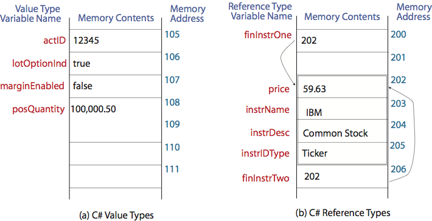
```

Variables are used for representing: inputs given to a program,
intermediate results of a computation, and results produced by the
program. These inputs and results can be of different types:
string, integer, boolean, class, among others. Therefore,
specifying the type associated with a variable is an integral part
of *declaring* the variable. In other words, variables are
*typed*. As discussed in Section \@ref(ValRefTypes),
*type* is a generic term in the .NET Framework  to
collectively refer to signed integral types (e.g., integers, long
integers), unsigned integral types (e.g., unsigned integer,
unsigned long integer), floating point types, characters, strings,
arrays, enumerations, structures, classes, interfaces, and
delegates.

The .NET Framework is discussed in Chapter \@ref(DotNet).
Chapter \@ref(DataRep) discusses how characters, signed and
unsigned integral types, and floating point types are represented
in computer memory. Enumerations and structures are discussed in
Sections \@ref(PreIntroEnums) and \@ref(Structures),
respectively. Section \@ref(PreIntroArrays) provides a
preliminary introduction to arrays and Chapter \@ref(Arrays)
discusses the same in greater detail. A preliminary introduction
to classes is presented in Sections \@ref(HelloWorldProg),
\@ref(SecProg), and \@ref(CalculatorProg); classes are
discussed in detail in Chapters \@ref(Classes1)
and \@ref(Classes2). Chapter \@ref(Interfaces) illustrates
interfaces and Section \@ref(Delegates) explains delegates.

### Value and Reference Type {#ValRefTypes}
The .NET types are grouped into two broad categories: *value
types* and *reference types* as shown in
Figure \@ref(fig:TypeTree). Corresponding to these two types are
value type and reference type variables. Value types are simple
types and have their own copies of data. In other words, value
types don't share their data with each other. Therefore, it is not
possible for operations on one value type to affect the value of
another value type. For example, *actID* value in
Figure \@ref(fig:ValRefTypes)(a) is not shared with any other
variable. This is the core property of a value type. Assigning a
new value to *actID* replaces the current value with the new
value.

In case of the pre-defined value types (char, bool, decimal,
integral, and floating point types in Figure \@ref(fig:TypeTree),
the type is traditionally referred to as *data type*. Data
type of a variable specifies three things: the type of data the
variable can hold (e.g., integer, float); the range of values that
the variable can hold; and the types of operations in which the
variable can be used as an operand. For example,
*concatenation* and *substring* operations are
meaningful only on string variables whereas, arithmetic operations
such as addition and multiplication are appropriate on integer and
floating point variables. In other words, typing of variables
helps to prevent meaningless operations such as adding a string
value to an integer value.

```{r TypeTree, echo = FALSE, out.height="50%", out.width = "55%", fig.align='center',fig.cap="The .NET Types"}
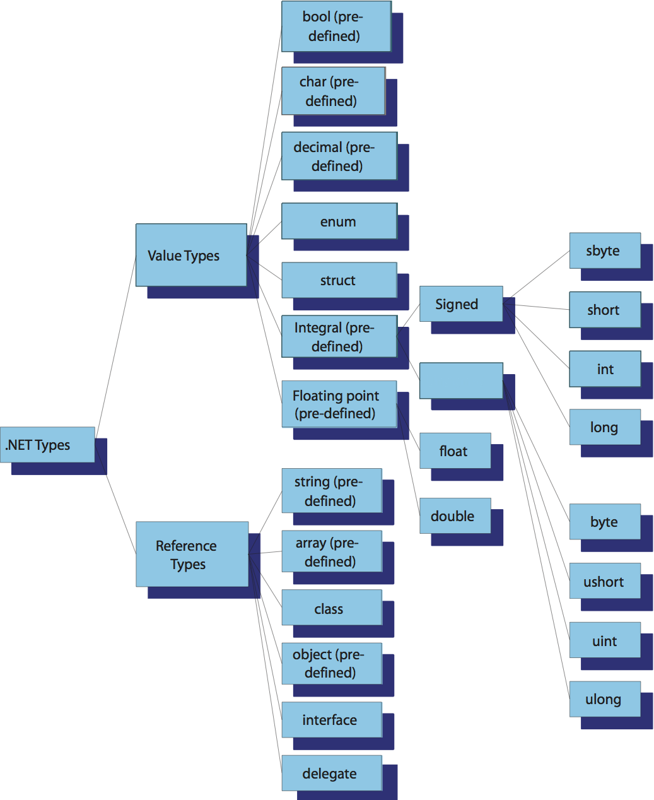
```

A reference type variable, rather than storing the information in
itself, stores the memory location (or address) of that
information. In other words, it stores a reference to the
information. In contrast with the value types, reference types are
more complex in terms of their memory layout and other aspects as
discussed in Section \@ref(ValRefTypProg). Consider
Figure \@ref(fig:ValRefTypes)(b). The reference type finInstrOne
points to memory location 200. What is stored at this location
(i.e., 202) is not the value of the reference type, but the
address of the memory location where the value can be found. The
interpretation of this value is dependent on the reference type.
For example, for reference variables of type class, the value is a
block of memory locations. In the case of finInstrOne, the value
comprises four other types: price, instrName, instrDesc, and
instrIDType. Note that there is a level of indirection associated
with the reference types. It takes longer to access the
information stored by reference types --- the first memory access
provides the address where the information can be found, and the
second memory access retrieves the information.

Reference types enable sharing the same copy of information across
multiple variables. In Figure \@ref(fig:ValRefTypes)(b),
finInstrOne and finInstrTwo share the same copy of the
information. Especially this is very significant if the
information to be shared is large. However, operations on
reference type variable can alter the values of another reference
type variable. For example, changes to *price* value via
finInstrOne entail changing the *price* value of finInstrTwo.

Reference types facilitate storing information whose memory
requirements are not known *a priori*. Also, reference types
enable data to be moved around in memory (for right reasons)
without affecting the consumers of the data. Assume that the
information in memory block comprising of the addresses 202 -- 205
has been moved to new locations 900 -- 904. This movement is made
transparent by storing the value 900 at memory locations 200 and
206. The Circle\_b.cs program in Section \@ref(ValRefTypProg)
demonstrates the differences in the behavior of value and
reference types.

A real-world analogy to reference types is depicted by the
following scenario. Assume that you change your address quite
frequently. It is painstaking to inform all your business and
personal acquaintances of your frequent moves. Your strategy then
is to ask your acquaintances to always contact your parents to get
your contact information every time they need to reach you. Each
time you make a move you only need to inform your parents. Of
course, the assumption is that your parents' contact information
doesn't change.


We focus on the value types for now. Various value types require
different amounts of memory. In Figure \@ref(fig:ValRefTypes)(a),
the floating point value type *posQuantity* requires two
memory locations whereas, all other types require only one memory
location ^[How many bits comprise one memory location is
not relevant for this discussion.].

Once a variable is declared as a certain type, the C\# compiler
automatically tags the variable's inappropriate usage (e.g.,
dividing an integer variable by a string variable) in the program
at the time of compilation. C\# requires all variables to be
explicitly declared in the program before their usage. Such
languages are referred to as *strongly-typed* in contrast
with *weakly-typed*, wherein the compiler makes implicit
assumptions about the data types of the variables that are used
but not declared. Explicitly declaring variables contributes to
developing safe and correct programs.

From a compiler stand point, value types are allocated on the
*stack memory*, whereas reference types are allocated on the
*heap memory* ^[Technically, for reference types used
as method parameters, storage is allocated both on the stack and
heap. The storage allocated on the stack stores a pointer to the
corresponding storage on the heap.].


### Variable Naming Convention
In C\#, variable names can be of maximum length 256. However, it
is unusual to have such long variable names. Variable names should
be chosen such that they are self-describing. In other words, the
variable name should suggest the intended purpose of the variable.
For example, the name statePopulation for a variable suggests that
it is used to store the population of a state.

Though a variable name can legally begin with an underscore (see
Table \@ref(tab:EBNFVarDecl)), but we discourage such names as they
are often used in system software. Variable names in C\# are
*case sensitive*. For example, statePopulation,
StatePopulation, and statepopulation are three distinct variable
names. *Keywords* are special identifiers or *reserved words*
 that have special meaning in C\#. As such we cannot use
them as variables. C\# keywords are shown in
Table \@ref(tab:CSKey).

Variable names can be all lower case, all upper case, or a
combination of both. Which style is desirable is a matter of
personal preference. However, it is a good programming practice to
be consistent throughout. All upper case names are often used for
constants. Consider the variable name statePopulation. Other
syntactically correct forms include state\_population,
StatePopulation, and statepopulation. The naming of
StatePopulation follows *Pascal* notation, where the first
letter of every word in the variable is an upper case. The naming
of statePopulation follows *Camel* notation, which is similar
to Pascal notation except that the first letter of the first word
is a lower case. *Hungarian* notation is another variation on
Pascal notation, in which the variable name is prefixed with a
string that indicates its data type. For example, the naming of
intStatePopulation follows the Hungarian notation; *int*
indicates that StatePopulation is an integer variable.

Table \@ref(tab:ValidInvalidVarNames) shows examples of variable
names expressed in Camel, Pascal, and Hungarian notation. The
table also depicts invalid variable names and reasons why they are
invalid. Consider the name anlHouseholdInc. This could have been
named as annualHouseholdIncome. Although the latter form is more
descriptive, it takes more time to type and doesn't necessarily
contribute to program readability. On the other hand, a more
succinct form such as anlHshldInc may rather be considered as
cryptic. Irrespective of which style is chosen, consistency is the
key. In real projects involving several programmers, variable
naming conventions and other standards are established *a priori 
and are strictly adhered to.


```{r CSKey, echo = FALSE, warning = FALSE, results = 'asis'}

options(knitr.table.format = "html") 

library(knitr)
library(kableExtra)

# column 1 vector
First <- c("abstract", "char", "do","finally","in","new","protected","sizeof","true","using")

# column 2 vector
Second <- c("as","checked","double","fixed","int","null","public","stackalloc","try","virtual")

# column 3 vector
Third <- c("base", "class", "else","float","interface","object","readonly","static","typeof","void")

# column 4 vector
Fourth <- c("bool", "const", "enum","for","internal","operator","ref","string","unit","volatile")

# column 5 vector
Fifth <- c("break", "continue", "event","foreach","is","out","return","struct","ulong","while")

# column 6 vector
Sixth <- c("byte", "decimal", "explicit","goto","lock","override","sbyte","switch","unchecked","-")

# column 7 vector
Seventh <- c("case", "default", "extern","if","long","params","sealed","this","unsafe","-")

# column 8 vector
Eighth <- c("catch", "delegate", "false","implicit","namespace","private","short","throw","unshort","-")

# create data frame
Cskey <- data.frame(First, Second, Third, Fourth, Fifth, Sixth, Seventh, Eighth , stringsAsFactors = FALSE)

library(knitr)


 kable(Cskey, caption = " C# keywords") %>%
   kable_styling(bootstrap_options = c("striped", "hover"))

```


```{r ValidInvalidVarNames, echo = FALSE, warning = FALSE, results = 'asis'}

options(knitr.table.format = "html") 

library(knitr)
library(kableExtra)

# column 1 vector
Camel <- c("customerName", "numOfChildren", "prefCustomer","anlHouseholdInc","cmn_Rate","dateOfBirth%")

# column 2 vector
Pascal <- c("CustomerName","NumofChildren","PrefCustomer","AnlHouseholdInc","Cmn_Rate","DateOfBirth%")

# column 3 vector
Hungarian <- c("strCustomerName", "intNumOfChildren", "boolPrefCustomer","fltAnlHouseholdInc","fltCmn_Rate","strDateOfBirth%")

# column 4 vector
Remarks <- c("Customer Name, string type", "Number of children, string type", "Preferred customer, bool type","Annual household income, float type","Commission rate, float type, Use of under-score is discouraged for readability reasons","DateOfBirth, string type. Invalid variable name. is not allowed in variable names")

# create data frame
Cskey <- data.frame(Camel, Pascal, Hungarian, Remarks ,stringsAsFactors = FALSE)

library(knitr)


 kable(Cskey, caption = " Valid and invalid variable names") %>%
   kable_styling(bootstrap_options = c("striped", "hover"))

```


### The .NET Types {#DNTypes}
Table \@ref(tab:CSDataTyp) shows various C\# data types (first
column), corresponding .NET System data types (second column), the
range of values that the data type can hold (third column), and a
description of the data type (last column). Note that the
description indicates, where appropriate, the amount of storage
required to store data type value. C\# data types are simply
aliases for .NET System data types. Significance of .NET System
data types is discussed in Chapter \@ref(DotNet).

All the data types shown except object are referred to as
*intrinsic data types*, meaning that the .NET Framework knows
how to construct these data types in memory and to perform
relevant operations on them. In contrast, for reference data types
(e.g., object) we need to programmatically specify their
construction and operations.

Signed integer data types are used to store both positive and
negative integers whereas, unsigned integer data types are used to
store only positive integer values. For storing monetary values,
decimal data type is recommended since its provides 28-digit
precision. How integers, floating-point numbers, and characters
are represented in memory is discussed in
Chapter \@ref(DataRep).

An assortment of pre-defined value types is provided so that the
correct one can be employed to suit the purpose. For example, if
the purpose of a variable is to keep count of number of positions
in a portfolio, any of the following types will suffice:
*sbyte*, *byte*, *short*, *ushort*,
*int*, *uint*, *long*, *ulong*. If we know
that the number of positions can never be a negative value, we
eliminate sbyte, short, int, and long right away since they should
be used in situation requiring storing both positive and negative
integer values. Furthermore, if we also know that the number of
positions in any portfolio is at most 100, then *byte* is the
right type.

Choosing the right pre-defined value type is important for three
reasons: safety and error checking, program efficiency, and memory
requirements. Suppose that a variable is declared as ushort and a
signed value is assigned to the variable during program runtime.
The C\# runtime system will generate an exception (or error
condition) for this situation, which can be handled in the program
by writing appropriate code (known as exception handling code).
This contributes to program safety via error checking. Although it
is possible to use a floating point type (e.g., float, double) in
situations where an integer data type will do (e.g., sbyte, byte,
short, ushort, long, ulong), the latter is preferred since
floating point arithmetic is relatively more expensive (in terms
of CPU time). Furthermore, declaring a variable of type ulong when
ushort will suffice entails *inefficient execution* and
*inefficient memory utilization*. Arithmetic operations on
ulong values usually take longer than the same operations on
ushort values; thus, the program takes longer to run. As noted in
Table \@ref(tab:CSDataTyp), ushort requires 16 bits of memory while
ulong requires 64 bits of memory. Thus, it is important not only
to select the right data type (e.g., float vs. long) but also the
data type that conserves memory usage (e.g., ushort vs. ulong) by
consulting Table \@ref(tab:CSDataTyp). A word of caution is that if
the values assigned to a variable are outside the range of values
associated with the variable's data type, then you will encounter
*overflow* (i.e., the value assigned to the variable exceeds
the maximum value allowed) and *underflow* (i.e., the value
assigned to the variable is less than the minimum value allowed)
exceptions.

Declaring a variable consists of naming the variable and
associating with it a type. Optionally, a variable can be assigned
an initial value. This is referred to as *initializing the
variable*. It is always a good practice to initialize variables
before their use, preferably at the time of their declaration.
EBNF for declaring and initializing variables and constants is
shown in Table \@ref(tab:EBNFVarDecl). The first two rows enumerate
values for the non-terminals data type and accessMod (access
modifier). The third row shows declaring a variable without
initialization. The next row shows declaring and initializing a
variable. We have used the terminal *literal* without
defining it. Literal is any string whose value is compatible with
the variable type to which it is assigned. The fifth row shows how
more than one variable of the same type can be declared on the
same line. The last row shows declaration and initialization of a
constant. The *static* access modifier is associated with a
constant by default. Note that constants need to be initialized at
the time of their declaration. Access modifiers are discussed in
Chapter \@ref(Classes1).

*Constants* are special variables whose values are fixed over
their life time. Once a value has been assigned to a constant
during the initialization, it can never be changed. In contrast, a
variable can be reassigned values any number of times during its
lifetime. Table \@ref(tab:VarDeclEx) shows several examples of
variable and constant declarations including initialization.


```{r CSDataTyp, echo = FALSE, warning = FALSE, results = 'asis'}

options(knitr.table.format = "html") 

library(knitr)
library(kableExtra)

# column 1 vector
Type <- c("sbyte", "byte", "short","ushort","int","uint","long","ulong","char","float","double","bool","decimal","string","object")

# column 2 vector
System_Type <- c("System.SByte","System.Byte","System.Int16","System.UInt16","System.Int32","System.UIt32","System.Int64","System.UInt64","System.Char","System.Single","System.Double","System.Boolean","System.Decimal","System.String","System.Object")

# column 3 vector
Range <- c("-128 to 127", " 0 to 255", "-32,768 to 32,767","0 to 65,535"," -2,147,483,648 to 2,147,483,647","0 to 4,294,967,295","-9,223,372,036,854,775, 808 to
9,223,372,036,854,775, 807","0 to 18,446,744,073,709,551, 615","U + 0000 to U + ffff","1:5 x 10^-45 to 3:4 x 10^38"," 5.0 x 10^-324 to 1.7 x 10^308","true,false","10^0 to 10^-28","Limited by computer memory","Encompasses all types")

# column 4 vector
Description <- c("Signed 8-bit integer (not CLS
compliant)", "Unsigned 8-bit integer", "Signed 16-bit integer","Unsigned 16-bit integer (not CLS
compliant)","Signed 32-bit integer","Unsigned 32-bit integer (not CLS
compliant)","Signed 64-bit integer","Unsigned 64-bit integer (not CLS
compliant)","A Unicode (16-bit) character","Single-precision (32-bit) floatingpoint
number","Double-precision (64-bit) floatingpoint
number","A Boolean value","A 96-bit signed integer","A set of Unicode characters","The base class of all types in .NET
universe")

# create data frame
CSDataType <- data.frame(Type, System_Type, Range,stringsAsFactors = FALSE)

library(knitr)


 kable(CSDataType, caption = " C# and .NET data types ") %>%
   kable_styling(bootstrap_options = c("striped", "hover"))

```


```{r EBNFVarDecl, echo = FALSE, warning = FALSE, results = 'asis'}

options(knitr.table.format = "html") 

library(knitr)
library(kableExtra)

# column 1 vector
Type <- c("datatype :=", "accessMod :=", "varDecl :=","varDeclWithInit :=","multVarDecl :=","constDecl :=")

# column 2 vector
Value <- c("bool | byte | char | decimal | double | float | uinit | int | long | object | sbyte | short
| string | ulong | ushort","internal | private | protected | public","[accessMod] [static] data type varName;","[accessMod] [static] data type varName = literal;","[accessMod] [static] data type varName [,varName];","[accessMod] [static] const data type varName = literal;")


# create data frame
EBNFVarDecl <- data.frame(Type, Value, stringsAsFactors = FALSE)

library(knitr)


 kable(EBNFVarDecl, caption = "EBNF notation for variable and constant declarations") %>%
   kable_styling(bootstrap_options = c("striped", "hover"))

```


```{r VarDeclEx, echo = FALSE, warning = FALSE, results = 'asis'}

options(knitr.table.format = "html") 

library(knitr)
library(kableExtra)

# column 1 vector
Declaration_Example <- c("char gender = 'M';","byte numStudents = 35;","uint statePopulation = 4294967295;","string actName = 'Savitar Trust';","bool lotOptionInd = true;","ulong distanceToMoon = 18446440737095;","float grossRevenue = 12234987654.65;","int firstScore, secondScore;","const int maxGrossWeight = 97693492;","const string stdGreeting = 'Hi There';")

# column 2 vector
Explanation <- c("Declares gender as a variable of type char and initializes it
to the character M","Declares numStudents as a variable of type byte and initializes
it to 35","Declares statePopulation as a variable of type unsigned integer
and initializes it to 4294967295","Declares actName as a variable of type string and initializes
it to the string 'Savitar Trust'","Declares lotOptionInd as a variable of type boolean and initializes
it to the value true","Declares distanceToMoon as a variable of type unsigned
long and initializes it to 18446440737095","Declares grossRevenue as a variable of type float and initializes
it to 12234987654.65","Declares two variables (firstScore, secondScore) as variables
of type integer. Though legal, this practice of declaring two
variable in the same line is discouraged","Declares maxGrossWeight as an integer constant and initializes
it to 97693492","Declares stdGreeting as an string constant and initializes it
to 'Hi There'")


# create data frame
VarDeclEx <- data.frame(Declaration_Example, Explanation, stringsAsFactors = FALSE)

library(knitr)


 kable(VarDeclEx, caption = "Declaring variables and constants") %>%
   kable_styling(bootstrap_options = c("striped", "hover"))

```

## HelloWorld Program {#HelloWorldProg}
HelloWorld program shown in Listing \@ref(HelloWorldProg01)
just prints the string ``HelloWorld`` to the system console (i.e.,
computer screen). Type the source code shown in the second column
of the table verbatim using Windows Notepad or some other text
editor. The first column in the listing numbers program statements
for cross referencing in the ensuing discussion, and is *not*
part of the program. If you are using Notepad, its contents should
look as Follows:

```{r HelloWrldProg01, echo = FALSE, out.width = "55%", fig.align='center',fig.cap="HelloWorld.cs program with proper indentation"}
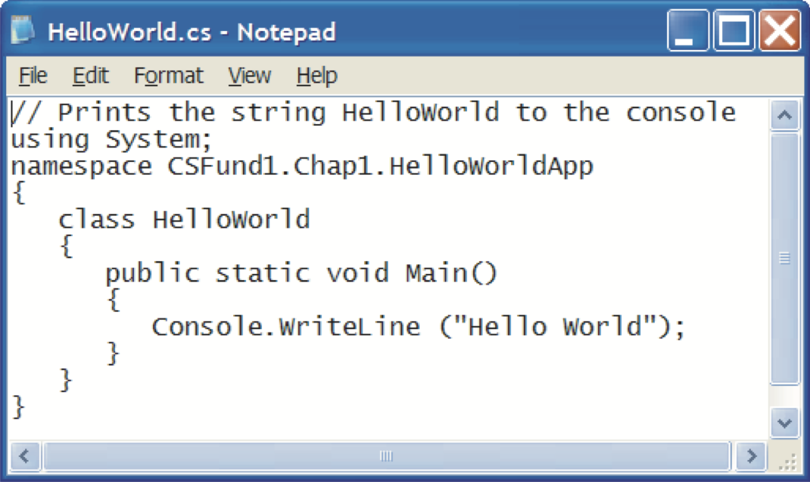
```

Use the tab key on your keyboard for indenting the statements.
Indentation is meant for program comprehension and has no effect
on the program correctness. From the C\# compiler's point of view,
programs shown in Figure \@ref(fig:HelloWrldProg01) and
Figure \@ref(fig:HelloWrldProg02) are equivalent.

```{r HelloWrldProg02, echo = FALSE, out.width = "55%", fig.align='center',fig.cap="HelloWorld.cs program without proper indentation"}
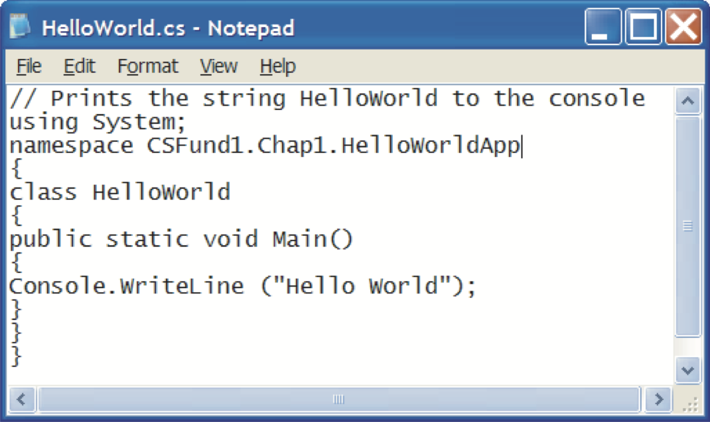
```

However, the style shown in Figure \@ref(fig:HelloWrldProg02) is
forbidden as it obscures program structure and makes program
comprehension difficult. Importance of this practice may not be
apparent in this small program, but will come through vividly in
typical real-world programs which run into thousands of lines
code, and in some cases even into millions of lines. Furthermore,
the code you develop will be subsequently maintained by other
software engineers. Therefore, when you write code, always be
aware that your code will be read, altered, and maintained by
others during its life time.

Save your file as HelloWorld.cs. The extension *cs* denotes
that it is a C\# source file. Note that C\# programs are case
sensitive and pay attention to the case of the alphabet when you
type the program.

### Dissection of the HelloWorld Program
Line 1 is one type of a comment. This type of comment in C\#
programs are preceded by //. Anything that comes after // is
ignored by the C\# compiler. We discuss comments in
Section \@ref(Comments). C\# keywords in the program are shown
in *italics* ^[This is done for illustration purpose
only. For the C\# compiler, the program is just a string of
characters without any formatting.]. *Namespace* is a
mechanism to resolve name conflicts. Think of how cities/towns are
named in the United States. In general, a city name is unique only
within the context of a state ^[However, there are
exceptions to this rule. There are three Marlboros in NJ.]. For
example, if we mention Jackson as a city name, there is ambiguity
about which Jackson we are referring to since the states
Mississippi, Tennessee, New Jersey, and Michigan all have cities
with the name Jackson. One way to resolve name ambiguity is to
specify the city name along with the state in which it is located.
Similar situation exists in naming classes.

In large projects, typically there are hundreds (or even
thousands) of classes, which are possibly developed by different
groups and some may even come from third party vendors. It is
possible that two groups might have selected the same name for two
different classes. In isolation this creates no problems. However,
when code from different groups is assembled, class name conflicts
create serious problems. One way to avoid this problem is through
the namespace concept. The code developed by each group (or even
each team member) is put into a separate namespace. Under this
scenario, class names need to be unique only within a namespace.
.NET namespaces are further discussed in
Section \@ref(DotNetNameSpaces).

Line 2 indicates that we are using a namespace called
*System*. The keyword *using* is called a *compiler directive*.
 It instructs the compiler to resolve any type name
conflicts using the System namespace. In the absence of a
*using* directive, one has to fully qualify the type in form
of *namespacename.typename*. Without the directive, we should
have written line 9 as: System.Console.WriteLine (``Hello World``);

System namespace defines various classes including *Console*,
which is used in Line 9. Note the semicolon (;) at the end of Line
2 to indicate the end of C\# program statement. For the reasons
discussed above, we like to keep whatever we develop in this
program under a separate name space called
*CSFund1.Chap1.HellowWorldApp*. Note that a period is allowed
in the namespace. Line 3 accomplishes this. The parenthesis pair
\{ (line 4) and \} (line 12) defines the scope of this namespace.
That is, everything enclosed between the lines 4 and 12 is in the
CSFund1.Chap1.HellowWorldApp namespace.

The text between the lines 5 and 11 defines a class named
*HelloWorld*. Line 5 defines the class name as
*HelloWorld*. A C\# class, in general, consists of the
following members: *fields*, *properties*,
*constants*, *methods*, *indexers*, *events*,
and *operators*. However, our HelloWorld class has only one
method named  *Main*. Recall that methods are the actual code
that implements the behavior of a class. The Main() method is
defined by the lines 7 through 10. Line 7 declares this method.
The keyword *public* is an access modifier, which indicates
that the method is accessible from any other class; *static*
specifies that the method is a static method (i.e., you don't need
to instantiate the class to invoke the method) ^[The
significance of static access modifier of a method will become
apparent to you after we discuss instantiating classes in
Section \@ref(ExcepHandling).]; *void* indicates that the
method doesn't return any value to the invoker of the method. The
parentheses, `(` and `)`, after the method name Main are used to
enclose placeholders (referred to as method parameters) that refer
to values passed to the method by the invoker of the method and
the values returned by the method to the invoker. In this case,
the method doesn't take any parameters. The method has no variable
declarations; if present, they need to be inserted between the
lines 6 and 7.

The parentheses in lines 8 and 10 delimit the method
implementation. The method has only one statement, which prints
the string ``Hello World`` to the console. For this purpose, we
make use of *Console* class defined in the *System*
namespace (line 2). Console class has a static method named
*WriteLine*, which takes a string as input and processes it
according to certain rules for display on console. In our context,
it simply displays the string enclosed in double quotes (i.e.,
Hello World) on console.

Indentation using tabs or spaces, and spaces between the keywords,
and between other syntactic units are referred to as *white space*.
All white space is removed by the C\# compiler before it
invokes the parser to validate the syntactic correctness of the
program.

```{r CommandWindow, echo = FALSE, out.width = "55%", fig.align='center',fig.cap="Executing *cmd* program to open a DOS Window"}
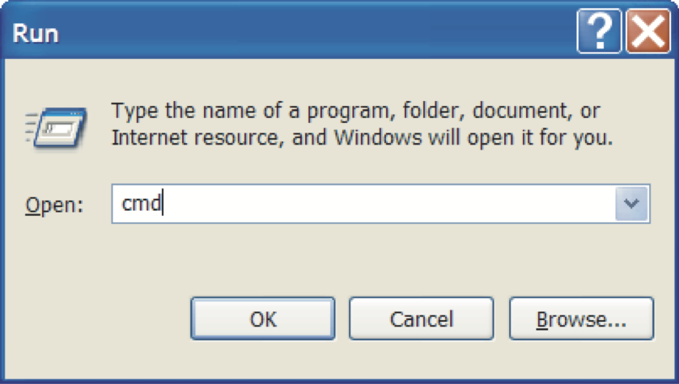
```

### Compiling the HelloWorld Program
It is assumed that your computer is using Windows XP operating
system and the .NET SDK (Software Development Kit) is installed in
C:\verb+\+WINDOWS\verb+\+Microsoft.NET\verb+\+Framework\verb+\+v1.1.4322
directory. Note that the directory name v1.1.4322 is also the
version number of the .NET SDK. The C\# compiler, csc.exe, is in
the this directory. Your system PATH should include the above
directory. It doesn't matter in which directory the SDK is
installed provided that the directory is included in the system
PATH. You may need to seek your instructor's or system
administrator's help for setting up the PATH correctly. Open a DOS
command window by running *cmd* program as shown in
Figure \@ref(fig:CommandWindow). Change to the directory where you
have saved HelloWorld.cs file by executing *cd* (change
directory) command (See Figure \@ref(fig:HelloWorldOut)). In our
case, it is in C:$\backslash$Test directory. Therefore, we execute
the following command in DOS Window: cd C:$\backslash$Test

Make sure that you confirm that the file exists in this directory
by executing DOS *dir* command. Next, compile HellowWorld.cs
program by executing the following command: csc HelloWorld.cs

If you have typed the program correctly, it should compile without
any errors as shown in Figure \@ref(fig:HelloWorldOut). Verify that
the compiler has produced an executable file named HellowWorld.exe
by executing DOS *dir* command or using Windows file
explorer. If the PATH is not correctly set, you may get an error:
*csc is not recognized as an internal or external command,*
*operable program or batch file*. As a quick fix to this problem,
execute the following command to compile the program (assuming
that the .NET SDK is installed in
C:$\backslash$WINNT$\backslash$Microsoft.NET$\backslash$Framework$\backslash$v1.

``C:\WINNT\Microsoft.NET\Framework\v1.0.3705\csc HelloWorld.cs``

Another source of errors can be forgetting to include the file
extension  *cs* in the above command. Run the program by
typing the executable name: *HelloWorld*.
Figure \@ref(fig:HelloWorldOut) shows the results of running the
HelloWorld program.

```{r HelloWorldOut, echo = FALSE, out.height="50%", out.width = "55%", fig.align='center',fig.cap="HelloWorld.cs program run results"}
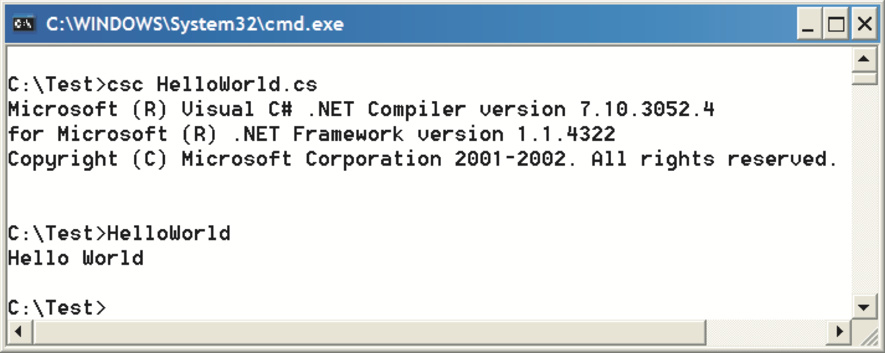
```

## Commenting C# Program {#Comments}
C\# supports three forms of comments: single-line, delimited, and
documentation. A *Single-line* comment starts with the
characters // and extend to the end of the source line as shown in
line 1 of Listing \@ref(HelloWorldProg01). Single-line comments
may also start after the end of a program line as shown in lines
6--9 of Listing \@ref(Enums1).

*Delimited comments* start with the character pair /* and end
with the pair */. Delimited comments may span across multiple
lines. Lines 4 -- 8 of Listing \@ref(StringStats1) shows a
delimited comment. Comments do not nest within each other. The
character pair /* and */ have no special meaning within a //
comment, and the character pair // and /* have no special meaning
within a delimited comment.

We insert single-line and delimited comments into programs to
provide information that will help maintain and enhance the
program. Comments at the beginning of a piece of code (e.g.,
class) provide a functional description of the code (i.e., what
function does the code accomplish?). Comments may be interspersed
throughout the code as appropriate (see
Listing \@ref(Arrays1Prog). Carefully chosen variable names
are self-documenting and eliminate the need for comments to
explain their function. Comments should be terse, precise, and
shouldn't repeat what is in the code.

The third type of comments --- *documentation comments* ---
is a mechanism for programmers to document their code using a
special comment syntax that contains Extensible markup Language
(XML) text. Such comments are one-line, always start with the
character triple ///, and precede source code elements such as
user-defined type (e.g., class, interface, and delegate) or a
member (e.g., field, event, property, indexer, or method).
Documentation comments are used to direct a tool to produce XML
from those comments and the source code elements. The XML
generation tool is called the *documentation generator*. The
output produced by the documentation generator is called the
*documentation file*, which is used as input to a
*documentation viewer*. The latter is a tool intended to
produce some sort of visual display of type information and its
associated documentation. Documentation comments are beyond the
scope of this book.


## A C# Program with Fields and Constants {#SecProg}
This program demonstrates declaring and initializing fields and
constants, reading data from and writing data to console,
assignment statements, and arithmetic expressions. We refer to
this program as ConsoleReadWrite and is shown in
Listing \@ref(ConsoleReadWrite).

In C\#, variables at the *class level* are called
*fields*. A constant is a field whose value cannot be changed
once a value is assigned. Line 9 declares and initializes PI --- a
constant of type *double* --- to the literal 3.1415.
Similarly, line 10 declares and initializes stdGreeting
--- a string constant --- to the literal ``Hi, there!`` By default,
all constants are static. Recall that constants declared at the
class level are shared among all instances of the class and are
*history-sensitive*. Line 11 declares and initializes an
integer field called *age*.

Line 14 writes the string enclosed in double quotes to the console
after substituting the value of PI for \{0\}. This string after
substitution reads *The Value of PI is: 3.1415*. Line 15
writes the string *Hi, there! How Old are You?* to the
console. In response, we assume that the user has entered the
value 18 using the keyboard.

Line 16 is an example of an *assignment statement*. The
expression on the right hand side of the symbol =,
Int32.Parse(Console.ReadLine()), is evaluated and assigned as the
value of the variable to the left of =, which is *age*. The
ReadLine() static method of the Console class reads and returns
input typed on the console, which subsequently becomes input to
the Parse() method of the Int32 class. What is read from the
system keyboard is just a string of characters. The Parse() method
of the Int32 class interprets this string as an integer. Line 17
is similar to the lines 14 and 15, and prints the string
*This Year You are 18 Years Old!* to the console. Line 18
increments the value of the variable age by 1. Line 19 prints the
string *Next Year You Will be 19 Years Old!*

Assignment statements are of the form: *variable* =
*expression*. Evaluating the *expression* should result
in a value whose data type is same as the data type of the
*variable*. Type the ConsoleReadWrite program using Windows
Notepad editor and save it as ConsoleReadWrite.cs. Compile the
program and run it. Verify that it produces correct results as
shown in Figure \@ref(fig:ConsoleReadWriteOut).

Microsoft Visual Studio.NET is an Integrated Development
Environment (IDE) for developing C\# programs. It offers a rich
set of tools for editing, compiling, running, debugging, and
packaging C\# programs. Visual Studio.NET is discussed in
Section \@ref(DotNetIDE).


```{r ConsoleReadWriteOut, echo = FALSE, out.height="50%", out.width = "75%", fig.align='center',fig.cap="ConsoleReadWrite.cs program run results"}
knitr::include_graphics("./Images/CSharpBasics/Illus/ConsoleReadWriteOut.png")
```
## Calculator Program {#CalculatorProg}
The program shown in Listing \@ref(Calculator1) illustrates
typical scenario of programming with classes. There are two
classes: Calculator (lines 4 -- 34) and CalculatorApp (lines 35 --
58). The first one provides arithmetic functionality and the
latter exercises this functionality. The Calculator class defines
seven methods: Add, Sub, Mult, Div, Mod, Power, and Absolute. The
first five methods, given two integers as the values for their
*method parameters*, compute and return addition,
subtraction, multiplication, division, and modulus of parameter
values. The sixth method, given two values $a$ and $b$ of type
double, computes $a^b$ as a double value. The last method, given
an integer value as parameter, returns the absolute value of the
parameter.

Consider the Add() method defined in lines 6 -- 9. Line 6 is
called the *method signature*. The keyword *public* is
the access modifier indicating its *visibility* --- who can
invoke the method; *public* allows accessing the method from
any where. The keyword *int* following the *public*
specifies that the method returns a value of type *int*. Add
is the method name. The invoker of this method need to provide a
value for each of the method parameters $n1$ and $n2$. One way for
a method to return a value to the invoker is by using the
*return* keyword. The method's logic is in line 8 --- just
returns the sum of the method parameter values $n1$ and $n2$. If
the Add method signature were: *public void* Add (*int*
$n1$, *int* $n2$), the method is not allowed to return a
value as the keyword *void* prohibits it. As we see in other
programming examples, there are additional ways for a method to
return values --- using the *ref* and *out* method
parameter qualifiers. Lines 6 -- 9 show the right indentation for
the code.

Notice that the *Mod*() method defined in lines 22 -- 25 has
*static* keyword in its method signature. Therefore,
*Mod*() is a static method. As we show later that invoking
*Mod*() method doesn't require instantiating the Calculator
class.

In contrast with the first five methods, Power() has method
parameters of type *double* and also returns a value of type
*double* (line 26). In line 28, the Pow() method of the Math
class, a pre-defined class from System namespace, is invoked. The
method signature for Power() is: *public static double* Power
(*double* $x$, *double* $y$). The parameter values of
Power(), baseNum and expoNum, are used for invoking Pow(). Note
that Pow() is a *static* method and returns *double*.
The Power() method simply returns the value returned by Pow. This
is only possible since the return types of Pow() and Power() are
the same.

How do we know that there exists a Math class? How do we learn
about its method signatures? Math is one of the several classes
defined in System *namespace*. The .NET Framework Class
Library (FCL) comes with thousands of classes ready for use. In
fact, your C\# programming productivity depends heavily on your
mastery of the FCL. Several tools are available to exploring the
library --- IL Disassembler, Windows Class Viewer, Class Browser
Web Application, Visual Studio.NET Object Browser --- which are
discussed in Section \@ref(DotNetUtilities). Using Windows
Class Viewer, one can search for Framework Class Library classes
and their methods as shown in Figure \@ref(fig:MathClassViewer).
The last method, Absolute(), given an integer, returns its
absolute value. Absolute() simply invokes Abs() method of the Math
class with its parameter value, and returns the value returned by
Abs().


```{r MathClassViewer, echo = FALSE, out.height="50%", out.width = "75%", fig.align='center',fig.cap="ConsoleReadWrite.cs program run results"}
knitr::include_graphics("./Images/CSharpBasics/Illus/MathClassViewer.png")
```

The objective of CalcApp class (lines 35 -- 58) is to demonstrate
creating an instance of Calculator class and invoking its
non-static methods. It also shows how to invoke static methods.
Such classes are generically referred to as *client* classes;
they consume the services or functionality provided by the other
classes. Lines 39 -- 40 declare and initialize two integer
variables, $num1$ and $num2$. Line 41 declares another integer
variable, *result*.

Note that $num1$, $num2$, and *result* are *method-level*
*variables* and are *local* to the method. In other words,
local variables are not known outside the method in which they are
declared. From the program readability and understandability point
of view, each variable should be placed on a separate line.

Line 44 prints the values of $num1$, $num2$, and
*Calculator.Mod(num1, num2)*. Note that *Mod*() is a
public static method and the syntax used for its invocation:
*Calculator.Mod(num1, num2)*. It requires prefixing the
method name with the class name (i.e., Calculator) and supplying
the necessary parameters ($num1$ and $num2$). In contrast,
invoking public non-static methods require an instance (i.e., an
object reference) of the class as shown below.

Line 46 declares and creates an instance, $myCalc$, of the
Calculator class. The unary operator *new* is used to create
the class instance. *Constructor* is a special method which
is used to create an instance of a class. C\# supplies a
*default constructor* for each class we define. However, we
can override this by providing our own constructor. Since we
didn't provide a constructor, the *new* operator will use the
default one. Note that the type of $myCalc$ is Calculator --- a
reference type. It is also known as an object reference of type
Calculator. Now that we have an object reference to the Calculator
class, we can invoke any of the non-static *public* methods
of the class using the $myCalc$.


The rest of the program essentially does methods invocation. Line
48 invokes the Add() method using $num1$ and $num2$ and the value
returned is assigned to the variable *result*. Note that the
return type of the Add() method and the type of *result*
variable should be compatible. For now, let us assume that
compatibility means that they should be of the same type. Line 49
writes to console the string in the double quotes after
substituting the values of $num1$, $num2$, and *result* for
\*0\*, \*1\*, and \*2\*. Line 50 is equivalent to lines 48 and 49.
Instead of first assigning a value to *result* (line 48) and
using the *result* in the WriteLine method (line 49), line 50
invokes the Add() method directly from the WriteLine statement.
Lines 51 -- 53 print the results returned by Sub(), Mult(), and
Div() methods.

Recognize that $num1$ and $num2$ are integers. They cannot be used
for method parameter values when invoking Power(), as the latter
expects parameter values of type *double*. One way to
circumvent this problem is to *explicitly* convert integer
values to double type using the *type casting* operator:
(*double*) $num1$ converts $num1$ value to a *double*
value (line 54). Converting an *int* into *double* is
information-preserving while the reverse is not necessarily true.
C\# compiler does an implicit type casting in
information-preserving situations. Line 55 assigns a negative
value to $num1$ and is used in the invocation of the Absolute()
method. The results of running the Calculator.cs program are shown
in Figure \@ref(fig:CalculatorOut).

```{r CalculatorOut, echo = FALSE, out.height="50%", out.width = "75%", fig.align='center',fig.cap="Calculator.cs program run results"}
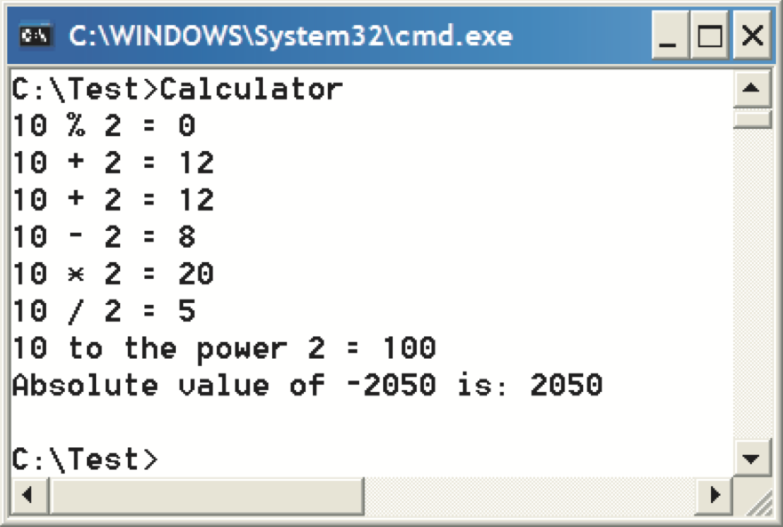
```

## Operators {#Operators}
An *operation* consists of an *operator* and one or more
*operands*. Operators that require only one operand are known
as *unary*; those that require two are referred to as
*diadic* (or *binary*); those that require three are
named *ternary*. Examples of arithmetic operators include
addition, multiplication, exponentiation, ceiling, floor, and
logarithm. The first three are binary whereas, the last three are
unary.

An operation is represented as an *expression*. In the simplest
case involving a diadic arithmetic operator such as addition, the
following are examples of arithmetic expressions: $2 + 5$; $*numStudents* + 1$.
In the first example, the operands are the
literal constants 2 and 5; in the second, the operands are the
variable numStudents and the literal constant 1.


### Operator Precedence
An expression can contain multiple operators as in: $2 \times 15 + 25$.
Furthermore, compound expressions are composed from simple
expressions in constrained ways. The expression $2 \times 15 + 25$
yields different results based on which operator is evaluated
first. There are two ways to evaluate this expression:
multiplication followed by addition, and addition followed by
multiplication. The first way results in 55 and the second one
yields 80. However, expression evaluation need to be
*deterministic* --- should always yield the same value. This
leads us to the notion of *operator precedence*, which
specifies the order in which the operators should be evaluated.
Multiplication operator has higher precedence over addition.
Therefore, the correct way to evaluate $2 \times 15 + 25$ is to
apply the multiplication operator first followed by addition.
Therefore, the correct value of $2 \times 15 + 25$ is 55.
Parentheses can be used to explicitly indicate operator precedence
as in: $(2 \times 15) + 25$. We strongly recommend using
parentheses to disambiguate order of operator application.

### Operator Associativity
Consider the expression 30 - 10 - 5. Since it has multiple
occurrences of the same operator, precedence rules don't help us
in determining which one of the following order of operator
application is correct: (30 - 10) - 5 or 30 - (10 - 5). This is
where *operator associativity* comes into play. Associativity
determines which side of an expression should be evaluated first.
If an operator is *left associative*, the expression to the
left of the operator is evaluated first. On the other hand,
*right associativity* requires that the expression to the
right of the operator be evaluated first. Since minus $(-)$ is
left associative, the expression 30 - 10 - 5 is equivalent to (30
- 10) - 5.

```{r CSOperators, echo = FALSE, warning = FALSE, results = 'asis'}

options(knitr.table.format = "html") 

library(knitr)
library(kableExtra)

# column 1 vector
Type <- c("Primary", "Unary", "Multiplicative","Additive","Shift","Relational","Equality","Logical AND","Logical XOR","Logical OR","Conditional AND","Conditional OR","Conditional","Assignment")

# column 2 vector
Operators <- c("(a), a:b, f (a), a[b], a++, a--, new, typeof, sizeof, checked,
unchecked", "+, -, !, ~ , ++a, --a, T(e)","*, /, %","+,-","<< , >>","< , <_ ; >; >_, is, as","==,!=","&","^","|","&&","||","?:","=, *=, /=, %=, +=, -=, <<=, >>=, &=, ^=, |")

# create data frame
Operator <- data.frame(Type, Operators, stringsAsFactors = FALSE)

library(knitr)

# table label named tab:tabCrossRef is automatically created

# kable(multiplePerspectives, booktabs = TRUE, caption = "Multi-perspective view of a class")

# kable(multiplePerspectives, caption = "Multi-perspective view of a class") %>%
#   kable_styling()

 kable(Operator, caption = "C# operators") %>%
   kable_styling(bootstrap_options = c("striped", "hover"))

```

C\# provides an assortment of operators as shown in
Table \@ref(tab:CSOperators). Primary operators have the highest
precedence, which decreases as we traverse down the table rows,
ending in assignment operators having the lowest precedence. All
diadic operators, except the assignment operator, are
left-associative. That is, they are evaluated from left to right.
Conditional and assignment operators are right associative,
meaning that they are evaluated from right to left. For example,
the expression $x=y=z$ is equivalent to $x=(y=z)$, since the
assignment operator, $=$, is right associative.


We provide a brief and generic  description of the operators
listed in Table \@ref(tab:CSOperators). Their precise behavior
depends on the data types of the operands --- for example, int vs.
float, value types vs. reference types.These nuances are discussed
in detail when the operators are used in C\# programs. The
grouping of the operators shown in the table is motivated by the
goal to depict operator precedence. However, in the following,
they are grouped differently to better facilitate their
discussion.

### Primary Operators {#OtherApps}
Parenthesis operator of the form, (a), is used to disambiguate
operator precedence in mathematical expressions and method calls.
The *dot* (.) operator in expressions of the form $a.b$ is
used to specify the member $b$ of the class or structure $a$.
$f(a)$ form of parenthesis operator is used to specify the list of
input parameter(s), *a*, when invoking the method $f$. The
square brackets in $a[b]$ are used to specify an index $b$ into
the array $a$. Array is a data structure to hold a list of
elements, and enables referencing the elements by their index or
location position. Arrays are discussed in
Chapter \@ref(Arrays).

o create instances of a class, the *new* operator is used.
The operator *typeof* (e.g., typeof(**expression**))
returns a string that identifies the type of an expression. It
returns type information as a string. There are six possible
values that typeof returns: ``number``,``string``,``boolean``,
``object``, ``function``, and ``undefined``.The parentheses are
optional in the typeof syntax.

The sizeof operator (e.g., sizeof(*type*)) is used to obtain
the size (in bytes) for a value type. This operator cannot be
overloaded and can only be used in *unsafe* mode. The
*checked* and *unchecked* operators are used to control
the overflow-checking context for integral-type arithmetic
operations and conversions. Overflow occurs when the value to be
stored is outside the data type's range of values. In a checked
context, arithmetic overflow raises an exception; in an unchecked
context, arithmetic overflow is ignored and the result is
truncated.


### Type Casting and Testing Operators
In the operation $(T)e$, the value of the expression $e$ is
explicitly converted to value of type $T.$ This operation is
referred to as *explicit type casting* operation.

The operator *is* used to dynamically check if the run-time
type of an object is compatible with a given type. The result of
the operation $e$ *is* $T$, is a boolean value indicating
whether the expression $e$ can successfully be converted to type
$T$. The *as* operator is used to explicitly convert a value
to a given reference type. Unlike the cast expression $(T)e$
(Section \@ref(OtherApps), the *as* operator never raises
an error condition (or an exception). If the indicated conversion
is not possible, the result is simply set to null. Both *is*
and *as* are illustrated in Chapter \@ref(Interfaces).

### Arithmetic Operators
The unary operator, +, is used in the form +(operand). It simply
returns the operand. On the other hand, -, returns the negative
value of its operand. Arithmetic operators $\ast, /, \%, +, -$ are
diadic and require numeric operands --- *int*, *uint*,
*long*, *ulong*, *float*, *double*, and
*decimal*. The remainder operator, \%, computes the remainder
of the division $a / b$. This operator is also known as modulus
operator. The operators $\ast, /, +,$ and $-$ compute
multiplication, division, addition, and subtraction, respectively.

$+ +$ and $- -$ are called *increment* and *decrement*
operators. They are used on numeric values. $a\!+\!+$ increments
the value of $a$ by 1 and  $a\!\!-\!-$ decrements the value of $a$
by 1. This form of increment and decrement operators are called
*post-increment* and *post-decrement* operators to
distinguish them from *pre-increment* $(+\!+\!a)$ and
*pre-decrement* $(-\!-\!a)$ counterparts.

There is no difference between the two versions if the operations
are used in isolation. Distinction exists if the operators are
embedded as part of other expressions. The operation $a\!+\!+$
increments the value of $a$ by 1 after the value of $a$ has been
used in expression evaluation. Likewise, $a\!-\!-$ decrements the
value of $a$ by 1 after the value of $a$ has been used in
expression evaluation. In contrast, $+\!+\!a$ first increments the
value of $a$ by 1, and the incremented value is used in the
expression evaluation. Similarly, $-\!-\!a$ first decrements the
value of $a$ by 1, and the decremented value is used in the
expression evaluation.

### The Conditional Operators
The $?$: operator is called the *conditional operator*. A
conditional expression of the form, $ bexp \, ? \, a \! \! \! : \!
b$, first evaluates the condition *bexp*. If *bexp* is
true, $a$ is evaluated and is returned the result of the
operation. Otherwise, $b$ is evaluated and is returned as the
result of the operation. A conditional expression never evaluates
both $a$ and $b$. The conditional operator is right-associative
--- operations are grouped from right to left. For example, an
expression of the form $a \,? \, b \! : \! c \,? \, d \! : \! e$
is evaluated as $a \,? \, b \!: \! (c \,? \, d:\! e)$. Since $? \!
\! :$ takes three *arguments* (inputs), it is also referred
to as the *ternary operator*. Listing \@ref(MiscOpr)
demonstrates how the conditional operator works.

### Increment/decrement, Shift, and Conditional Operator Program
Listing \@ref(MiscOpr) exemplifies how increment/decrement,
shift, and the conditional operators work. The results of running
this program are shown in Figure \@ref(fig:MiscOprOut). MiscOpr
class (lines 5 -- 29) has only the Main() method (lines 7 -- 28).
Line 10 prints the value of local variable $x$ declared and
initialized in line 9. The printed value should be 10. The
expressions $x+\!+$ and $+\!+x$ by themselves as complete
statements are equivalent. Line 12 post-increments $x$ whereas
line 13 pre-increments $x$. After executing line 13, the value of
$x$ should be 12 (i.e., $10 + 1 + 1$). Lines 14 and 15 post- and
pre-decrement $x$. Therefore, the value of $x$ printed by line 16
should be 10 (i.e., $12 - 1 - 1$).

ow consider line 17. First, $x$ is pre-incremented, then
multiplied by 2, and this result is assigned to $y$. Hence, the
values of $x$ and $y$ printed by line 18 should be 11 and 22. In
contrast, in line 19, the current value of $x$ (i.e., 11) is used
in the expression, the result is assigned to $y$, and then $x$ is
(post-)incremented. Therefore, the values of $x$ and $y$ printed
by line 20 should be 12 and 22.

Line 22 performs a *left shift* on $x$ by four bits. If we
sidestep overflow issues, left shifting $x$ by one bit is
equivalent to multiplying $x$ by 2. Hence, the value of $x$ after
line 22 should be 192 (i.e., $12 \ast 2 \ast 2 \ast 2 \ast 2)$.
Line 23 performs right shifting of $x$ by two bits. The effect of
right shifting of $x$ by one bit is equivalent to dividing $x$ by
2. The value of $x$ after executing line 23 should be 48 (i.e.,
$192 \div 4$), which is verified by the output of line 24.

Finally, line 26 illustrates the conditional operator. First, the
relational expression $x < 10$ is valuated. It evaluates to
*false* since $48 < 10$ is *false*. Hence, $y$ is
assigned the result of evaluating the expression $x \ast 3$, which
is 144. The output of line 27 verifies this.

```{r MiscOprOut, echo = FALSE, out.width = "75%", fig.align='center',fig.cap="MiscOpr.cs program run results"}
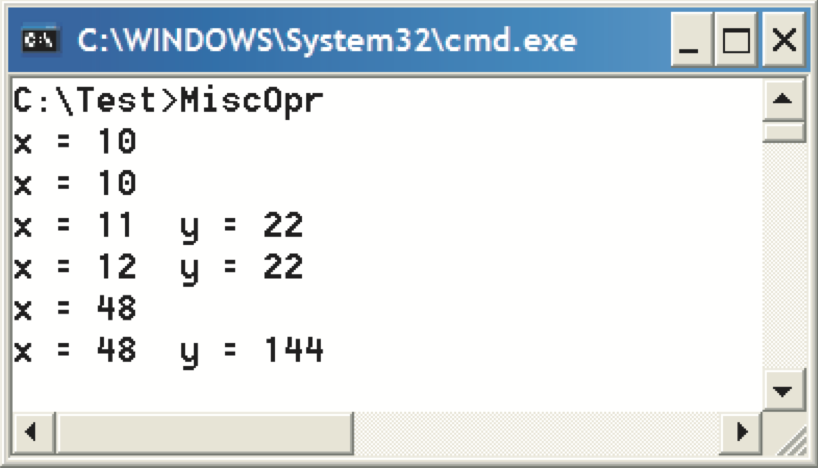
```

### Logical OPerators
There are two types of logical operators: logical boolean and
logical bitwise. *Logical boolean* operators require their
operands to be of type boolean and produce a result which is also
of type boolean. On the other hand, *logical bitwise*
operators work on the binary representation of their operands.
Logical operators include \&, $\wedge$, $\vert$, $!$, $\sim$,
$!\!=$, \&\& and $\vert\vert$ *Shift operators* are a type of
bitwise operators and include $<\!<$ and $>\!>$.
Table \@ref(tab:LogicalOperators) summarizes logical operators.

#### Logical Boolean Operators
First consider the boolean versions of the logical operators. The
\&, $\wedge$, and $\vert$ operators' are diadic and their behavior
is discussed in detail in Section \@ref(LogicalOps). The result
of $a \& b$ is *true* if both $a$ and $b$ are *true*;
otherwise, the result is *false*. The result of $a \wedge b$
is *true* if $a$ is *true* and $b$ is *false*, or
if $a$ is *false* and $b$ is *true*; otherwise, the
result is *false*. When the operands are of type bool, the
$\wedge$ operator computes the same result as the $!\!=$ operator.
The result of $a \vert b$ is *true* if either $a$ or $b$ is
*true*; otherwise, the result is *false*. The negation
operator, $!$, takes one operand and negates it. It returns
*true* if its operand is *false*; otherwise, returns
*false*. The $\sim$ operator is not applicable for boolean
operands.

The operators \&\& and $\vert\vert$ are conditional versions of
the \& and $\vert$ operators. Hence, they are referred to as the
*conditional logical (boolean) operators*. The operation $a
\,\, \&\& \,\,b$ corresponds to $a \, \& \, b$, except that $b$ is
evaluated only if $a$ evaluates to *true*. The operation $a
\, \vert \vert \, b$ corresponds to $a \, \vert \, b$, except that
$b$ is evaluated only if $a$ evaluates to *false*. For this
reason, they are also referred to as the *short-circuit*
logical operators.

#### Logical Bitwise Operators
If the operands are integers (i.e., *int*, *uint*,
*long*, *ulong*), the \& operator computes the bitwise
logical *AND* of the two operands; the $\wedge$ operator
computes the bitwise logical exclusive OR (XOR) of the two
operands; and the $\vert$ operator computes the bitwise logical
*OR* of the two operands. For enumeration type operands,
bitwise operators simply perform the logical operation on the
*underlying data types* of the two operands (as in the case
of integer types). The $\sim$ operator performs a *bitwise*
complement *operation* (see Section \@ref(SignedIntegers)) on
its operand. Bitwise complement operators are predefined for
*int*, *uint*, *long*, and *ulong*.

```{r LogicalOperators, echo = FALSE, out.width="45%", warning = FALSE, results = 'asis'}

options(knitr.table.format = "html") 

library(knitr)
library(kableExtra)

# column 1 vector
Boolean_Symbol <- c("&","|","^","!")

# column 2 vector
Name <- c("Logical-AND","Logical-OR","Logical-XOR","Logical Negation")

# column 3 vector
Example <- c("a&b","a|b","a^b","!a")

# column 4 vector
Remarks <- c("Evaluates to true if both a and b evaluate to true","Evaluates to true if any of a and b evaluates to
true","Evaluates to true if and only if one of the
operands evaluates to true and the other evaluates
to false; otherwise, evaluates to false","Evaluates to true if a is false; otherwise, evaluates
to false")

# column 1 vector
Bitwise_Symbol <- c("&","|","^","~")

# column 2 vector
Names <- c("Logical-AND","Logical-OR","Logical-XOR","Logical Complement")

# column 3 vector
Examples <- c("a&b","a|b","a^b","~a")

# column 4 vector
Remark <- c("Performs bitwise logical ANDing of a and b.
The result is interpreted as a binary value","Performs bitwise logical ORing of a and b. The
result is interpreted as a binary value","Performs bitwise logical XORing of a and b.
The result is interpreted as a binary value","Performs bitwise complement of a. The result is
interpreted as a binary value")

# column 1 vector
Short_Circiut <- c("&&","&&")

# column 2 vector
Namess <- c("Control-AND","COntrol-OR")

# column 3 vector
Exampless <- c("a&&b","a||b")

# column 4 vector
Remarkss <- c("Corresponds to a&b, except that b is evaluated
only if a evaluates to true","Corresponds to aj b, except that b is evaluated
only if a evaluates to false")

# column 1 vector
Shift <- c("<<",">>")

# column 2 vector
Nam <- c("Left","COntrol-OR")

# column 3 vector
Exmpl <- c("a<< bitcount","a>> bitcount")

# column 4 vector
Remk <- c("Perform left shift on a by number of bits = bit
count","Perform right shift on a by number of bits = bit
count")


# create data frame
Operator <- data.frame(Boolean_Symbol, Name, Example, Remarks,Bitwise_Symbol,Names,Examples,Remark,Short_Circiut,Namess,Exampless,Remarkss,Shift,Nam,Exmpl,Remk, stringsAsFactors = FALSE)

First <- data.frame(Operator, stringsAsFactors = FALSE)

library(knitr)

# table label named tab:tabCrossRef is automatically created

# kable(multiplePerspectives, booktabs = TRUE, caption = "Multi-perspective view of a class")

# kable(multiplePerspectives, caption = "Logical operators") %>%
#   kable_styling()

 kable(First, caption = "C# operators") %>%
   kable_styling(bootstrap_options = c("striped", "hover"))

```
#### Logical Operators Program
Listing \@ref(tab:LogicalOpr) exemplifies logical operators. The
results of running the program is shown in
Figure \@ref(fig:LogicalOprOut). Line 11 prints out the values of
$x$ and $y$ declared and initialized in line 9. Line 13 evaluates
the expression $x < 10 \, \& \, y > 10$ and prints the result. The
first operand, $x < 10$, evaluates to *true* since $5 < 10$.
The second operand, $y > 10$ evaluates to *false* since $10> 10$
is *false*. Since both the operands are not
*true*, the operator $\&$ returns *false*.

Line 14 prints out *true* since $x < 10$ of the expression $x
< 10 \, \& \, y > 10$ evaluates to *true*. Line 15 prints out
*true* since for the operator $\wedge$, one of the operands
($x < 10$) evaluates to *true* and the other ($y > 10$)
evaluates to *false*. Line 16 prints *false* since the
operand $(x < 10)$ evaluates to *true* and negation operator
$(!)$ negates it to *false*.

To understand what is printed by lines 18--22 requires an
understanding of how signed and unsigned integers are represented
in binary form (Section \@ref(SignedIntegers). Consider the $x
\& y$ operation on line 18. The binary representation of $x$ is
0101 (= 5) and the same for $y$ is 1010 (= 10). Bitwise ANDing
gives 0000 (= 0). Likewise, bitwise ORing (line 19) gives 1111 (=
15).

Lines 24 and 25 illustrate short-circuit evaluation of boolean
expressions. Since the first operand $x > 5$ of the expression 
$ a > 5 \&\& y < 10$ evaluates to *false*, the rest of the
expression is not evaluated and line 24 prints *false*. Note
that the expression evaluates to *false* irrespective of the
value of the second operand evaluation. In line 25, the first
operand $x < 10$ evaluates to *true* and the line prints
*true*. The second operand $y > 10$ is evaluated only if the
first operand has evaluated to *false*.

```{r LogicalOprOut, echo = FALSE, out.width = "55%", fig.align='center',fig.cap="LogicalOpr.cs program run results"}
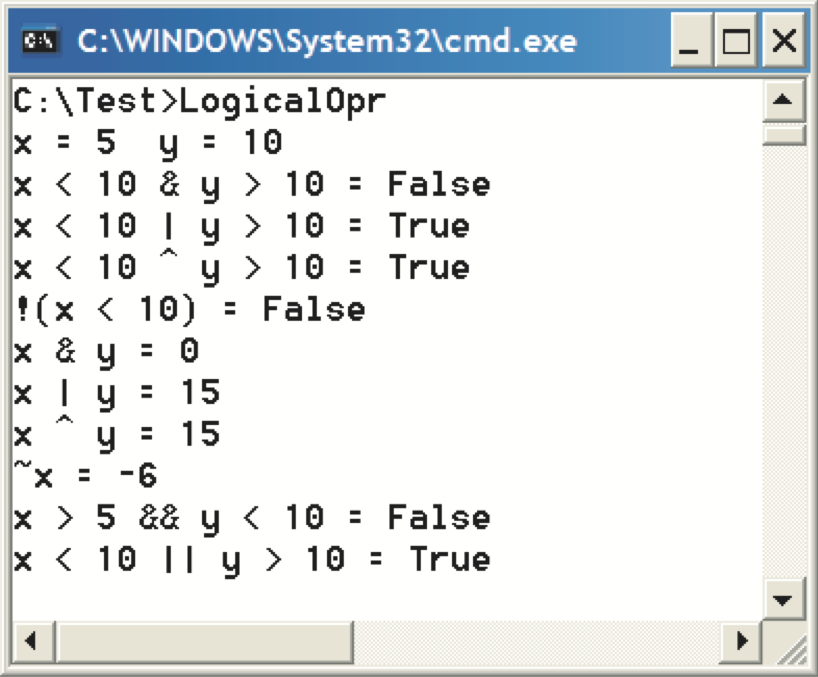
```

```{r RelOps, echo = FALSE, warning = FALSE, results = 'asis'}

options(knitr.table.format = "html") 

library(knitr)
library(kableExtra)

# create column 1 vector
Expression <- c("a==b", "a!=b", "a<b","a>b","a<=b","a>=b")

# create column 2 vector
Description <- c("true if a is equal to b; false otherwise","true if a is not equal to b; false otherwise","true if a is less than b; false otherwise","true if a is greater than b; false otherwise","true if a is less than or equal to b; false otherwise","true if a is greater than or equal to b; false otherwise")

# create data frame
Rel <- data.frame(Expression, Description, stringsAsFactors = FALSE)

library(knitr)

kable(Rel, caption = "Relational operators' behavior") %>%
   kable_styling(bootstrap_options = c("striped", "hover"))

```

### Relational Operators
The operators $= =, !\!=, <. \leq, >, \geq$ are called relational
or comparison operators. They are all diadic and return a boolean
value as result. Table \@ref(tab:RelOps) summarizes results of
relational operations.

### Assignment Operators
The assignment operators: $=$, $\ast \! =$,   $/ \!\! =$, $\% \!
\!=$,  $+ \! \!=$,   $- \! \!=$, $< \! < \! =$,   $> \! > \! =$,
$\& \!\! =$, $\wedge \! \! =$,   and $\vert \! \! =$,  assign a
new value to a variable, a *property*, an *event*, or an
*indexer* element. Properties are discussed in
Section \@ref(Classes1Properties), events in
Section \@ref(Events), and indexers in
Section \@ref(Indexers11). Assignment statements are of the
form: *leftOperand assignmentOperator rightOperand*. The
leftOperand must be an expression classified as a variable, a
property access, an indexer access, or an event access.

The operator, $=$, is referred to as  the *simple assignment operator*.
It assigns the value of the rightOperand to the
variable, property, or indexer element given by the leftOperand.
The left operand of the simple assignment operator may not be an
event access. In a simple assignment, the rightOperand must be an
expression of a type that is implicitly convertible to the type of
the leftOperand. It assigns the value of the rightOperand to the
variable, property, or indexer element specified by the
leftOperand. The result has the same type as the leftOperand and
is always considered as a value type. If the leftOperand is a
property or indexer access, the latter must have a *set accessor*.


*Compound assignment operators* $\ast \! =, /\!\!=, \%\!=,
+\!=, -\!=, <\!<=, >\!>=, \&\!=, \wedge\!\!=$,   and $\vert\!\!=$
are operators formed by prefixing a diadic operator with the =
character. They perform the indicated operation on the leftOperand
and rightOperand, and then assign the resulting value to the
variable, property, or indexer element given by the leftOperand.
The operators, $+ \! \!=$ and $- \! \!=$, with an event access
expression as the leftOperand are called *event assignment operators*.
No other assignment operator is valid with an event
access as the leftOperand.

```{r AssignmentOprOut, echo = FALSE, out.width = "65%", fig.align='center',fig.cap="AssignmentOpr.cs program run results"}
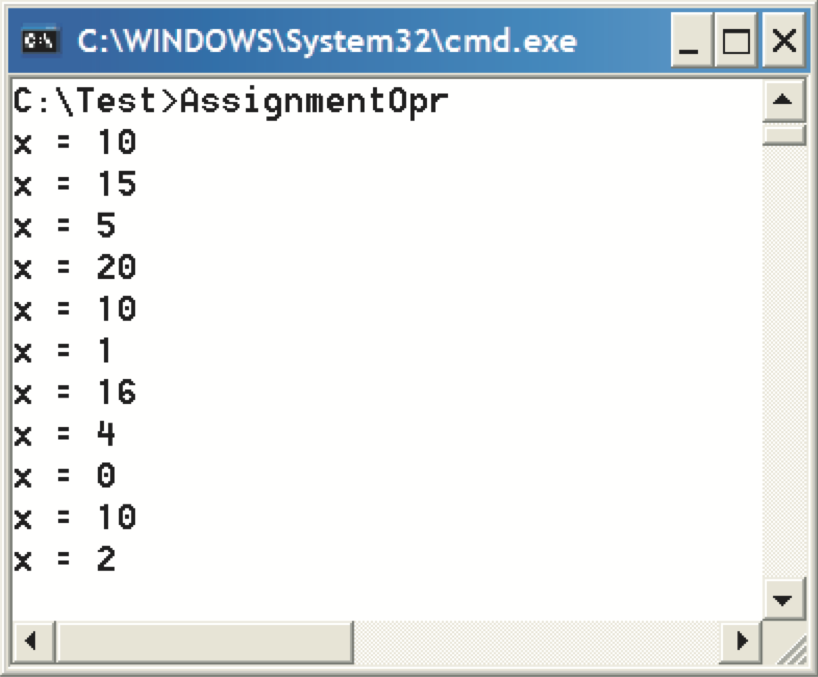
```

Compound assignment operations of the form $a \, \, op  =  b$
(where *op* is one of $\ast, /, \%, +, -, < \! <, > \! >, \&,
\wedge, \vert$) are processed as if it is written in the form $ a
= a \, \, op \, \, b$. Evaluation of $a$ performed only once. This
contributes to performance improvement, especially if evaluating
$a$ involves method calls.

The program shown in Listing \@ref(AssignmentOpr) exemplifies
the various forms of the compound assignment statement. The
results from running this program are shown in
Figure \@ref(fig:AssignmentOprOut). Line 10 prints the initial
value of $x$, which is equal to 10. Consider lines 12 -- 16. Each
line is a compound assignment statement. Once we recognize the
syntactic equivalence, for example,  that $x +\!= 5$ and $x = x +
5$ are the same, it is easy to follow the program. Value of $x$
after executing lines 12 -- 16 is 15, 5, 20, 10, and 1,
respectively. Hence, line 17 prints 1. The left shift operation on
line 18 assigns 16 for $x$ (each of the four left shifts doubles
the value of $x$ successively). The right shift operation on line
19 assigns 4 for $x$ (each left shift halves the $x$ value).
Therefore, 4 is printed by line 19.

Bitwise ANDing of $x$ (0100) with 10 (1010) results in assigning 0
to $x$ (line 25). ORing 0 (0000) with 10 (1010) entails a value of
10 to $x$. Finally, XORing (exclusive OR) of $x$ (1010) with 8
(1000) results in 0010 (= 2). Hence, line 24 prints 2. When the
leftOperand of a compound assignment is a property access or
indexer access, the property or indexer must have both a *get*
*accessor* and a *set accessor*.


## Expression Evaluation {#ExprEval}
A simple expression consists of one or more operands and zero or
more operators. Compound expressions are constructed by linking
simple expressions with the logical connectives \&\& and $\vert
\vert$. There are three types of expressions: arithmetic, boolean,
and relational. You are already familiar with arithmetic
expressions. As discussed above, we use precedence and
associativity rules in evaluating them deterministically.
Evaluating an arithmetic expression always yields an integral
value.


Boolean and relational expressions are quite similar to arithmetic
expressions. Operands in a boolean expression are restricted to
boolean variables and boolean constants (or literals): *true*
and *false*; operators are limited to !, \&\&, and $\vert
\vert$. Their evaluation should always result in a boolean value.
Assuming that *moreInput* and *done* are boolean
variables, the following are valid boolean expressions:
*moreInput*, *!moreInput*, *moreInput* \&\&
*!done*, *moreInput* $\vert \vert$ *done*.

A simple relational expression involves integral operands and
integral literals, and the operands $<$, $\leq$, $>$, $\geq$, $=
=$, and $!=$. Assuming that *age* and *weight* are
variables of type integer, the following are valid relational
expressions: !(*age* $<$ 20), *age* == 30, and
*age* $\geq$ 10. Valid compound relational expressions are:
(*age* $\leq$ 30) \&\& (*weight* $\leq$ 300),
((*weight* $\geq$ 120 ) \&\& (*weight* $\leq$ 300)).
Note that, though it is not necessary, we have used parentheses to
convey the intended order of evaluation explicitly. Evaluation of
relational expressions should always result in a boolean value.


Boolean and relational expressions can be linked using the logical
connectives to form compound expressions as in: (*nonSmoker*
\&\& ((*height* $\geq$ 170) $\vert \vert$ ((*weight*
$\geq$ 120 ) \&\& (*weight* $\leq$ 300)))). Boolean and
relational expressions are used in conditionally executing a
statement(s) and in repeatedly executing one or more statements as
long as a certain condition holds (discussed in
Chapter \@ref(CS)).

## Exception Processing {#ExcepHandling}
As you might have already encountered, errors are generated by the
compiler when (syntactically) defective programs are compiled. The
compiler reports *syntactic errors* --- those that are
related to the grammar violations of the language --- and other
errors that can be discovered at the compile-time (e.g.,
typecasting related errors). In contrast, *runtime errors*
occur during the program execution. Such errors, for instance,
occur when opening a non-existent file, reading data from a file,
and overflow conditions in arithmetic operations. Runtime errors
need to be detected (termed *raising* or *throwing an
exception*) and handled appropriately (termed *exception
handling*). Otherwise, the program crashes --- an undesirable and
unpleasant situation. Closely related to, but distinct from
exceptions, are *events*. For example, end of file event
occurs when the end of file is reached while reading data from the
file. Like exceptions, events need to be detected and processed
(discussed in Section \@ref(Delegates)).


There are two categories of exceptions: system-defined and
user-defined. *System-defined exceptions* are pre-defined
ones and are automatically raised by the language runtime.
*User-defined* or *custom exceptions* are discussed in
Section \@ref(UserDefinedExceptions). The .NET Framework
provides Structured Exception Handling (SEH) --- a comprehensive
feature for addressing exceptions. SEH is common to all
.NET-compliant languages including C\#, VB.NET, and VC++.NET.
Exceptions raised by the code in one .NET language can be caught
and handled in the code written in another .NET language.
Table \@ref(tab:SysDefExceptions) shows some system-defined
exceptions.

```{r SysDefExceptions, echo = FALSE, warning = FALSE, results = 'asis'}

options(knitr.table.format = "html") 


library(knitr)
library(kableExtra)

# create column 1 vector
Exception_Name <- c("DivideByZeroException", "OverflowException", "FormatException","ArgumentOutOfRangeException","IndexOutOfRangeException","ArrayTypeMismatchException","StackOverflowException","InvalidCastException")

# create column 2 vector
Description <- c("Raised when an attempt to divide an integral value by zero occurs.","Raised when an arithmetic operation (in a checked context) overflows.","Raised when the format of an argument does not meet the parameter
specifications of the invoked method.","Raised when the value of an argument is outside the allowable range of
values as defined by the invoked method.","Raised when an an array is accessed via an index that is less than zero
or outside the bounds of the array.","Raised when a value assigned to an array element fails because the actual
type of the assigned value is incompatible with the actual type of
the array.","Raised when the execution stack is exhausted typically due to unbounded
recursion.","Raised when an explicit conversion from a base type or interface to a
derived type fails at run time.")


# create data frame
SysDefExceptions <- data.frame(Exception_Name, Description, stringsAsFactors = FALSE)

library(knitr)

 kable(SysDefExceptions, caption = "Some system-defined exceptions") %>%
   kable_styling(bootstrap_options = c("striped", "hover"))

```

### try/catch/finally Blocks {#TryCatchFinally}
We need to first introduce *try/catch/finally* block syntax
to explain how exceptions are thrown and caught/handled. A
*try/catch/finally* block is of the form:

try
\{\

 try block\

 \}\

*catch* (ExceptionClass$_1$ $e_1$)\

\{\

 catch block$_1$ statements\

 \}\

 *catch* (ExceptionClass$_2$ $e_2$)\

 \{\

 catch block$_2$ statements\

\}\

 $\cdots$\

*catch* (ExceptionClass$_n$ $e_n$)\

 \{\

 catch block$_n$ statements\

 \} \

 $[$ *catch* ( )\

 \{\

 default catch block statements\

 \}  $]$ \

 $[$ \emph{finally}\

 \{\

 finally block statements\

 \}\ $]$

}


It has one *try* block, one or more *catch* blocks, and
an optional *finally* block. Note that each *catch*
block is associated with an exception class. For example, the
exception class of *catch* block$_1$ is ExceptionClass$_1$.
The code that may cause run-time errors is enclosed within the
*try* block. When pre-defined exceptional conditions arise
during the processing of statements in the *try* block, the
C\# runtime system *throws* an exception immediately and
unconditionally. For user-defined exceptions, a *throw*
statement is used by the programmer to raise the exception
(Section \@ref(UserDefinedExceptions)).

Program control never reaches the statement immediately following
the statement that resulted in a pre-defined exception or the
*throw* statement. When an exception occurs, the run-time
system searches for the nearest *catch* clause that can
handle the exception. Matching an exception with a *catch*
block is determined by the run-time class of the exception. For
example, the class of the exception that occurred is compared with
*ExceptionClass*$_1$. If they match, the exception is handled
by executing the code in catch block$_1$. If the optional
*finally* block exists, the program control is then
transferred to the *finally* block. The program terminates
after executing the statements in the *finally* block. This
block typically contains statements for gracefully terminating the
program by performing house-cleaning and resource release (e.g.,
releasing database connections and other system resources)
activities. If there is no match, the class of the exception that
occurred is compared with *ExceptionClass*$_2$. If they
match, the exception is handled by executing the code in catch
block$_2$ and the program control is transferred to the optional
*finally* block as before.

Successive *catch* block exception classes are compared with
the class of the exception that occurred in the order of their
physical placement until a match is found. If the optional default
*catch* block is present (the one that is just before the
*finally* block), and if no match is found up to this point,
the default *catch* block is executed. Note that the default
*catch* block doesn't have an exception class to match. It is
always a good idea to provide the default *catch* block so
that no exception goes without being handled.

The order of placement of *ExceptionClass*es is important.
*ExceptionClass*$_1$ is more specific than
*ExceptionClass*$_2$, and *ExceptionClass*$_2$ is more
specific than *ExceptionClass*$_3$, and so on. Hence, the
default *catch* block is the most general. The idea is that
the more specific we are about an exception type, the more precise
we can be in handling the exception.

Several interesting issues arise when a method $m_1()$ of class
$C_1$ calls method $m_2()$ of class $C_2$, and $m_2()$ calls
method $m_3()$ of class $C_3$. What happens when an exception is
raised in $m_3()$ which has a *finally* clause and there is
no suitable *catch* block to handle the exception? What
should $m_2()$ do about this exception? If $m_2()$ also doesn't
handle this exception, what should $m_1()$ do? In which order
should the optional *finally* and *catch* blocks be
executed in this cascading scenario? Some of these issues are
addressed in Section \@ref(UserDefinedExceptions).

### System-Defined Exceptions Handling Program
Exceptions.cs program shown in Listing \@ref(ExceptionsProg1)
exemplifies handling of system-defined exceptions. Lines 5 -- 15
implement a simplified Calculator class with only two methods:
Add() and Div() (see Listing \@ref(Calculator1). The Main() in
Exceptions class declares three integer variables ($num1$, $num2$,
and $result$). It also declares, creates, and initializes strArray
--- an array of strings. The array size (3) is implicitly
specified through the values in the initializer list. Line 22
creates an instance of the Calculator class (myCalc). Lines 25 --
36 compose the *try* block. For the runtime system to detect
exceptions, statements must be placed in the *try* block.


Following the *try* block are three *catch* blocks
(lines 38 -- 55). The first catch block (lines 40 -- 42) processes
or handles exceptions of type OverflowException. Likewise, the
catch block of lines 46 -- 48 handles exceptions of type
DivideByZeroException; and the catch block lines 52 -- 54
processes all types of exceptions. We chose to provide the first
two catch blocks so that specialized action can be taken when
exceptions of that type are detected.

As soon as an exception is detected in the *try* block, the
program execution control is immediately transferred to the
appropriate *catch* block. For example, if OverflowException
is detected in the *try* block, the program control is
transferred to the *catch* block of lines 38 -- 43. If we
didn't have this *catch* block, the control would have been
transferred to the generic *catch* block of lines 50 -- 55.
Therefore, *catch* blocks corresponding to specialized
exceptions should be placed ahead of the *catch* blocks
corresponding to the more general exceptions.

Each *catch* block has three statements. The first one prints
the exception type name by calling the GetType() method. The next
two lines print values of two properties: Source and Message.
*Source* indicates which class/object caused the exception,
and *Message* provides descriptive information about the
exception. Notice the  *finally* keyword on line 56 and its
statements (line 58). The control always gets transferred to the
*finally* block after passing through the relevant
*catch* block. As indicated earlier, the *finally* block
is typically used to free up system resources and to perform house
cleaning tasks (e.g., closing database connections, closing open
files, flushing memory buffers) and to provide graceful exit from
the error conditions. Therefore, the *finally* block should
be placed at a strategic location to meet these objectives.

Now let us trace the program execution for certain input values.
The results of running the Exceptions.cs program is shown in
Figure \@ref(fig:ExceptionsOut). Line 25 prompts the user to enter
an integer number, and line 26 assigns this number to $num1$. The
value returned by Console.ReadLine() is passed to the Parse()
method of Int32 class. This is needed since the value returned by
Console.ReadLine() is simply a string of characters, which the
Parse() interprets as an integer. This also illustrates the
principle of *functional composition* --- stringing together
several functions in a way that the output of one becomes the
input for another to achieve elegance and simplicity in the code.
Say, we entered 4000000000 (4 billion), which is greater than the
maximum value an integer (Int32) can hold (see
Table \@ref(tab:CSDataTyp). Therefore, the runtime generates
OverflowException and immediately transfers the control to the
*catch* block of lines 38 -- 43 since this block is
specifically for processing exceptions of this type. As can be
seen from the program output (Figure \@ref(fig:ExceptionsOut),
exception type (System.OverflowException), the source that caused
the exception (mscorlib.dll, the library where the Console class
is defined), and a descriptive message. Then the control is
transferred to the *finally* block which simply prints out
the string: Control always comes here.

Rerun the program and enter 100 for the first prompt and 0 for the
second one. Now $num1$ is 100 and $num2$ is 0. myCalc.Add() call
doesn't result in raising an exception, and line prints the sum of
the two numbers. However, myCalc.Div() call results in raising
DivideByZeroException since $num2$ is 0. This causes the control
to immediately move to the *catch* block specifically
designed for catching this type of exception (lines 44 -- 49).
After printing the exception details, the control is moved to the
*finally* block, and the program terminates.

Rerun the program one more time with $num1$ = 1000000 and $num2$ =
2000000. Both addition and division operations don't result in
raising any exceptions. The control moves in sequence to line 34
and prints strArray element at index 0 (which is the string
``First``). The execution of line 35 results in IndexOutOfBounds
exception, since strArray[3] (which doesn't exist) is accessed.
Since none of *catch* blocks are specifically designed for
handling this type of exception, it is caught by the last
*catch* block (which is a generic one).

In passing, Structured Exception Handling (SEH) feature of the
.NET Framework provides an effective and integrated approach to
uniformly detecting, raising, and handling exceptions. Prior to
the days of SEH, many ad hoc approaches were used for exception
handling in Windows programming. One that was widely used is based
on returning error code(s) by the callee method to the caller. A
major problem with this approach was not having the *context*
to process the exception. Assume that method $A$() calls $B$(),
which in turn calls $C$(). If $C$() returns an error code to
$B$(), which transforms this code into some other code to account
for its local factors and returns this new code to $A$(). The
problem now is that $A$() doesn't have the *context* in which
the exception was raised in $C$(). SEH facilitates exception
handling without losing the context.

Separation of the code into *try* and *catch* blocks
makes the code easy to understand and maintain. In
mission-critical and high-availability applications, exception
handling code doesn't write to the console. Exception messages are
either logged to a file, or sensed by a network management program
and displayed at a central location, where they are monitored
round the clock. The latter is typical in enterprise applications
which are hosted in a *data center*. The data center monitors
all exception messages routed to it from multiple programs
(applications).

It is important to recognize that all exceptions are objects. They
are instances of classes derived from the System.Exception class
(Figure \@ref(fig:ExceptionsTree). SystemException is derived from
the Exception; ArithmeticException is derived from
SystemException; OverflowException and DivideByZeroException are
both derived from the ArithmeticException. Therefore, *catch*
(Exception e) block (lines 51--56 of
Listing \@ref(ExceptionsProg1) can be used to process all
exception types in a generic way.

```{r ExceptionsOut, echo = FALSE, out.width = "55%", fig.align='center',fig.cap="Exceptions.cs program run results"}
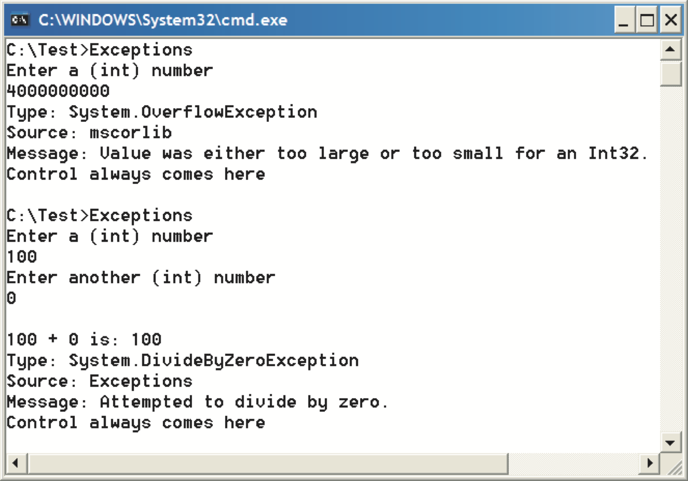
```

System.Exception defines three *overloaded constructors*
(discussed in Section \@ref(Classes1Constructors), six
properties, and six methods. All system-defined exceptions are
derived from the System.Exception class. *User-defined*
*exception* classes are also derived from the System.Exception
class and typically override the methods of the latter. They are
needed in special cases to more intimately customize and address
application-specific exceptions. User-defined exception class name
should follow the naming convention of suffixing Exception to the
class name. They should also implement all the three overloaded
constructors of the System.Exception class for uniformity.
User-defined exceptions are discussed in
Section \@ref(UserDefinedExceptions).

## Chapter Summary
*Syntax* specifies the structure of C\# programs. The
syntactic correctness is usually specified by a grammar. EBNF is a
notation for precisely and succinctly describing the grammar. A
*parser* is a program that validates the syntactic
correctness of C\# programs. You don't directly invoke the parser;
it is typically invoked by the compiler when C\# programs are
compiled. Semantics of a programming language describes the
meaning of various constructs the language offers for program
construction. There are two types of semantics: denotational and
operational.

```{r ExceptionsTree, echo = FALSE, out.width = "75%", fig.align='center',fig.cap="Partial hierarchy of system-defined exceptions"}
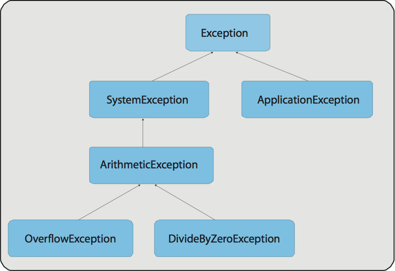
```

C\# offers an assortment of types (both pre-defined and
user-definable) to suit different needs. They are broadly grouped
into *value* and *reference* types. *Pre-defined
value types* include bool, char, decimal, integral types (byte,
sbyte, short, ushort, int, uint, long, and ulong), floating point
types (float, and double); *user-definable value types*
include enum and struct; *pre-defined reference types*
include array, string, and object; lastly, *user-definable
reference types* include class, interface, and delegate. A *
value type* specifies three things: the type of the value, the
range of values that can be stored, and permissible operations.

*Variables* are aliases or symbolic names for memory
locations. Declaring a variable comprises naming the variable and
associating a type with the variable. For efficiency and safety
reasons, it is important to assign a right types to variables.
*Constants* are special variables whose values cannot be
changed once the values are assigned. Namespaces is a mechanism by
which C\# type name conflicts are resolved.

A C\# class consists of one or more of the  following members:
fields, constants, methods, properties, indexers, events, and
operators. Access modifiers are used to control the visibility of
various components of the class. One of the classes in the C\#
program should define the Main() method, which serves as an entry
point into the program.

C\# features a repertoire of operators, which are grouped into
categories: arithmetic, logical, relational, assignment, and
conditional.

The .NET Framework Class Library provides a large assortment of
classes, which can be included in our programs. Several tools
exist to explore the library including IL Disassembler, Windows
Class Viewer, Class Browser Web Application, and Visual Studio.NET
Object Browser.

*Exceptions* are abnormal conditions that occur in a program
during its execution. Such conditions need to be detected and
processed to prevent a running program from crashing. Exceptions
are implicitly raised in the *try* block and are processed in
the *catch* block.

## Exercises
1. Define the terms syntax, semantics, and BNF.

1. Keywords are identifiers that are reserved for special uses. True or false?

1. Which of the following are valid identifiers? For invalid identifiers, explain why they are invalid.

    - Age
    - _price
    - $loan
    - 1bank
    - LoanAmount
    - CUst-Name
    - stockID
    - prodDesc
    - Course#
    - prod&id

1. Which of the following are keywords in C#?

    - price
    - new
    - income
    - int
    - class
    - xyz
    - static
    - void
    - nill
    - public
    - null
    - enum
    - savings
    - enumeration
    
1. Identify each of the following C# types as either value type or reference type:

    - int
    - short
    - ulong
    - double
    - byte
    - enum
    - char
    - float
    - struct
    - decimal
    - string
    - class
    
1. For each of the following data types, give the number of bytes allocated for storing values of the given
   type:

    - char
    - byte
    - short
    - int
    - long
    - float
    - double
    - decimal
    
    
1. For each of the following data types, give the smallest and largest values that a variable of the specified
   data type can store:

    - byte
    - sbyte
    - short
    - ushort
    - int
    - uint
    
         
1. If p = 5, q = 8, and r = 10, evaluate the following arithmetic expressions:

    - p + q * r
    - p + q * r % 10
    - (p + q) * (q - p)/5
    - p * q/r + q % 3
    - p * (q + r)/5 + r % 3
    
1. If p = 5, q = 8, and r = 10, evaluate the following logical expressions:

    - p < 5 & r> 10
    - p < 5 | q == 5
    - p == 5 & q > 5
    - !(p < 5 & q > 5)
    - p < 5 ^ (q < 5 ^ r >= 5)
    - p <= 5 &! (r > 10)
    - p > 5 & (q < 5 ^ r >=5)
    - true & false | true
    - true ^ true & false
    - !(p > 5 | q < 10 ) & (r > 5)
    
1. If p = 5, q = 8, and r = 10, determine the value assigned by each of the following assignment
   statements:

    - p = ++ q + r
    - q = p++ + r++
    - r = --p + --q
    - p = r++ - q--
    - q = --r + p++
    - r = --p - --q
    - p = p + q++
    - q = p-- + r++
    - r = ++p + ++q
    - p = ++r% ++q
  
1. If p = 12, q = 20, and r = 30, determine the value assigned in each of the following statements:

    - p += q + r
    - p *= r-q
    - q %= 3
    - r /= q - p
    - r -= q - p
    
1. If p = 12, q = 20, and r = 30, evaluate the following expressions:

    - p << 5b
    - p >> 2
    - q << 4
    - q >> 3e
    - r >> 2
    - r >> 4
    
1. If p = 10, q = 8, and r = 6, evaluate the following bit-wise operators:

    - p & q
    - q | r
    - p ^ q
    - p & q & r
    - p & q | r
    - p | q & r
    - q ^ r
    - p | q ^ r
    - p | q | r
    - q & r
    
1. If p = 10, q = 8, and r = 6, determine the value assigned in each of the following assignment
   statements:

    - p = r < 10 ? q + 2 : q - 2
    - p = q > ? 5 : 15
    - p = q < 5 ? r * 2 : q * 3
    - p = r > 10 ? q % 2 : p % 3
    - p = q > 5 ? q / 2 : r / 3
    
1. If p = 10, q = 8, and r = 6, evaluate the following expressions:

    - p < 5 && r > 10
    - p < 5 || q == 5
    - p == 5 && q > 5
    - !(p < 5 && q > 5)
    - p > 5 && (q < 5 || r >=5)
    - p <= 5 && !(r > 10)
    - p > 5 && (q < 5 || r >= 5)
    - !(p > 5 || q < 10) && (r > 5)
    
1. Which of the following are valid variable/constant declarations? Give explanation for each invalid
   declaration.

    - int x, y, z;
    - int x = 10, y = 10.5;
    - const float pi = 3.14156;
    - double price = 150.99;
    - char ch = “X";
    - string strMsg = “Peace";
    - public const int count;
    - private static int multiplier = 15.75;
    - protected char gender = ‘M’;
    - public bool flag = TRUE;


1. Match each item on the left with its meaning on the right.

    - void             \   \  - left shift operator
    - using directive  \   \ - Indicate that a method does not return a value
    - int              \   \  - Logical OR operator
    - Main             \   \ - Permit the use of types in a namespace
    - <<               \   \  - Modulus operator
    - &&               \   \  - Keyword used to declare a scope
    - private          \   \  - Short-circuit logical AND operator
    - namespace        \   \ - Access modifier
    - |                \   \  - integer Data Type
    - %                \   \  - Method Name
    
1. Identify and fix errors in the following program:

    using System;
    
    namespace TestApp
    
    {
    
    public class Test
    
    {
    
    public static void Main(string[ ] args)
    
    {
    
    int x, y;
    
    x = 10;
    
    y = 15.0;
    
    Console.WriteLine(“x = {0} y = {1}", x, y);
    
    return x + y;
    
      }
    
     }
    
    }
  
1. Identify and fix the errors in the following program:

    
    using System;
    
    namespace TestApp
    
    { 
    
    public class Test
    
    {
    
    public const double PI;
    
    public string greeting = ’Hello!’;
    
    public static int Main(string[ ] args)
    
    {
    
    int f = 3 * PI;
    
    Console.WriteLine(f);
    
    return;
    
      }
    
     }
    
    }


1. Identify and fix the errors in the following program:

    using System;
    
    namespace TestApp
    
    {
    
    public CLASS Test
    
    {
    
    public static VOID Main()
    
    {
    
    char ch = “Doe";
    
    int x = 10 + 15.75;
    
    Console.WriteLine(“ch = {0} x = {1}", ch, x);
    
      }
    
     }
    
    }


1. What output is generated by the following program?

    using System;
    
    namespace TestApp
    
    {
    
    public class Test
    
    {
    
    public static void Main()
    
    int x = 4, y = 6;
    
    int p = 8, q = 10, r = 12;
    
    x += y;
    
    y *= x;
    
    p /= 2;
    
    r %= 5;
    
    q -= x / 3;
    
    Console.WriteLine(“x = {0} y = {1} p = {2}
    
    q = {3} r = {4}", x, y, p, q, r);
    
      }
    
     }
    
    }
    

1. What output is generated by the following program?

    using System;
    
    namespace TestApp
    
    {
    
    public class Test
    
    {
    
    public static void Main()
    
    {
    
    int x, y, z;
    
    int p = 8, q = 10, r = 12;
    
    x = p & q j r;
    
    y = p j q & r;
    
    z = p & q ^ r;
    
    Console.WriteLine(“x = {0} y = {1} z = {2}", x, y, z);
    
      }
    
     }
    
    }


1. What output is generated by the following program?

    using System;
    
    namespace TestApp
    
    {
    
    public class Test
    
    {
    
    public static void Main()
    
    {
    
    int x = 50, y = 25;
    
    x = x << 3;
    
    y = x > 100 ? x - y : x + y;
    
    y = y >> 5;
    
    Console.WriteLine(“x = {0} y = {1}", ++x, y);
    
      }
    
     }
    
    }


1. What output is generated by the following program?

    using System;
    
    namespace TestApp
    
    {
    
    public class Test
    
    {
    
    public static void Main()
    
    {
    
    int x, y, z;
    
    int p = 8; q = 10; r = 12;
    
    x = ++p + q++;
    
    y = ++x * r++ - p--;
    
    z = --p + y-- * q++;
    
    Console.WriteLine(“x = {0} y = {1} z = {2}", x, y, z);
    
    Console.WriteLine(“p = {0} q = {1} r = {2}", p, q, r);
    
      }
    
     }
    
    }

1. What output is generated by the following program?

    using System;
    
    namespace TestApp
    
    {
    
    public class Test
    
    {
    
    public static void Main()
    
    {
    
    int x;
    
    bool b1, b2, b3;
    
    int p = 8; q = 10; r = 12;
    
    x =p < 10 ? q + 2 : r - 2;
    
    b1 =x < 10 && q > 5;
    
    b2 =r > 10 ? true : false;
    
    b3 =b1 || b2 && (p + q < r );
    
    Console.WriteLine(“x = {0}", x);
    
    Console.WriteLine(“b1 = {0} b2 = {1} b3 = {2}", b1, b2, b3);
    
      }
    
     }
    
    }

1. Name any five predefined system exceptions.

1. What output is generated by the following program?

    using System;
    
    namespace TestApp
    
    {
    
    public class Test
    
    {
    
    public static void Main()
    
    {
    
    int x =10;y = 0; z =0;
    
    try
    
    {
    
    z  =x/y;
    
    }
    
    catch (System.DivideByZeroException ex)
    
    Console.WriteLine(“Division by zero is not allowed!");
    
    }
    
    catch (System.Exception ex)
    
    {
    
    Console.WriteLine(“Sorry, an exception occurred!");
    
    }
    
    Console.WriteLine(“x = {0} y = {1} z = {2}", x, y, z);
    
      }
    
     }
    
    }

1. What output is generated by the following program?

    using System;
    
    namespace TestApp
    
    {
    
    public class Test
    
    {
    
    public static void Main()
    
    {
    
    int x =10;y =0; z =0;
    
    try
    
    {
    
    z =x/y;
    
    Console.WriteLine(“x = {0} y = {1} z = {2}", x, y, z);
    
    }
    
    catch (System.DivideByZeroException ex)
    
    {
    
    Console.WriteLine(“Division by zero is not allowed!");
    
    }
    
    catch (System.Exception ex)
    
    {
    
    Console.WriteLine(“Sorry, an exception occurred!");
    
       }
    
      }
    
     }
    }

1. What output is generated by the following program?

    using System;
    
    namespace TestApp
    
    {
    
    public class Test
    
    {
    
    public static void Main()
    
    {
    
    int x =10;y =0; z =0;
    
    try
    
    {
    
    z =x/y;
    
    }
    
    catch (System.DivideByZeroException ex)
    
    {
    
    Console.WriteLine(“Division by zero is not allowed!");
    
    }
    
    catch (System.Exception ex)
    
    {
    
    Console.WriteLine(“Sorry, an exception occurred!");
    
    }
    
    finally
    
    {
    
    Console.WriteLine(“x = {0} y = {1} z = {2}", x, y, z);
    
       }
    
      }
    
     }
    
    }

1. What output is generated by the following program?

    using System;
    
    namespace TestApp
    
    {
    
    public class Test
    
    {
    
    public static void Main()
    
    {
    
    int x =10;y =5; z =0;
    
    try
    
    {
    
    z = x/y;
    }
    
    catch (System.DivideByZeroException ex)
    
    {
    
    Console.WriteLine(“Division by zero is not allowed!");
    
    }
    
    catch (System.Exception ex)
    
    {
    
    Console.WriteLine(“Sorry, an exception occurred!");
    
    }
    
    finally
    
    {
    
    Console.WriteLine(“x = {0} y = {1} z = {2}", x, y, z);
    
       }
    
      }
    
     }
    
    }

1. What operator is used to create an instance of a class?

1. Write get and set methods for member variables, declared as shown below, of a class that describes a
   product:

    - private int quantity;
    - private string description;
    - private float price;

```{r UInt16Class, echo = FALSE, out.width = "65%", fig.align='center',fig.cap="Exploring UInt16 class"}
knitr::include_graphics("./Images/CSharpBasics/Illus/UInt16Class.png")
```
    
    


## Programming Projects

1. As shown in Table \@ref(tab:CSDataTyp), most of the C\#
   intrinsic data types alias System data types. The latter are
   derived from ValueType class. Use a Class Viewer or Class Browser
   Web application to examine the System data types
   (Figure \@ref(fig:UInt16Class)). Note that UInt16 data type has two
   static constants: MaxValue and MinValue, which specify the range
   of values the data type can store. It has various methods
   including CompareTo(), Equals(), GetType(), GetHashCode(),
   Parse(), and ToString(). Write a program to print MaxValue and
   MinValue of various System types to the console. The program
   should also demonstrate how the above methods can be used.

1. Write a program that reads two integer numbers and outputs
   their sum, difference, product, and quotient.
   
1. Write a program that converts Fahrenheit degrees to Celsius
   degrees. Use the formula $*Celsius* = 5.0 (*Fahrenheit* - 32.0) / 9.0$ 
   for conversion. Input the Fahrenheit temperature as
   a double type value. Output the computed Celsius temperature as a
   double value.
    
    
1. Write a program that reads the radius of a circle and
   computes and displays the area and circumference of the circle.
   Use a C\# constant declaration to represent the value, 3.1415, of
   $\pi$.
   
1. Write a program that reads the length and the width of a
   rectangle and computes the area and the perimeter of that
   rectangle. Display the length, width, and the computed area and
   perimeter.
   
1. Write a program that inputs number of seconds and converts
   it to an equivalent number of hours, minutes, and seconds. Use
   division and modulus operators to accomplish this. An example
   output is: 4540 seconds  =  1 hour,  15 minutes,  40 seconds
   
1. Write a program that reads principal amount, rate of
   interest, and length of time in years, and computes simple
   interest using the formula interest = principal $\ast$ rate $\ast$
   time. Display the computed interest.
   
1. Write a program that reads hourly pay rate and hours worked.
   Compute and display the gross pay, taxes paid, and net pay. Use
   10% as rate of tax.
   
1. Write a program that reads distance travelled in miles
   during a trip, miles per gallon, and the cost of gas per gallon.
   Compute and display the cost of the trip.
   
1. Write a program that reads a four digit number and displays
   the digits in the number one per line. Use division and modulus
   operators to accomplish this. For example, the number 4523 will be
   displayed as follows:

    - 4
    - 5
    - 2
    - 3
    
1. Write a program that reads the first name and the last name
   of a person and displays the output as follows (if John and Doe
   are input as first name and last name):

   Hello John Doe, Welcome to the world of C\# and .NET!
   
1. Write a program that reads the values of constants $a, b$,
   and $c$ of a quadratic equation of the form $ax^2 + bx + c = 0$.
   Compute and display the roots of the quadratic equation. Use the
   following formulae to compute the roots: $\mbox{root}_1 = \frac{-b + \sqrt{b^2 - 4ac}}{2a}$
   and $\mbox{root}_2 = \frac{-b -\sqrt{b^2 - 4ac}}{2a}$
    
1. Write a program that reads the value of the variable $x$ in
   the polynomial $7x^2 + 4x + 5$  and displays the value of the
   polynomial.
   
1. Write a class named *Product* with the following member
   variables with private access level: *id*, *name*, and
   *price*. Provide public *get* and *set* methods for
   each of these member variables. Equip your class definition with a
   Main method which creates an instance of the Product class, sets
   each of its member fields, and displays the product details by
   invoking the appropriate get methods.
   