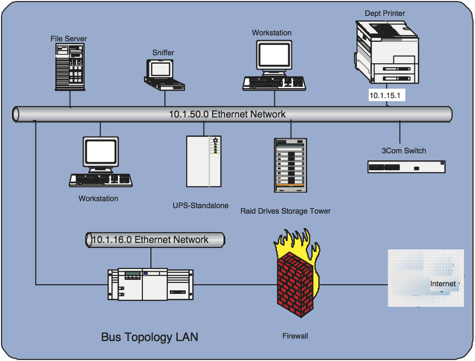

# Panormic View of Computer Science {#Pano}
Computer Science has been one of the fastest grown disciplines
during the last few decades. The growth and innovation has been
phenomenal. Computing power that was encased into multi- million
dollar, mammoth size IBM Mainframe computers of the 1960s is made
available today in laptop computers. Advent of the World-Wide Web
(WWW) in 1993 has spurred even more interest in computers and
indeed they have become a household name. It is quite uncommon not
to find a computer on  the desks of employees of organizations.
Productivity software such as word processors and spreadsheets
that run on these desktop computers has become a commodity item.
Computers have become an integral part of our personal and
societal life directly and indirectly. They are being used for
tasks ranging from home security alarm systems to running
airplanes and nuclear power plants.

As impressive as the advances in computing discipline are, there
are different views on what exactly is computer science. Is it a
science? Or, is it an engineering discipline? Or yet, is it an
art? All of these view points seem equally valid given one's
exposure and experience of the discipline. It is a science because
of its rigorous mathematical underpinnings and its core is rooted
in computability theory, formal languages, and algorithmics, among
others. It is an engineering discipline in that precise
engineering design and micro-manufacturing processes go into the
making of the computers. Those that had the fortune of building
and maintaining complex, enterprise-scale applications will attest
to the fact that software development is by far carried out as an
art form practice rather than as an engineering practice.

Before we embark on our study of computer science, in light of the
above observations, it is imperative that we answer the question
of precisely what body of knowledge constitutes the computer
science discipline. We expect the answers to this question
identify the core concepts and practices in computer science. It
would be an added bonus if the answers also include the types of
problems that computers have been used to solve and how the
solutions have been developed. Therefore, objectives for this
chapter are to:

- Provide a conceptual description of subjects areas of
computer science that are collectively regarded as representing
the core principles and practices in the discipline.

- Describe various classes of computers and their intended
use.

- Explain types of system software and their functions.

- Explain embedded software and its applications.

- Discuss various application software and the problems that
they solve.

- Provide an overview programming language concepts and
describe programming paradigms.

- Introduce the concept of abstract machine hierarchy.

## Facets Of Computer Science {#Facets}
There seems to be no consensus on precisely what body of knowledge
constitutes the discipline of computer science. Even if such an
agreement were to exist, it is subject to change due to
technological innovations and the range of problems that have been
solved using a computer. The Joint Task Force on Computing
Curricula 2001 has identified the following areas:
Discrete Structures, Programming Fundamentals, Algorithms and
Complexity, Architecture and Organization, Operating Systems,
Net-Centric Computing, Programming Languages, Human-Computer
Interaction, Graphics and Visual Computing, Intelligent Systems,
Information Engineering ^[The Joint Task Force on Computing
Curricula 2001 refers to this subject area as Information
Management. However, we think that it is a misnomer.], Software
Engineering, Computational Science and Numerical Methods, and
Social and Professional Issues. In the following subsections, each
of the subject areas is described in some detail. It should be
noted that the subject area boundaries are rather fluid and tend
to change with time and technological advances.

### Discrete Structures
Discrete Structures is to Computer Science what Calculus is to all the engineering disciplines.
No engineering student can expect to master the discipline without a thorough knowledge of Calculus. 
In a similar vein, the study of Discrete Structures is fundamental to the
study of Computer Science. Discrete Structures is the study of mathematical problems concerning
finite or discrete sets. It provides many different mathematical models that have
direct relevance to the problems encountered in Computer Science and Operations Research.
These mathematical models can be described using finite sets and their structures. In contrast
with Calculus, where the phenomenon of interest is continuous — air flow around the
wings of an aircraft, pressure distribution across the thickness of a water pipe — Discrete
Structures focuses on modelling and analyzing the phenomenon that is intrinsically discrete
in nature. Discrete Structures encompasses the study of Sets, Relations, Functions, Mathematical
Logic, Combinatorics, Discrete Probability, Digital Logic and Digital Systems, and
Algebraic Structures. Other topics such as Formal Languages, Algorithm Analysis and Computational
Complexity, Graph Theory, and Trees are also within the realm of Discrete Structures.
The latter body of knowledge is often considered as application of Discrete Structures
to Computer Science.

The concept of a set, set operations and structures — union, intersection, difference,
complement, subsets, sequences, partitions, relations between sets, functions that map elements
from one set to another — are fundamental topics in Discrete Structures. Relations
between elements of sets is the foundational basis for relational data model. The industry
standard language for querying relational databases—SQL (Structured Query Language)—
is based on set theory. The rules of logic are used in writing computer programs, in designing
computer chips, and in the construction of mathematical proofs. Mathematical induction
is another proof technique that is widely used in Computer Science. It can be used, among
other things, to show that a program with loops performs as expected. Combinatorial techniques
are used in enumerating all possible solutions to a problem and has direct application
to optimizing queries in relational databases. Using a mathematical theory of probability,
one can compute the likelihood of complex events occuring under the assumption that the
events are governed by appropriate axioms. Discrete probability is computed by summing
(instead of integrating as in the case of continuous probability) the probabilities of individual
events comprising a complex event.

A sequence is an ordered list of objects drawn from a set. A
*binary sequence* is a sequence whose elements are drawn from
the set \{0,1\}. All data and programs are encoded as binary
sequences for execution on a computer. Binary arithmetic is used
to manipulate data and programs by a computer and is the basis for
digital logic and digital systems. Computational complexity theory
is an area of theoretical computer science concerning *what*
problems can be solved by  *any* computer. On the other hand,
algorithms study is concerned with devising efficient and
effective algorithms for solving a given problem.

### Programming Fundamentals
This area of Computer Science is concerned with developing computer programs. It encompasses
the study problem solving techniques; algorithm design and analysis; structures for
representing data; control structures as elementary building blocks in program construction
and as a means to effect flow of control in program execution; debugging and testing strategies
to insure correctness of programs, abstraction mechanisms for constructing programs;
and abstraction and encapsulation mechanisms for packaging programs into functional components.

It is also concerned with  *programming paradigms* --- a set
of well defined and proven high-level algorithmic steps useful in
naturally solving a class of problems that exhibit certain common
characteristics --- and the programming languages that support the
paradigms. Imperative, object-oriented, event-driven, and
functional are different programming paradigms.  Program
translation from a high-level language to a language that
computers understand is also within this realm.

### Algorithm and Complexity
Solving problems has been the hallmark of human endeavor since
times immemorial. Typically a problem has input. For example, if
the problem is ``Find directions to drive from Dayton, OH to
Detroit, MI," the inputs are Dayton, OH and Detroit, MI. A
solution to this problem is precisely specified directions to
drive from Dayton to Detroit. Solution is also referred to as the
output. An algorithm describes the *process* of turning
inputs into output. It is a precise specification of the process.
The specification is in terms of a series of steps. Each step
contributes to the solution. The steps should embody computation
that is feasible. The algorithm should contain a finite number of
steps so that the algorithm is guaranteed to terminate. We would
like the algorithm to be *efficient* --- get the work done in
the least amount of time possible. We would also like the
algorithm to consume as minimal amount of resources as possible.
If an algorithm is executed by a computer, the resources are
memory and processor cycles. Finally, we want the algorithm to be
*generic* --- should be able to find driving directions
between any two pairs of cities and not just between Dayton and
Detroit. An algorithm can be executed by a human, a robot, or a
computer. Algorithms and Complexity area of Computer Science is
concerned with identifying what types of problems are amenable for
algorithmic solutions, and devising suitable algorithms that are
both effective and efficient.

### Computer Architecture and Organization
A computer is a complex system comprising of multiple subsystems
--- processor, memory, input/output devices, sensors. Each
subsystem in turn can be composed of several other components. A
communication mechanism is also needed to enable these subsystems
to cooperatively execute tasks. Computer architecture refers to
the design principles employed in selecting and configuring the
various components to produce a computer with the desired
functional and performance characteristics. An architecture is
*open* if its design principles are based on a framework that
is not rigid and conforms to industry standards. Open
architectures enable building computers by mixing and matching
off-the-shelf components from different vendors. A *closed architecture* 
system is one that is based on a proprietary design
and cannot easily connect to other vendor components or systems.

Differences in the architecture, functional capabilities and
performance characteristics of the subsystems entail in classes of
computers --- tablet computers, laptops, desktops, workstations,
servers, mainframes, and supercomputers. Each class is intended
for solving a set of problems or for use by a segment of the
computer user population. Computers, in general, have the
following components: Central Processing Unit (CPU), memory,
input/output (I/O) devices, and a bus to interconnect these
components (See Figure \ref(fig:LANDetail).

This area is also concerned with the programmability aspects of
the computer at the machine level. *Firmware* is a collection
of programs that control the components within a subsystem.
Firmware is used to control and coordinate the processor
components to effect the execution of programs written in the
machine language. Firmware programs are permanently stored in Read
Only Memory (ROM) since they don't change over time.

#### Central Processing unit (CPU)
CPU is composed of Arithmetic and Logic Unit (ALU), and Control
Unit (CU). As the name implies, ALU performs basic arithmetic
operations (addition, subtraction), moving data from one location
(register) to another, and logical operations such as *AND*,
*OR*, and *NOT* on binary strings. ALU can also perform
relational operations ($=, <>, <, \leq, <, \geq$) on numbers and
strings. A CPU is designed to execute a pre-defined repertoire of
machine instructions, referred to as its *instruction set*. A
machine language program is a sequence of machine instructions
assembled to solve a problem. CPU is capable of understanding and
executing its machine language programs.

Advances in microelectronics have led to creation of the entire
CPU on one or a small number of integrated circuits; computers
with such CPUs are known as *microprocessors*. Computational
speed of a CPU is designated in terms of *clock rate* or
*cycles per unit time*. Some machine instructions are
executed in one CPU cycle time, while other may require multiple
CPU cycles. The clock rate of a computer is normally determined by
the frequency of a crystal. The original IBM personal computer had
a clock rate of 4.77 MHz (close to five million cycles/second).
Some recent Intel's Pentium chips run at 2.4 GHz  (close to 2.5
billion cycles/second). The clock rate of a computer is only
useful for providing comparisons between computer chips in the
same processor family. Clock rate should not be used when
comparing different computers since the amount of work different
computer chips can do in one cycle varies. In addition to clock
rate, there are many other factors to consider when comparing
different computers.

#### Memory
Memory is used to store computer programs and as a scratch pad for
storing the intermediate results of a computation. Random Access
Memory (RAM) is a type of memory, which is fast and expensive
relative to other types. The term *random access* means that
access to any piece of information in RAM takes the same amount of
time. RAM is volatile --- when the power is off the data
disappears. RAM is referred to as *primary memory* or
*primary storage device*. Other types of memory medium or
devices include *registers*, *cache*, *magnetic disks*,
*magnetic tapes*, *optical disks*, and
*CD-ROM* (see Figure \ref{fig:MHierarchy}.

#### Input/Output (I/o) Devices
I/O devices are used to bring data into the computer and move the
data out of the computer. Common I/O devices include the
ubiquitous keyboard, monitor (or computer screen), mouse, (hard or
magnetic) disk drive, tape drive, CD-ROM (Compact Disk - Read Only
Memory), CD-RW (Compact Disk - Read Write), scanner, and printer.
Others include Network Interface Card (NIC), optical disks, video
and audio capture devices, and sensors of various kinds. Unlike
RAM, data stored in magnetic disks and CD-ROM is non-volatile.
Information can be erased and rewritten to magnetic disk over and
over. Such I/O devices are known as *read-write*. CD-ROM, on
the other hand, allows writing information only once but it can be
read any number times. Such devices are referred to as WORM (Write
Once Read Many). CD-RW is like a magnetic disk --- data can be
erased and rewritten. However, CD-RW is smaller in storage
capacity and takes longer to access the data.

Since access to data on disks takes relatively longer time
compared to RAM memory, they are referred to as *secondary storage devices*.
Optical disk is another type of storage device
for storing large amounts of data. Since optical disk and tape
device access times are even greater than that of magnetic disks,
they are referred to as *tertiary storage devices*. Because
large amounts of information can be stored on disks and CD-ROM,
they are also known as *mass storage devices*. It should be
noted that magnetic disks, optical disks, and CD-ROMs are random
access devices, whereas tape drive is a *sequential-access*
device. Information can be read from a sequential-access device in
the sequential order --- to read data item $n,$ the first $n-1$
data items need to be skipped over. The distinction between
random-access and sequential-access devices is akin to that
between an audio CD and audio tape.

#### Bus
Bus is an integral part of any computer and is used to transmit
data, address, and control information among the components. There
are busses within the CPU. Buses are also needed to connect the
CPU to external memory and peripheral devices. Depending on the
type of data they transmit, they are referred to as *data*
*bus*, *address bus*, and *control bus* (see
Figures \@ref(fig:Buses1) and \@ref(fig:Buses2). Despite their
names, they are really a single bus since any one is useless
without the others. Width of a bus is its structural
characteristic and designates number of parallel connectors. The
wider the bus, the more information it can transmit. Both the bus
width and its clock rate determine its *data rate* --- the
number of bytes it can transmit per second. Most current
microprocessors have 32-bit busses with a clock rate of 100 or 133
megahertz (MHz). The bus clock is typically slower than the CPU
clock. Various bus designs have been used in personal computers,
including ISA, EISA, Micro Channel, VL-bus and PCI.

### Operating Systems {#OS1}
An Operating System is a program that interfaces between the user
and the computer, application programs and the computer. It is the
most important program and is entrusted with great many
responsibilities. Every general-purpose computer comes with an
operating system. Windows XP and UNIX ^[There are many
flavors of UNIX such as Sun OS, IBM AIX, HP UX, and Linux.] are
two operating systems that are widely used.

#### Characteristics
Operating systems are characterized by attributes such as
*multi-user*, *multi-processing*, *multi-tasking*,
and *multi-threading*. A multi-user operating system permits
several users to use the computer concurrently and each user is
allowed to execute several programs concurrently. A
multiprocessing operating system enables running a program using
multiple processor on the same computer. Multitasking endows an
operating system with the capability to run multiple programs
concurrently. Multitasking capability is a prerequisite for
multi-user operating systems. Multithreading characteristic allows
running different parts of a single program to run concurrently,
possibly on different processors. A real-time operating system is
one that has a predictive behavior --- responds within a specified
interval of time. They are are used in embedded systems for
managing, for example, nuclear power plants.

#### Functions
An operating system performs multiple functions in different roles
--- security manager, process manager, command interpreter,
resource manager, scheduler, file system manager, among others. As
a security manager, it is responsible for insuring that only
authorized users can access the system and execute only those
functions that they are entitled to. A program in action is called
a process. A program needs resources such as the processor and
memory to become a process. As a process manager, the operating
system is responsible for assigning the required resources to the
processes, starting and terminating them, insuring that processes
execute without interfering with each other and share common
resources in a mutually exclusive manner when needed. Users and
programs interact with the operating system through a set of
commands and *system calls*. For example, commands exist for
copying, renaming, and deleting a file. The part of the operating
system that intercepts and processes these commands is called a
*command processor*, *command line interpretor*, or
*shell*.

IN resource manager's role, it a responsible for managing the
system resources (processors, memory) and the peripheral devices
(e.g., disk systems, printers, keyboard, mouse) and providing
access to them for users and programs via application programming
interfaces. The operating system also takes on the responsibility
of scheduling requests for processors, disks, and printers. As a
file system manager, it is responsible for allocating space for
user and application files, organizing and keeping track of files.
Most of the operating systems feature a hierarchical file system
in which files are grouped into directories and directories form
an inverted tree structure. Another important function of an
operating system is to provide mechanisms for processes to
communicate with each other  --- InterProcess Communication (IPC).
Techniques such as *shared memory* and *messaging* are
used for IPC.

An operating system usually provides a set of utility programs.
These utilities vary from simple text editor, to text formatters,
to compilers and sophisticated program debugging tools. Especially
the UNIX operating system comes with a powerful set of utility
programs. The latter can be strung together using a scripting
language to accomplish significant tasks without writing any
programs at all.

### Net-Centric Computing
No matter how powerful a computer is, by itself its use is rather
limited. The real power of computing comes into play when two or
more computers can communicate and collaboratively solve complex
problems. A group of computers that are connected via a
communication mechanism is referred to as a *computer*
*network*. Each computer in a network is called a *node*.
There are different types of networks including local area
networks (LANs), wide-area networks (WANs), campus-area networks
(CANs), metropolitan-area networks (MANs), and home-area networks
(HANs).

#### LANs
omputers on a LAN are geographically close together, more often
reside in the same building. Each node on a LAN has its own CPU
with which it executes programs. A node can also access other
nodes on the LAN. This enables sharing expensive resources such as
plotters and color printers among the LAN users. Similarly, files
can also be shared. LAN users can communicate with each other via
e-mails and instant messengers. There are many different types of
LANs. Best known among them are *Ethernets* for desktop
computers and workstations, and *AppleTalk* for Macintosh
computers.

LANs are differentiated based on topology, protocols,
architecture, and media. *Topology* refers to geometric
arrangement of nodes in the network. There are different
topologies --- ring, bus, star, point-to-point. Bus topology LAN
is shown in Figure \@ref(fig:LANDetail). *Protocols* are the
rules for communication between the nodes including the type of
error checking to be used, data compression method, how the
sending device will indicate that it has finished sending a
message, and  how the receiving device will indicate that it has
received the message. LAN *architecture* refers to how the
nodes collaborate in accomplishing a task: peer-to-peer and
client-server are two such architectures. *Media* refers to
either physical (e.g., twisted-pair wire) or non-physical (e.g.,
radio waves for wireless networks) medium that is used to connect
the nodes. Other physical media choices include coaxial and fiber
optic cables.

(\#fig:LANDetail)Bus Topology LAN

One LAN can be connected to another LAN over any distance using a
suitable media. A system of LANs connected in this way is referred
to as a WAN. Internet is a best example of a WAN in existence.
Thus, Internet is a mammoth network of networks and connects
millions of computers globally. Any computer connected to the
Internet can communicate and exchange data with any other computer
on the Internet subject to security constraints.

#### CANs, MANs, and HANs
Nodes in a CAN are limited to a geographic area, such as a
military base, an industrial area, or a campus. MANs are networks
designed for a city or town. HANs refers to a network contained
within a user's home that connects home computers, DVD players,
home security systems, and ``smart" appliances. Like any other
engineering task, network design involves careful tradeoff between
various facets --- topology, protocols, architecture, and media.
For example, in case of protocols, some are simpler than others,
some are faster, while other are more reliable.

#### Application Architectures
A computer network unfolds several distributed architectures for
developing applications --- Client-server, Multi-tier, Web-based,
Services-based. *Client-server* is an application
architecture where a specific computer is designated as the server
which provides a specialized service centrally. Print servers,
file servers, and database servers are examples of this category.
Clients are other programs or computers which request services of
the server. Typically the server and the clients are connected
using a LAN and the computers themselves can be of disparate
types. Client-server architecture is an example of *two-tier*
(application) *architecture*. The server constitute one tier
and the clients constitute the other tier.*Multi-tier*
*architecture* is a generalization of two-tier client-server
architecture. A node can act as a server under one context and as
a client in another context. In a service provider role the node
acts as a server, and in service requestor role it acts as the
client. The nodes in a multi-tier architecture are typically
confined to a LAN or WAN.

Web-based architecture takes the multi-tier architecture to the
next level by removing the requirement that the nodes be confined
to a LAN or WAN. Any node on the World-Wide Web (WWW, or simply
Web) can be a service provider or service requester, or both. It
should be noted that Internet and WWW are not synonymous. Web is a
way of accessing documents on the Internet using HTTP (HyperText
Transport Protocol). Such documents are formatted using a markup
language called HTML (HyperText Markup Language). The Web also
enables accessing other types of documents including animations,
audio and video clips, and graphics. Not all the Internet servers
participate in the WWW. Internet is also used for transmitting
e-mail using *SMTP* (Simple Mail Transport Protocol), Usenet
news groups, FTP (File Transfer Protocol), and instant messaging.
Every computer that communicates over the Internet is assigned an
*IP address*. This address uniquely identifies the computer
and distinguishes it from other computers on the Internet. An IP
address is 32 bits in length.

Web servers are specialized  computers that process requests for
information sent over the Web using the HTTP protocol. Microsoft
Internet Information Server (IIS), and Free Software Foundation's
Apache are well-known Web servers. Web browsers are programs that
are used to navigate the Web and to render the HTML documents.
Netscape Navigator and Microsoft Internet Explorer are two popular
Web browsers.

#### Security
Security is one of the greatest challenges in this area and is
critical to *electronic commerce* (e-commerce) applications.
It is of two fold. The first one is authenticating the identity
and determining the entitlements of the requester. The second one
is to insure that the data is transmitted in an encrypted form and
unauthorized users don't siphon off the data using sniffers.
Effective tools and techniques for network management ---
monitoring the network for node failures, network congestion,
sabotage, and attacks --- are equally important. *SNMP*
(Simple Network Monitoring Protocol) is a protocol for this
purpose.

Recent advances in multimedia technologies coupled with Web-based
architecture contributed to the emergence of new applications for
distance learning, distributed collaborative problem solving, and
net meetings.

#### Web Services
The most recent distributed computing architecture aims at
programming the Web. Under this scenario, a software application
is ``weaved" by composing services from different servers on the
Web. For instance, a word processor application is composed by
making use of three service providers --- one provides a text
editor, the other provides a formatting engine, and yet another
provides a spell checker. Industry converging on standards like
SOAP (Simple Object Access Protocol), UDDI (Universal Description,
Discovery, Integration), XML (eXtensible Markup Language), and
WSDL (Web Services Description Language)  is helping to propel
services-based distributed computing towards a reality.

### Programming Languages {#PL1}
This realm of Computer Science is concerned with designing
programming languages for encoding algorithmic solutions so that
the latter can be executed by a computer. Solving a problem using
a computer is a two step process. First, a suitable algorithm need
to be devised. Second, the algorithm is expressed in a language
that the computer understands. Such languages are called
programming languages. Natural languages --- for example, English
--- are too complex for a computer to comprehend. Furthermore,
algorithm steps expressed using a natural language may lack
precision and thus entail ambiguity. A programming language, on
the other hand, has a unique set of keywords that it understands,
a well-defined syntax and semantics, and control structures.
Syntax refers to the grammatical rules of the language governing
the construction and organization of program statements. Semantics
refers to the meaning of various statements in the language from
the computation point of view. Control structures direct the order
of execution of statements in a program.

Languages such as COBOL, FORTRAN, Visual Basic, C++, Java, and C\#
are referred to as *high-level programming languages*. Their
syntax and programming constructs available for organizing program
instructions are at a higher level of abstraction. Programs can
also be written using a machine language. Such programs are
amenable for direct execution on the computer. However, machine
languages feature a lower level of abstraction and a machine
language program is simply a string composed of binary digits 0
and 1. Programs written in high-level languages are translated
into machine language by a program called the *compiler*.
Languages that fall between machine languages and high-level
languages are called *assembly languages*. Though assembly
languages are similar to machine languages, they are relatively
easier to program since they allow substituting symbolic names for
binary numbers. An *assembler* is a program which translates
assembly language programs into machine language. Even today some
programs are developed in assembly language since the latter
offers direct access to a computer's memory structures and results
in efficient programs in terms of execution speed.

There is a class of languages above the high-level languages
called the *fourth-generation languages*. They are typically
intended for use by non-programmers. Users declaratively specify
*what* needs to be accomplished as opposed to *how* it
can be accomplished.

There exists a multitude of programming languages. Which language
is appropriate for a given task depends on various factors. Every
language has its strengths and weaknesses and is designed for use
in solving a specific class of problems.Section \@ref(PLOverview)

### Human-Computer Interaction
Human-Computer Interaction (HCI) is a discipline concerned with
the study, design, construction, and implementation of
human-centric interactive computer systems. HCI's scope is more
than just designing and implementing Graphical User Interfaces
(GUIs) and menus that are intuitive and easy to use. It is a very
broad discipline and draws upon ideas and advances in sociology
and anthropology, psychology, linguistics, and ergonomics.
Sociology and anthropology address the issues that arise out of
interactions between work and organization, and technology. It is
also concerned with the way human systems and technological
systems adapt to each other. Psychology comes into play to make
the user interaction more intuitive by modelling human cognitive
processes and the behavior of the users. Linguistics role is in
the development of natural and machine languages and the interplay
between the two. Ergonomics is the study of physical design of
workspace, lighting, chair, keyboard, physical screens or
monitors, and related peripheral devices, and the manner in which
people work and interact in such a space or environment. Ergonomic
design is vital to insure the safety of computer users from
problems such as repetitive stress syndrome.

Early computer systems provided a simple character-based
interfaces using a keyboard. Then GUIs and menus became popular
user interfaces and mouse was the preferred device to navigate
these interfaces. Graphics and image processing systems employed a
device known as *graphics tablet* to effect direct
interaction with a graphic or image, whereas game systems employed
*joy stick* as the device for interacting with the game
programs. Point of Sale (POS) systems, Personal Digital Assistants
(PDAs), Kiosks, Automated Teller Machines (ATMs) employ a
combination a simplified keyboard, pen or stylus, and touch panels
as means for providing the user interfaces.

The advent of the Web and advances in multimedia technology
brought additional challenges to the HCI. Interfaces for Web
applications should be designed as interfaces for the masses ---
intuitive and easy to use, require little or no training, minimize
the likelihood for making mistakes, recover gracefully from user
interaction mistakes. Interacting with multimedia data --- text,
images, graphics, audio, video, animation --- demands innovative
interfaces that are intrinsically suited to the type of media. For
example, images can be queried based on color, texture, type of
objects contained in the image, object's shape, spatial layout of
the objects, and a combination of these. To query images based on
some of these characteristics, an user interface that allows the
user to sketch a query --- query by example --- maybe a logical
choice. As computers become more entrenched in our society, HCI
assumes even a greater role in looking for ways and means to
making the interaction with the computer systems more intuitive,
efficient, and safe.

### Graphics and Visual Computing {#GVC}
This facet of Computer Science deals with generation, capture,
processing, manipulation, display, and printing of visual
information. There are three subareas: Computer Graphics, Images
and Video, and Visualization. There are two major aspects to the
study of these subareas --- physical devices that are used for
generating, capturing, and displaying/printing of visual
information, and the software programs that are used to process
and manipulate the visual information for various purposes.

#### Computer Graphics
Computer Graphics is concerned with generating synthetic images
and rendering them to look realistic. There are four broad
categories of graphics software: Paint programs, Presentation
graphics, Illustration graphics, and Design graphics. Paint
programs are low-end graphics programs that are used to create
freehand drawings. The drawings are stored in a raster-based
format such as bitmap and can easily be edited. Microsoft Paint is
an example of this category. Presentation graphics are programs
that are used to create graphics that are typically used in slide
shows and reports
--- bar charts, pie charts, line graphs, scatter plots. The data
for these graphics can be imported from spreadsheet applications
such Lotus 123 or Microsoft Excel. Spreadsheet programs themselves
have capabilities for producing most commonly used charts and
graphs. Illustration graphics software sports more advanced
features that are often required in engineering drawing and
graphic arts. Adobe Illustrator and CorelDraw are well-known
programs in this category. Design graphics software is the most
advanced and sophisticated among the graphics programs. It is
primarily used by engineers for designing automobiles, aircraft,
ships, computer chips, and various sorts of machine parts. Design
graphics software is known as CAD (Computer Aided Design)
software.

#### Images and Video
In contrast with the computer graphics, images and video subarea focuses on capturing images
of an existing artifact and processing them for various purposes. Processing is done
for improving the visual appearance of an image (e.g., photo touch up using programs such
as Adobe Photoshop), restoring a degraded image to its original form (typical of remotely
sensed satellite imagery),and extracting features and measuring them (as done in medical
imaging to aid in disease diagnosis).

#### Visualization
Visualization involves the study of techniques for revealing meaning hidden in the data. It
offers techniques for exploring, analyzing, and communicating information about the data.
Scientific visualization refers to communication of knowledge via visualization techniques.
Animation is related to visualization, and involves showing several graphics or images in
quick succession to simulate motion. Animation techniques are widely used in applications
such as flight simulators, arcade games, and movies.

#### Common Issues
The following issues transcend all the three subareas. Graphics and image data tends to
be voluminous and processing is memory- and processor-intensive. Typically images and
graphics are transmitted in compressed format for efficiency reasons. Applications that support
graphics and images require powerful workstations or specially designed graphics workstations.
The pervasiveness of graphics and images has resulted in large graphics and image
repositories. This has necessitated the need for powerful yet flexible retrieval techniques to
identify and retrieve relevant images from the repositories.

### Intelligent Systems
This branch of Computer Science is concerned with various aspects
of developing computer systems that exhibit human-like intelligent
behavior. Cognitive tasks performed by humans are of two kinds ---
commonsense tasks and expert tasks. *Commonsense tasks* are
the ones such as conversing in a natural language, and walking.
*Expert tasks*, on the other hand, require a great deal of
domain expertise. Writing a technical paper, diagnosing diseases,
and performing surgery are examples of expert tasks.

Initial investigations in this area were on game playing, natural
language translation and understanding. Impressive advances were
made recently in game playing. A chess program running on an IBM
supercomputer defeated world chess champion Gary Kasparov in a
match in 1997. Natural language processing offers the greatest
potential rewards especially in the area of human-computer
interaction. However, the problem remains elusive to date.

Machine learning, visual perception and image understanding,
robotics, and knowledge-based expert systems also subsequently
came under the realm of intelligent systems. *Machine*
*learning* aims at designing strategies and techniques for computer
programs to learn from examples and experiences. Neural Networks
are learning systems that simulate human intelligence by
attempting to reproduce the types of physical connections that
occur in biological brains. They made significant inroads in a
number of disciplines such as voice recognition, pattern
recognition and classification.*Visual perception and image*
*understanding* deals with endowing computer systems (e.g., robots)
with human-like vision capabilities so that they can navigate the
physical space which is possibly hazardous for humans
--- nuclear power plants, areas infested with biological weapons
--- understand the scene, and perform useful actions. The present
state of the art in robotics is limited to using them in a highly
controlled environments for repetitive tasks --- configuring and
packaging products in factory assembly lines.
*Knowledge-based systems* or knowledge-based expert systems
is an umbrella term to refer to a class of programs which
configure and perform according to the domain knowledge made
available to them.

#### Knowledge Representation and Inference
Central to the domain of intelligent systems are the concepts of
knowledge representation and inference. Domain knowledge is one of
the prerequisites for intelligent behavior. Therefore, a principal
task in building intelligent systems is encoding or representing
the domain knowledge into suitable data structures. Inference
rules encode the reasoning methods --- deriving new knowledge from
the existing knowledge --- associated with the knowledge
representation schemes. If representational details are omitted,
there are three main approaches for knowledge representation:
slot-and-filler structures, logical formulas, and production
rules. Under *slot-and-filler structures* method, the domain
of discourse has certain domain objects. Slots are attributes
which are used to describe the properties of domain objects.
Fillers are the values assigned to these attributes for a specific
instance of the domain object. The domain objects are cast in a
hierarchical tree-like structure to capture the relationships
among the objects. Inference is effected by matching the values
that represent the task context with relevant part of the tree
structure and traversing the tree up and down based on the domain
object relationships.

In the second approach, *logical formulas* are used to
describe the domain objects and to capture the relationships among
them. The formal power of logical theorem proving is used to infer
new knowledge. However, this may result in combinatorial explosion
--- number of choices to choose from at each step of a solution is
large and all choices need to be systematically explored to arrive
at a solution --- renders the method impractical. In the last
approach, domain knowledge is represented as production rules.
*Production rules* are of the form: *IF* condition(s)
*THEN* action(s). For example, in the domain of disease
diagnostics, conditions represent various symptoms and the action
part specifies what the disease might be. The action part may
include a weight (in the range 0 to 1), known as *certainty*
*factor*, to indicate the degree of faith in the recommended
action.

#### State Space Search
A prerequisite for solving problems is that they must be precisely
defined. *State space search paradigm* is a powerful,
general-purpose framework for rigorously defining the problems.
Problem definition, under this framework, encompasses five steps:
defining state space, the initial state(s), the final or goal
state(s), rules that govern transitions between the states, and
heuristic knowledge such as preferred or recommended transitions
between the states under different contexts. Then, a solution to
the problem is finding a path through the state space beginning at
an initial state and ending at an end state. As an example, for
board games such as chess, state space is the chess board
configuration. Initial state is how the pieces (i.e., soldiers,
knights, pawn, queen, king) of the two players are positioned on
the board at the beginning of the game. Goal state(s) are the
positions in which opponent's king has been captured. Rules are
the legal moves of the chess game, and the heuristic knowledge are
the functions that evaluate board positions to assess their chance
that they will lead to a win, standard opening moves, etc.

Though there exists several programming languages for constructing
intelligent systems, LISP and Prolog are the well-known ones.

### Information Engineering {#IE}
Information Engineering addresses issues related to structuring,
storing, and retrieval of structured, unstructured, and
semi-structured data. It is also concerned with transforming data
into information. Volume of data considered here can be in the
order of terabytes (A terabyte is $2^{40} = 1,099,511,627,776$
bytes.).*Structured information* has well-defined structure
and semantics. For example, a collection of employee records is a
piece of structured information. An employee record may consist of
first name, last name, address, date of birth, title, and salary.
Collection of such records can be stored in a file or a database
table and retrieved based on various criteria such as: names of
employees whose salary exceeds \$50,000. It is assumed that the
attributes first name, last name, address, date of birth, title,
and salary capture all the information of interest about an
employee. Using data modelling techniques, one can determine
information entities or elements, their attributes, constraints on
the entities, relationships between the entities to meet the
information needs of an organization. The resulting artifact is
referred to as a *data model*. In other words, data model is
an abstraction for describing the information elements, their
semantics and constraints, and the relationships among the
elements.

#### Structured Information
Initially file systems were used for managing the structured information. File system have
several shortcomings. Database Management Systems (DBMS) were introduced to remedy
these shortcomings and to deal with massive amounts of data. DBMS provides a secure,
shared, and concurrent access to the data, eliminates data redundancy (i.e., avoids storing
multiple copies of the same data) and the concomitant inconsistency problem, enforces integrity
constraints on the data (e.g., an employee’s salary can never be a negative number),
provides transactional capability (ability to treat several database operations as one logical
operation at the application level), and automatically recovers from software and hardware
failures. An overarching design objective for a DBMS is to provide *data independence* --—
the ability to change the database structures without changing the applications that use the
database.

#### Unstructured Information
Unstructured information, on the other hand, has no well-defined structure and semantics.
For example, consider a collection of technical research papers. How do we model the information
content of a paper? What portion of the document do we consider for the modelling
task? Do we consider only the title, authors, title and abstract, or the entire text of the paper?
A set of keywords? Or, a set of keywords with weights that are proportional to their
relative significance in reflecting the information content of the paper? How are user queries
specified? What matching strategies are used in identifying relevant documents to the user
query? Solutions to these issues become even more difficult if we extend the unstructured
information to encompass multimedia data—graphics, images, animation, audio and video.
Information Retrieval systems are used for managing textual document collections. Multimedia
data is managed using Multimedia Retrieval Systems.

#### Semi-Structured Information
In between the structured and unstructured information lies
*semi-structured information*. Examples of this kind include
markup documents such as HTML and XML. The structure and semantics
of semi-structured documents is not as rigid and precise as in the
case of structured information. Semi-structured information is
managed within the framework of relational, object-relational, or
object-oriented database management systems with suitable
extensions.

One aspect of Information Engineering that transcends both
semi-structured and unstructured information is how it is
presented or displayed, better known as *multimedia*
*presentation*. The goal of Hypertext and Hypermedia Systems is to
address this problem. These systems have important practical uses
in searching on-line documentation, digital libraries, and
computer-based training (CBT).

### Software Engineering {#SEIntro}
Software Engineering (SE) is concerned with developing reliable and safe software-intensive
systems. It addresses not only the technical aspects of building software systems, but also
project management issues, such as organizing and directing programming teams, forecasting
resources, scheduling, and budgeting. Life cycle of a software project encompasses the
following steps: requirements gathering and analysis, requirements specification, conceptual
and detailed design, construction, testing, deployment, and maintenance. Software Engineering
employs rigorous and systematic engineering approaches to developing software systems
that meet the specified functional and non-functional (e.g., performance, availability, reliability)
requirements. It provides processes and methodologies, and measurement techniques
to insure quality and to track progress.

#### Requirements
As simple as it may seem, gathering requirements is one of the
difficult task. It is hard even for those who are intimately
familiar with the problem domain to articulate the requirements in
a level of detail to generate a requirements specification
document *Use cases* and *use case stories* are two
techniques that have come into existence recently to help with the
requirements elicitation task. *Rapid prototyping* is another
technique for eliciting requirements. This requires quickly
building a (throw-away) prototype and using it as a means to probe
the system users to discover the requirements. *Joint*
*Application Development* (JAD) is a methodology that requires the
involvement of both the system users and system developers in
defining the system requirements.

If the proposed system is a replacement for an existing (legacy)
system, it is important to carefully glean the requirements
realized in the existing system. This is a good starting point to
which additional requirements can be added to. Several systems
have failed due to what is known as *feature regression*
--- the new system upon completion didn't even have those features of the
existing system, let alone having new features. There is an
interesting corollary to this. Several software projects have
failed due to the inability in precisely defining the scope and
functionality of the system. This is referred to as *scope*
and *feature creep*.

#### Design
Software design is the process of precisely specifying how the
system is going to be built, given the requirements
specifications. There are several software design methodologies
including Structured Analysis and Design, Object-oriented Analysis
and Design (OOAD), and Component-based Design. Software design has
several goals including reuse, maintainability, and reliability.
Unified Modeling Language (UML) --- a set of formal and informal
notations --- is an industry standard language for documenting
various artifacts of software design. Based on years of collective
software engineering practice across various problem domains, a
set of best practices have been captured and documented  ---
*design patterns*. A design pattern is simply a
problem-solution pair. It describes the characteristics of a
generic problem and demonstrates a proven solution. The idea is
that if the problem at hand is similar to the problem that a
design pattern solves, then simply use the solution recommended by
the design pattern rather than reinventing the wheel.

#### Construction
Construction is converting the design into code. It may also require reusing code developed
for another project or code purchased in the form of code libraries or class libraries. Code
libraries feature an API (Application Programming Interface). API specifies the syntax and
semantics for using the functionality manifested in the code library in the form of library
calls. A code library typically will have hundreds of functions and procedures and there is
an API associated with each function and procedure. Class libraries feature functionality at
a class level. A class has both structure and behavior. Behavior of a class is made available
via methods of the class. Making use of functionality of a class involves either invoking the
methods of the class or developing a new class based on the classes in the class library.

#### Validation
Testing is one aspect of software validation. The goal of testing
is to uncover any errors or bugs in the software before it is put
into production. There are two approaches to testing: black-box
and white-box. Under the *black-box* approach, testing is
carried out without knowing how a piece of software has been
implemented. Focus is on whether or not the software is producing
the expected results for a given set of input values. In contrast,
*white-box* testing looks into the implementation details of
how a piece of code has been implemented.

There are several types of testing: unit, integration, system,
user acceptance, and regression. Unit testing focuses on a small
piece of code, usually a procedure, function, or a class.
*Unit testing* is the only test type done by the developer of
the code. All other test types are typically carried out by a
separate Quality Assurance (QA) team. In *integration*
*testing*, several unit-tested pieces of software is tested
together to validate their collective behavior.*System testing* 
is done in an environment which is quite similar or
identical to the environment in which the system will go into
production. The intent here is to validate the interaction of the
system under development with other subsystems, and to insure
compatibility with the infrastructure and other environmental
factors of the production environment.

Other validation techniques include design reviews, and code
inspections. There are formal methods to validate software
systems. However, they are not practical even for small, realistic
systems.

#### Deployment
Activities in the deployment phase include installing and configuring the system in the production
environment, insuring that the production environment features the required infrastructure
and meets other environmental requirements, migrating the data from existing or
legacy system into the new system, and providing training to the people who will be managing
and using the new system.

#### Maintenance
Maintenance phase activities comprise fixing bugs (i.e., software errors) as discovered by the
users, and making patch releases to replace a portion of the code that has been changed to
fix the bugs. Maintenance may also include software evolution —-- feature enhancements to
the system as requested by the users.

#### Availability and Reliability
Availability is the probability that the system is available for users at any given time. It
is concerned with making a software system fail-safe. This involves identifying all single
points of failure in the system and providing *redundancy* and *fault-tolerance* based on a
chosen software availability model. *Reliability*, on the other hand, is the probability that the
system is producing the correct results. Like most other engineering problems, there is a
trade-off between the degree of availability and reliability desired and the costs in providing
them.

#### Project Management
Not all software project management issues are unique to software projects. In fact, most of
the issues apply equally to other types of projects such a construction of a high-rise building.
Activities include putting the project team in place, defining their roles and reporting responsibilities,
determining training needs, and documenting protocols for team communication.
A detailed *project plan* showing task level breakdown of the project activities, resource assignment,
task duration, and task dependencies needs to be produced as well. This is a living
document in that it should always be current and valid. Proper tools are needed for tracking
project progress, software versioning and configuration management, software validation,
and issues and bugs tracking. Assessing and managing risk as well as fall-back options are
also necessary tasks in the project management.

#### Reuse
Writing code from scratch is not the only way to develop software
systems. Reusable pieces of code in the form of code libraries and
class libraries has been used to reduce the development cycle
time. However, this type of reusability is at the code level. What
is needed is the reusability at a functional level. In case of the
banking domain, application-level functionality is such as
creating an account, transferring funds from one account to
another, producing a period-end statement, and inquiring account
balance. True reusability is achieved when such application-level
functionality is packaged into components which can run on any
computer, and are accessible from any other computer over the
network. This is the domain of *component-based software*.
Under this scenario, it possible to develop an application quickly
by assembling and configuring the relevant software components.
*Web Services* is an industry initiative in this direction.
However, it should be recognized that there are inherent risks in
this approach.

### Computational Science and Numerical Methods
This is an area that encompasses topics in numerical analysis,
operations research, modelling and simulation, and
high-performance computing. They are of greater interest to
engineers and physicists. Applications include simulations,
scientific visualization, economic forecasting, weather
forecasting, structural analysis using finite element methods,
fluid dynamics, molecular modelling, computational biology,
bioinformatics, and geological modelling to name a few. They are
characterized by massive computations and the required computing
power is only available in a specially designed high-performance
computers.

Numerical analysis is concerned with floating-point arithmetic,
error control, stability, convergence of series, numerical
integration and differentiation, differential equations, linear
algebra, iterative solutions for finding roots of polynomials, and
curve fitting. Operations research investigates issues in linear
programming, probabilistic modelling, network analysis and
routing, prediction and estimation, and dynamic programming.

Modelling and simulation has many practical applications. It is
used to study system behavior without actually constructing the
system. Constructing a real system may be cost prohibitive or
unsafe (e.g., creating and studying the effects of a biological
warfare). Random number generation conforming to different
probability distributions, discrete-event and continuous
simulation, and queuing theory models are of interest.

High-performance computing is an area that addresses harnessing
the computing power necessary to solve computationally intensive
problems by various architectural means such as pipelining,
parallelism in processors and input/output devices, and
associative memory access. Of late, there has been intense
interest in *grid computing* --- efficiently harnessing the
collective computational power of the various computers connected
via a network.

### Social and Professional Issues {#SocProfIssues}
In addition to the mastery of technical aspects of the discipline,
it is equally important to understand the societal and
professional implications of the discipline. Knowing the history
of computing puts the current state of the field in the right
perspective besides an appreciation for the pioneering work of
great many scientists, engineers, and mathematicians.  It would
also be an interesting exercise to imagine how our modern society
would have been without computers. Certain people would argue that
all these advances are not necessarily contributed to improving
the quality of life in general. Think about the societal
implication of the Web. It made possible to share and access
reference and other information meant for public dissemination
instantly for global audience around the clock. It ushered in a
short lived era of ``new" economy, and paved the way for
electronic commerce as a new channel for sales and marketing. On
the flip side, imagine what it would be like if all the businesses
were successful electronic businesses (e-businesses). There are no
bookstores to go to, and no neighborhood grocery stores to shop
in.

As a responsible professional, one should ask questions during the
design stage of a software system its implications to the human
quality of life, or its impact to a particular segment of the
society. One needs to be cognizant about the potential risks and
liabilities of computer-based systems. No amount of testing can
give one an absolute guarantee that a software system is bug-free
and safe. One should recognize that there is inherent danger in
reusing a piece of software --- be it an in-house class library or
a purchased component.

One should also understand professional code of conduct at work
place. What constitutes acceptable use of computers for personal
work at office during the working hours and outside the working
hours? Does your employer guarantee privacy of your e-mail? Or, is
it considered public information within the company? What kind of
actions are construed to be discriminatory and harassing at work
place?

Next there is the issue of intellectual property: copyrights,
software patents, and trade secrets. They need to be honored and
protected. Consider software piracy, for example. If there are no
laws to protect software companies from piracy, think about what
it means to the company and you as an employee of the company. One
needs to be cognizant of the rights of the software vendor,
hardware vendor, and users as well as the rights and liabilities
associated with software licensing.

Privacy and civil liberties is another issue. A malicious attack
on massive databases such as the ones maintained by the Internal
Revenue Service poses a serious threat to the privacy of millions
of tax payers. Though civil liberties entitles one for free
expression in the cyber space, the same privilege can be misused
by spreading misleading or false information to incite people for
a wrong cause.

Of late computer crime is on the rise. It includes spreading the
viruses, looking at information for which one has no entitlement,
and hacking or breaking into computer systems. There is also an
economic aspect related to computing. Issues such as monopolizing
the market space by eliminating competition using unscrupulous
means, and controlling supply and demand of work force are in this
direction.

## Classes of Computers {#ClassesOfComputers}
Computers are categorized into two broad groups: special-purpose
and general- purpose. *Special-purpose computers* are
specifically designed to solve a pre-determined problem and are
optimized for solving that problem. Computers which are part of an
*embedded system* are typically special-purpose type.
*General-purpose computers*, on the other hand, are
programmable --- they can be made to do things that are not
pre-determined. Based on the performance characteristics, size,
and cost, general-purpose computers are classified into the
following overlapping categories: hand-helds, laptops, notebooks,
desktops, servers, workstations, mini-computer, mid-size computer,
mainframe computer, and supercomputer.

### Hand-Held Computers
*Hand-held computers* are small in size and are meant for use
when away from the office. One type of hand-helds are referred to
as *Personal Digital Assistants* (PDAs). They run personal
productivity applications such as word processors, spreadsheets,
e-mail, and schedulers. They feature functionality to synchronize
their contents with a desktop computer. Another type of hand-held,
which is more recent, is called the *Tablet PC*. It is an
advanced (wireless) computing device, bringing together the
functionality of a laptop and a PDA.

### Laptop Computers
Laptop computers are small, light weight, full-fledged computers for personal use. They are
popular especially among mobile users. More and more workplaces are doing away with the
desktop computers in favor of the laptops. This way employees can use the same computer in
the office and off-site. *Notebooks* are predecessors to laptops, and the name is derived from
the fact that they look more like (fat Calculus) books in terms of size and perhaps weight.

### Desktop Computers
Desktop computers are, as the name implies, computers whose size allows them to be housed
on a desk. They are typically used to run personal productivity software as well as work
related applications in a client capacity (i.e., they are used to run applications by connecting
to a server computer). PDAs, laptops, and desktops are called *personal computers* since their
use is limited to only one user at a time.

### Server Computers
Compared to the desktops, *server computers* have more processing power and disk capacity.
They are used to host software applications such as a database management system, web
server, file server, and print server. Servers support several concurrent users, who connect to
the server from their desktops, laptops, and PDAs. They are expected to function around the
clock to assure high availability. Server computers are generally housed in a secure location
such as a server room or data center. A *data center* is a specially designed building or floor
for housing computers. It needs ample air conditioning and Uninterrupted Power Supply
(UPS). Physical access to data centers is secured and controlled.

### Workstations
*Workstations*, though can be used as general-purpose,
programmable computers, their design is optimized for a class of
applications. To execute these applications very efficiently, they
may have specialized processors and I/O devices. For example, a
workstation used for graphics and imaging work, needs special
circuit boards or processors and high-resolution display devices
for speeding up number crunching operations ubiquitous in
processing and rendering graphics and images. Workstations are
widely used in Computer-Aided Design/Computer-Aided Manufacturing
(CAD/CAM), Computer-Aided Software Engineering (CASE), Desktop
Publishing, Molecular Modelling, and Drug Design applications.
Like personal computers, workstations are meant for single users.
However, they are typically interconnected using a Local Area
Network (LAN).

### Mini-, Mid-, and Mainframe Computers
The distinction between mini-, mid-size, and *mainframe computers* is based on the number
of concurrent users that can be supported. At one end, mini-computers support hundreds of
users, while at the other end, mainframe computers can support thousands of users. This
class of computers are characterized by powerful processors, enormous amounts of storage
space, and round the clock operation. Since multiple users use these computers, security
(who can use the system) and entitlements (who can do what) are of high concern. Like
server computers, they are housed in a secure location such as a data center.

### Supercomputers
Supercomputers are the fastest computers and can execute billions
of instructions per second. They are used in high-performance
computing applications such a nuclear simulation, weather
forecasting, fluid dynamics, and computational biology. These
applications are characterized by the need for extremely fast
computation. From the perspective of supporting large number of
concurrent users, mainframes are more powerful than the
supercomputers. However, supercomputers can execute a single
application faster than mainframes. Supercomputers are also housed
in a specially designed space. Because of their potential use for
military applications, their sale is governed by the United States
government export controls.

## System Software {#SysSoft}
Software is classified into three broad categories: system
software, embedded software, and application software.
*System software* includes operating system, compilers,
interpreters, assemblers, loaders, linkers, and debuggers.
Application software are programs which are designed to solve
specific problems and are used by application users. Oracle
database management system, Microsoft Word, and \LaTeX\ are
examples of application software. Embedded software is used in
embedded systems and it is permanently ``burned" into Read Only
Memory (ROM).

### Operating Systems
As discussed in Section \@ref(OS1), an operating system is a
supervisory program which is responsible for running the computer
and managing the applications that run on the computer. Operating
system makes it easy to use a computer by providing an abstract
layer. Every computer comes with an operating system of some sort.

### Compiler, interpreter, and Assembler
A computer can execute programs written in its machine language
only. These programs are called machine language programs.
Applications are generally developed using a high-level language
such as C\# and Java. Programs written in high-level languages are
also referred to as *source code*. There are two ways to
execute programs written in a high-level language: compilation and
interpretation. In the first method, a compiler is used to
translate the high-level language program into machine language
(also known as the object code). An interpreter translates
high-level language program into an intermediate form, which it
then executes. No machine language program is generated.

Compiled programs generally run faster than interpreted programs
since the machine language code produced by the compiler is
optimized for execution speed. The advantage of an interpreter is
that it does not need to go through the compilation stage during
which machine instructions are generated. Compilation process can
be time-consuming especially for large programs. In contrast, the
interpreter can immediately execute high-level language programs.
Interpreters are sometimes used during the development stage of a
program, during which it is typical to add small sections at a
time and test them quickly. Interpreters are also often used in
learning environments since they allow students to program
interactively.

An assembly language is similar to machine language except that
the former uses symbols in its program statements instead of
binary strings. To execute an assembly language program, first it
needs to be converted into an equivalent machine language program.
*Assembler* is a program for this task. In other words, an
assembler is to an assembly language what a compiler is to a
high-level language.

### Loader and Linker
A *loader* is a piece of system software that copies programs
from a secondary storage device such as a disk to the main memory,
where they can be executed. Each instruction in a machine language
program has an address prefixed to it. The address can be thought
of a mechanism to uniquely refer to instructions in the program.
An instruction references another using its address. Generally the
first instruction will have 0 (zero) as its address, the next one
will have 1, and so on. Addresses assigned this way are referred
to as *virtual addresses*. In addition to copying a program
into main memory, the loader also replaces virtual addresses with
physical or real addresses. That is, if the first instruction gets
copied to physical address 600, virtual address 0 corresponds to
the physical address 600. Physical address of the second
instruction is 601, and that of the third is 602, and so on. Most
loaders are used by the operating system when needed, and users
rarely need to invoke them directly.

A large programming project typically involves several software
engineers. Each engineer will work on different pieces of code,
called modules. Modules are compiled separately thus resulting in
several object modules. A *linker* is used to combine all
these object modules to produce a final executable. This process
also requires replacing virtual addresses with physical addresses.
Linker is also known as *link editor*, and *binder*.

### Debugger
A *debugger} is a special program used to find errors (or
bugs) in other programs. A debugger allows a programmer to stop a
program at any statement using *break points* and to examine
and change the values of variables. Some debuggers also allow for
setting up expressions involving program variables and watching
their values as the program executes. Note that a debugger is
operating on the machine language program, and not on the source
code. A *source code-level debugger* is one which can help
you step through the source program as it executes the object
code. This requires the debugger to maintain association between
the source code statements in the high-level language program and
the associated machine instructions in the object code.

### Utilities
Utility programs such as e-mail, text editors, hex editors, text
processors, spell checkers, and document typesetting also come
packaged with an operating system. However, they are not
considered as system software. Of late, vendors are unbundling
this software from the operating system software as a means to
increasing their revenues by separately licensing them.

## Embedded Software {#EmbSoft}
Embedded system refers to a computer and software which form a
component of some other larger system.  An embedded system is
physically housed in the larger system. Embedded systems are
expected to function without human intervention and respond to
events in real-time. An embedded system may include some kind of
operating system with very small footprint --- often written as a
single program. It will not usually have any of the normal I/O
devices such as keyboard, monitor, mass storage devices attached
to it nor feature any kind of user interface software. A typical
system is comprised of a single-board microcomputer with software
in ROM (Read Only Memory). ROM is a type of data storage device
which is manufactured with pre-determined data and software
programs. ROM, in contrast to RAM, is non-volatile --- retains its
contents even when the power is switched off.

Embedded system starts running some special-purpose application
program as soon as it is turned on and is typically expected to
run forever. Embedded systems abound in practice --- in aircraft,
spacecraft, automobiles, nuclear power plants, and home
appliances.

## Application Software {#AppsSoft}

An application program is a software system designed to solve a
specific domain problem --- for example, payroll, accounts
payable, accounts receivable, securities trading, financial
portfolio management. They are designed for end users. End users
can be human users or other application programs. Application
software sits on top of the system software --- it needs the
services of system software and system utilities in order to run.
In the following, we briefly describe some important application
software.

### Document preparation and Desktop Publishing
Of all the computer applications, document preparation or word
processing is the most common. Some users of desktop computers
spend more time on document preparation than on any other task.
Document preparation and desktop publishing are two distinct but
related applications. In document preparation, the goal is to
quickly produce a document without undue emphasis on esthetics.
Programs such as Microsoft Word and WordPerfect belong to this
category. Desktop publishing systems, on the other hand, are used
to produce documents that rival in quality with those that are
professionally typeset. MS Publisher and Broderbund Software's
PrintShop are low-end desktop publishing systems. The ones on the
high-end  are Open Software Foundation's \LaTeX{}, Adobe
PageMaker, Adobe FrameMaker, ArborText's Epic Editor, and
Interleaf, Inc.'s Interleaf.

Common features found in document preparation software include
word wrap, insert, delete, cut and paste of text; search and
replace, side-by-side editing of multiple documents, font
specifications, spell checking and thesaurus, importing graphics,
searching files based on their contents; specification of document
layout --- margins, headers and footers, page numbering style and
location; automatic numbering of footnotes, cross referencing,
automatic generation of table of contents and index, and printing.
Some allow definition of macros. Macros allow recording a series
of actions (can be text or commands) and replaying the sequence
repeatedly on different parts of the document to save time and to
avoid tedium.

Desktop publishing systems provide a full set of features of the
document preparation software as well as additional features to
provide fine control over placement of text and graphics to enable
creating high quality documents such as sales and marketing
literature, product white papers, newsletters, and brochures of
various sorts. The boundary between the document preparation
software and the desktop publishing systems is rather fluid and is
constantly shifting with technological advances. Document
preparation software is constantly trying to catch up with desktop
publishing features, while the latter is relentlessly making new
inroads.

In general, a document has two aspects: content and layout. Having
a clean separation between the content and layout has several
advantages. Authors can focus on the content of the document and
its structural composition --- for example, a book has several
chapters, each chapter has multiple sections, a section has
possibly many subsections, and so on. A given content and
structural composition can be rendered differently by specifying
suitable layout options. Layout options for one-sided printing are
different from those for two-sided printing. Of late, there is a
need for *multichannel publishing* --- traditional print,
Web, CD-ROM, and wireless. Separating the content from the layout
naturally lends itself for multichannel publishing.

We can take the concept of separating the content and its
structure from the layout a step further. Under this scenario,
content, structure, and layout are orthogonal to each other. A
document is produced by first selecting the content, specifying
structural relationships among the content items, and finally
choosing layout options for rendering the document. Content
created in Standard Generalized Markup Language (SGML) format
suits this paradigm quite naturally. Large documents that run into
millions of pages --- aircraft maintenance manuals, for example
--- are created using this approach. Content is truly treated as a
reusable component and its existence is independent of the
documents in which it is used.

### Presentation and Authoring Software
Presentation software is used to create and display highly
stylized slides. Basic features include templates and wizards for
several classes of presentations, charts and graphs creation,
importing graphics, incorporating audio and video clips,
formatting and aligning text, spell checker, thesaurus, creating
animations and slide shows. Though these presentations can look
very sleek, virtually there is no user interactivity. The order in
which the slides are shown (navigation path) is pre-defined and
hardwired. Changing navigation path to suit a different audience
requires physically shuffling the slides, possibly adding some and
deleting others since navigation path is simply the physical
placement order of the slides in the file. Microsoft PowerPoint is
a well-known presentation application.

Software for authoring Computer-Based Training (CBT) courses and
e-Books, flexible and interactive delivery of product
documentation, diagnostic and trouble shooting manuals, help
files, and complex technical documents is also considered as
presentation software. Hypertext and hypermedia technologies are
often used in these systems.

With the recent emergence and popularity of multimedia personal
computers, there has been a tremendous interest in authoring and
delivering on-demand, customized, interactive, and compelling
multimedia presentations for multichannel delivery. This poses
several challenges including assessing the user need and
motivation for the presentation, identifying the appropriate
content components, determining pre-requisite dependencies between
the content components, and assembling a multimedia presentation
on the fly considering the constraints on the length of
presentation and the delivery channel chosen. Under this scenario,
it is imperative that the content is generated and maintained as
reusable components with independent existence. Such systems for
automated assembly of presentations feature functionality to
support multimedia data, built-in interactivity, templates for
common tasks, a repertoire of navigational structures including
conditional branching, multi platform deployment, and multichannel
delivery. Support is also provided for content versioning and for
multiple authors collaboratively creating the content. Macromedia
is a leading provider of product suites in this area.

### Graphics Program
As discussed in Section \@ref(GVC), there are four broad
categories of graphics software: Paint programs, Presentation
graphics, Illustration graphics, and Design graphics. We have also
described basic characteristics of these categories of software in
that section. Design graphics exemplifies high-performance
graphics computing.

There are four distinct tasks in design graphics applications:
modeling, geometric processing, rasterization, and display.
Modeling, also known as geometric modeling, involves defining the
geometry of the object to be designed using 2D and 3D geometric
primitives such as point, line, polygon, circle and ellipse,
sphere, curved objects, surfaces, and text. To achieve realism,
light source, materials, texture mapping are also specified. The
type of projection to be used (orthographic, axonometric,
oblique), shading model to be used, and the type of view desired
(isometric, perspective) are also specified. All this becomes
input to the geometric processor which carries out tasks such as
hidden line removal, hidden surface removal, clipping, ray tracing
to achieve realistic rendering of the object. Rendered object is
still in vector format  --- a line, for example, is defined by its
end points, or by the current position and one other point.
However, all modern display devices are raster based.
Rasterization is the process of taking the rendered object in
vector format and translating it into raster format. Once the
rasterization is done, the object can be displayed on any raster
output device (monitor, printer, plotter).

Geometric processing and rasterization operations are usually
implemented in hardware because of their computational
intensiveness. Therefore, industry standards are needed for
developing portable 2D and 3D graphics applications. OpenGL is
such a standard introduced in 1992. It features a rich and
versatile application programming interface (API) and brought
thousands of applications to a wide variety of computer platforms.
The API provides access to geometric and image primitives,
modelling transformations, lighting and texturing, anti-aliasing,
blending, among others.

Every conforming OpenGL implementation includes the full
complement of OpenGL functions. OpenGL standard has language
bindings for C, C++, FORTRAN, Ada, and Java. Applications
utilizing the OpenGL functions are easily portable across a wide
array of platforms. Silicon Graphics, Inc. is a premier provider
of graphics workstations. Several vendors supply OpenGL API
implementation and bindings for popular languages on different
platforms.

### Image Processing Software
Image processing, computer graphics, and visualization are closely related \@ref(GVC).
Computer graphics is concerned with the generation of artifical images. Image processing,
on the other hand, deals with processing, enhancing analyzing, and understanding images.
These images are not artificial. They correspond to real objects or observed phenomenon.
Visualization’s goal is to help understand real-world data collected in numeric or image
forms.

#### Image Acquisition and Representation
Images are typically obtained by air-borne sensors, areal
photography, cameras, frame grabber, scanner, and remote sensing
satellites. Some of these are taken in less than ideal conditions.
Several corrections are applied to remove ``noise" introduced into
the images. Some of the corrections are performed in *spatial domain*
and others are carried out in *frequency domain*. In
the spatial domain, an image representation is composed of pixels
arranged in a rectangular array of certain width and height.
*Resolution* of an image corresponds to the width and height
of the rectangular array.*Pixel depth* refers to the number
of bits used to represent pixel values. Each pixel represents the
brightness of the image at that point and possibly including color
information encoded as RGB (Red, Green, Blue) triples. The more
the pixel depth, the larger is the range of values which can be
used to represent pixel depth --- contributes to image quality.
Space required to store an image is a function of the resolution
and pixel depth.

A frequency domain representation is obtained by applying discrete
2D Fourier transform, for example, on the spatial domain
representation. Certain tasks which are difficult or
computationally expensive in the spatial domain become easier or
computationally less expensive in the frequency domain. Using the
inverse Fourier transform, the spatial domain representation can
be recovered from the frequency domain representation. Frequency
domain representations are often used to reduce storage
requirements, especially when images are transmitted.

Image processing software is usually available as a library of
functions implementing the various algorithms including
convolution (on which many others are based), Fast Fourier
Transformation (FFT), Discrete Cosine Transform (DCT),
segmentation, thinning (or skeletonization), edge detection, and
contrast enhancement. These are usually implemented in software
but may also use special purpose hardware for speed. Many of these
algorithms are used for higher level tasks such as image
enhancement, restoration, compression and decompression, object
recognition, and image interpretation.

Silicon Graphics manufactures workstations which are often used
for image processing. There are a few programming languages
designed for image processing including CELIP and VPL.

### Visualization Software
Visualization is of great interest in engineering, physical
sciences, and medicine. Visualization is used as an effective tool
to communicate the knowledge hidden in numbers and mathematical
models. The core principles are centered around selecting and
arranging image components: color, gray scale, black and white;
line types; text for annotation; and background. Effective and
limited use of color is important to achieve a visualization goal.
Lines can be effective in promoting understanding of the image by
delineating object boundaries or regions. Textual annotation of
the image should be minimal, otherwise the adage ``a picture is
worth a thousand words" is defeated. When properly used,
background enhances, supports, and highlights the main components
in the image.

Like graphics and image processing software, visualization
software is computationally intensive, and requires specialized
workstations. Most of the visualization work is done at national
laboratories of the Department of Energy, NASA, and the National
Institutes of Health (NIH).

### Mathematical Software
Mathematics is a universal language and transcends almost all the disciplines. Mathematical
software is widely used for doing mathematics symbolically and numerically, and for
exploring and visualizing abstract concepts. It varies in scope and sophistication from being
mathematical libraries for a specific subject area of mathematics to comprehensive embodiment
of mathematical knowledge.

#### Characterizing Mathematical Software
Mathematical software is characterized by using the following
facets: coverage scope, access mode, extensibility,
interoperability, importing and exporting, visualization, and
application development.

*Scope of coverage* is determined by which of the following
topics (not comprehensive) are addressed and to what degree:
Symbolic Algebra --- symbolic math with real and complex numbers,
and polynomials, factoring, expansion, and combination,
simplification of algebraic expressions and polynomials; Calculus
--- derivatives, integrals, and limits; Differential Equations
--- exact and numerical solutions; Partial Differential Equations;
Linear Algebra --- matrix operations, Eigen vectors and Eigen
values; Vector Calculus; Euclidian Geometry; Financial
Mathematics; Number, Graph, and Group Theories; Statistical and
Data Analysis.

*Access mode* refers to different ways of making use of the
software. Some provide libraries, and the functions in the library
are invoked from a C or C++ program using the syntax and semantics
of library's Application Programming Interface (API). Others
feature a GUI-based workbench within which all the computations
are performed. Access through the workbench is ideal for
interactive exploration and visualization. Leading mathematical
software vendors provide both types of access.

*Extensibility* refers to how the users can extend the
functionality of the system. Some systems allow users to add
additional capability by developing new programs using the vendor
supplied Software Development Kit (SDK). User added functionality
seamlessly coexists and is transparent to the other users.

*Interoperability* refers to the mechanisms available in the
system to interact with other applications. Some systems allow
calling external procedures and integrating with the functionality
featured in third-party component-based software.

*Importing* and *exporting* refers to the aspects of the
system that enable importing data from and exporting data to other
applications. MathML is an emerging standard for these tasks.

*Visualization* is an integral component of mathematical
software to visualize data, concept exploration, and to make the
abstract concrete. Graphing, 2D and 3D plotting, different
coordinate systems, animation, standard geometric objects, regular
solids and polyhedra, and lighting models are functional
components featured under visualization.

*Applications development* aspect refers to the availability
of tools and programming environments for developing specific
applications using the mathematical software.

#### Mathematica, Maple, Matlab, and Mathcad
There are scores of mathematical software systems and libraries.
Mathematica from Wolfram Research, Maplesoft's Maple, Matlab from
Mathworks, and Mathcad from Mathsoft are well-known and
comprehensive systems. Mathematica is programmable in four
different paradigms: procedural, rule-based, object-oriented, and
functional programming (see Section \@ref(ProgParadigms).
There are hundreds of Mathematica packages available which extend
its capabilities. Maple features more than 3,000 computational
functions for symbolic and numerical mathematics. Matlab features
more than 600 mathematical, statistical, and engineering
functions. Toolboxes are collections of highly- optimized,
application-specific functions that extend Matlab's functionality.
Scores of toolboxes exist for various application including signal
processing, image processing, curve fitting. Mathworks application
development tools include the Matlab Compiler and C/C++ Math and
Graphics libraries. Forte of Mathcad is its use as an interactive,
visual mathematical problem solver with advanced OpenGL compliant
graphics and publishing capabilities.

JACAL is free mathematical software and its coverage includes
Algebra, Calculus, Matrices and Tensors, and Lamda Calculus. It is
written in Scheme --- an algorithmic, functional language. Scheme
installation is required in order to run JACAL.

### SpreadSheet Software
A spreadsheet is a table of values arranged in rows and columns. Each value in the table
is referred to as a cell. A cell is constrained to store values of certain data type only —
integers, strings, floating point numbers, dates. Font and formatting information can also be
associated with cell data. For example, there are multiple formats to display a date: June 15,
2002; Jun 15, 2004; 06-15-2004; and 15-06-2004. Existence of cells in isolation has only a
limited value such as to display information formatted attractively in a tabular format.

#### Cross Linking of Cells
What makes a spreadsheet computationally useful is the ability to link a cell with several
other cells. For example, the value of a cell can be expressed as a formula composed of
values of other cells. If the value of any of the cells participating in a formula changes, the
value of the cell gets computed automatically. This capability is used to study “what-if"
scenarios. Consider the task of computing a mortgage payment for a home. The variables
are cost of the house, down payment amount, mortgage rate, length of the loan, and monthly
payment. Monthly payment cell value is expressed as a formula in which the values of the
cells corresponding to cost of the house, down payment amount, mortgage rate, and length
of the loan are variables. The effect of down payment amount, mortgage rate, and length of
the loan on monthly payment can be assessed by varying the values for the down payment,
mortgage rate, and length of the loan and noting the change in the monthly payment.

#### Features
Spreadsheets programs also provide an assortment of features:
copy, cut, and past of blocks of data, edit and validate checks on
cell data, spell checker and thesaurus, generating charts and
graphs from the data in the spreadsheet, importing data and
graphics, conditional formatting of data (e.g., color coding to
classify data or to indicate exceptions), sort and filter data,
grouping and subtotals. A vast array of functions are also
available for use in formula specification. There are financial
functions (e.g., straight-line depreciation, net present value,
future value, internal rate of return), date and time functions
(e.g., date and time arithmetic, converting a text string to date
format), mathematical and trigonometric functions (e.g., Sin, Cos,
rounding, factorial, logarithmic, combinations and permutations),
statistical functions (e.g., mean, mode, average, standard
deviation, variance), and string functions (e.g., substrings,
searching for string patterns using regular expressions).
Spreadsheets usually incorporate a macro language, by which a
sequence of actions can be recorded and played back under a macro
name to avoid tedium and to save time. Macro language is also used
to write user-defined functions from scratch or by composing the
functions that come with the system.

Microsoft Excel is arguably the most popular and widely used
spreadsheet software. It is completely programmable using a macro
language or another language known as Visual Basic for
Applications (VBA). Using VBA, one can program Excel to
communicate with other programs in the Microsoft Office suite ---
Word, Access, PowerPoint, and Project. The computational paradigm
featured in spreadsheets is simple, yet powerful. Because of this
and familiarity of the Excel user interface to the masses,
spreadsheet computational paradigm has been adopted in designing
user interfaces for several business and scientific applications.

### E-mail Systems
E-mail messaging has become the primary mode of communication in
most organizations. It is fast and reliable. E-mail message based
evidence is even admissible in courts of law. A company's e-mail
system scope may be limited to within the company or world-wide.
In the first scenario, e-mails can be delivered to recipients
within the company. In the latter case, the company's e-mail
system is connected to other e-mail gateways so that the messages
can be sent to users world-wide.

#### E-mail Message Structure
An e-mail message consists of two parts: header and body.
*Header* comprises the name and e-mail address of both the
sender and the receiver, time and date when it was sent, and
subject. Other headers may get added by different message handling
systems during the course of transmission and delivery. Message
body is separated from the header by a blank line.*Message body*
can contain not only text but also multimedia data such as
audio, video, images, fax messages as *attachments*.
Multipurpose Internet Mail Extensions (MIME) is a standard
governing the contents of e-mail message body.

#### Mail System Component
An end user program which is used to compose, send, receive, read,
forward, and delete e-mail messages is called *Mail User Agent* 
(MUA). Popular MUAs for UNIX include elm, mush, pine, and
RMAIL; for Microsoft Windows, it is Outlook. After a message is
composed, it is handed over by MUA to another program known as
*Message Transfer Agent* (MTA). MTA directly delivers the
message if the recipient is local (i.e., within the jurisdiction
of MTA). Otherwise, it hands off the message to another MTA on
another computer.

MTAs communicate using a protocol known as *Simple Mail Transfer Protocol*
(SMTP). The actual message is transported from
point to point by a program called the *sendmail*, which is
used in over 75\% of all Internet mail servers. Message Handling
System (MHS) refers to a family of services and protocols that
provides the functions for global electronic mail transfer among
local mail systems and MTAs.

#### MAPI
Microsoft Exchange is Microsoft's messaging and enterprise
collaboration server. Though the Exchange's primary role is as an
electronic mail message store, it is also used to store calendars,
task lists, and contact details. Messaging Application Programming
Interface (MAPI) is the messaging component of Windows Open
Services Architecture (WOSA). MAPI is a messaging architecture and
a client interface component for applications such as electronic
mail, scheduling, and calendaring. As a messaging architecture,
MAPI provides a consistent interface for multiple application
programs to interact with multiple messaging systems across a
variety of hardware platforms.

### Database Management System {#DBMS}
A *Database Management System* (DBMS) is a collection of
programs that enable storing, modifying, and querying information
from a database. A*database* is a set of files storing
interrelated data. DBMS and database are collectively referred to
as *database system*. There are many different types of
DBMSs, ranging from small systems that run on personal computers
to huge systems that run on mainframe computers.

There are several facets to understanding DBMS: data models, data
definition languages, data manipulation languages, logical and
physical database design, query languages, transaction processing,
concurrency control, data warehousing, on-line analytical
processing (OLAP), data mining, distributed and parallel
databases.

#### Data models
As discussed in Section \@ref(IE), a data model is an
abstraction for describing information elements, their
characteristics, semantics and constraints, and relationships
among the elements. There are two categories of data models:
logical and physical. Logical models describe the data at a
logical or conceptual level. Logical data models are further
categorized into object- based and record-based.

*Object-based logical data models* feature flexible and
intuitive constructs for modelling the data and allow for explicit
specification of data semantics and constraints.
Entity-Relationship (ER) model and object-oriented (OO) data model
are well-known in this category. Of the two, the ER model is
widely used in practice.

In contrast to the object-based logical models, *record-based logical models*
are used to specify the structure of the data as
well as higher level implementation details. Hierarchical,
network, and relational models (in historical order) are the most
widely used record-based logical models. Under these models the
database is structured as a fixed-format records of several types.
Each record type is composed of a fixed number of attributes.
Relational data model has taken over the hierarchical and network
models in recent years. However, the latter are still abound in
older or legacy database systems.

*Physical data models* are used to describe the data at the
lowest level.*Unifying model* and *frame-memory model*
are two such models

#### ER Data Model
From the ER model perspective, a domain of discourse consists of a
collection of basic objects known as *entities*. Entities are
characterized by one or more *attributes*. For example, in
the university domain, *Student* and *Section* are two
entities. *Student* entity is characterized by attributes
such as first name, last name, classification, major, date of
birth, social security number, and GPA. Attributes course ID,
section ID, credit hours completed, semester, year, time, days,
and room number characterize the  *Section* entity.
Assignment of values to the attributes of *Student* entity
results in an *instance* of *Student* entity. Thus, an
entity can have many instances. Entities by themselves are not
very useful. It is relationships between entities that makes the
data more useful. The information that a student can enroll in
multiple sections and a section has multiple students is a
*many-to-many* relationship information between the entities
*Student* and *Section*. Information such as a student
should enroll in at least one section and that a section needs at
least five students specifies *constraints* on the
relationship. ER models shown graphically are referred to as
*ER diagram*.

#### OO Data Model
Object-oriented (OO) model is based on the notion of objects.  An
object is similar to an instance of an entity in the ER model. An
object is characterized by a set of instance variables (or
attributes) and the values of the instance variables are stored
within the object. While instance variables specify the structure
of an object, a set of methods specify the behavior or functional
capability of an object. Objects that have the same instance
variables and methods are grouped together into *classes*. A
new class (known as derived class) can be obtained from an
existing class (referred to as base class) through a mechanism
known as *inheritance*. Derived classes inherit all the
structure and functionality of the base class, and can add
additional structure and functionality as needed. Inheritance can
be extended to any number of levels. One aspect of inheritance is
to promote reuse of classes. Classes are also related through each
other via various types of associations or relationships.

#### Hierarchical and Network Data Models
*Hierarchical data models* are suitable for applications in
which data is inherently hierarchical. For example, an enterprise
is structured into various divisions, a division has several
departments, and each department has several employees. A domain
is modeled as a collection of hierarchies: one for organizational
structure, other for product organization, and so on.  If we allow
a node in a tree structure can have more than one parent, we get a
*network data model* in the form of a graph structure. User
queries are answered in hierarchical and network data models by
traversing the tree and graph structures.

#### Relational Data Model
Table is the prime data structure in the relational model. A table
corresponds to either an entity or a many-to-many relationship in
the ER model. A table can have multiple columns and column names
within a table are unique. One or more columns of a table are
designated as *primary key* of the table. No two rows in the
table can have the same values for the primary key columns. This
is one type of constraint known as *primary key constraint*.
In other words, values of primary key columns are used to uniquely
identify a row in the table. A table can have only one primary
key.

Relational model also allows other types of constraints on table
columns. A *uniqueness* constraint is specified on one or
more columns. Uniqueness constraint specifies that no two rows in
the table can have the same values for the columns comprising the
uniqueness constraint. *Check constraint* is another type of
constraint which is used to specify that a column can only assume
values from a pre-defined set of values. Constraints can also be
specified between tables. Such a constraint is referred to as
*referential integrity constraint*. Think of a scenario where
a (child) table uses data which actually belongs to another table
(parent table). Referential integrity constraint insures that the
data exists first in the parent table before the child table can
use or refer to it.

*Indexes* are a mechanism available in relational databases
to speed up access to table data.

#### DDL and DML
*Data Definition Language* (DDL) specifies precise syntax and
semantics for creating tables, specifying constraints, and
creating indexes. It is also used to specify parameters for
storing the table data --- how much of disk space should be
reserved when the table is first created, increment size for
requesting additional space as the table grows, etc. Unlike the
other record- based logical models, queries on the relational
databases are specified using Data Manipulation Language (DML)
declaratively: *what* data is needed as apposed to *how*
to retrieve the data. Structured Query Language (SQL) is an
industry standard language used in relational databases as DDL and
DML.

#### Logical and Physical Database Design
*Logical database design* (in relational model context)
focuses on information sufficiency for a given application and
insures that the tables are structured in a way to guarantee
certain anomalies associated with insert and update operations
don't exist and storing multiple copies of the same data across
multiple tables is minimized. *Physical database design* is
concerned with choosing proper storage structures and associated
parameters for storing table data, and providing appropriate index
structures to optimize access to the data.

#### Transactions and Concurrency Control
A *transaction* is a logical unit of work at the application
level. However, a transaction when executed by a DBMS may result
in multiple operations at the database level. A transaction
manager insures that all operations associated with a single
transaction succeed as a unit. If any one of the operations fail,
the transaction manager will nullify the effect of previously
executed operations related to the transaction. This notion of
*all or none* is critical to insuring data integrity.

*Concurrency control* function insures that the effect on the
database by a set of concurrently executing transactions is same
as that effected by serially executing the transactions in the set
in some order. Concurrency control helps to increase the database
throughput (i.e., number of transaction executed in unit time)
while guaranteeing data integrity.

#### Data Warehousing and Data Mining
Large organizations typically have hundreds of databases scattered
across various departments. These databases are designed to meet
functional needs of individual departments. However, making
decisions at the organizational level requires an integrated
access the departmental databases. *Data warehousing* is an
approach to integrating data from multiple, often disparate data
sources (i.e., databases based on different data models, legacy
applications, flat files).

The goal of *data mining* is to discover implicit patterns in
the data. Knowledge derived from such patterns can be used, for
example, to promote sales, and to improve customer shopping
experience. Suppose data mining revealed a pattern on retail
transactional data: whenever a customer bought item $x$, the
customer also bought item $y.$ Such knowledge can be used to put
item $x$ on sale so that item $y$ can be disposed off quickly. The
same knowledge can also be used to shelve items $x$ and $y$ next
to each other to improve customer shopping experience.

#### OLTP and OLAP
Database applications are classified into two broad categories:
*on-line transaction processing* (OLTP) and *on-line analytical processing*.
OLTP applications are characterized by a
large number of concurrent transactions and the design goal is to
increase the system throughput. OLAP applications, on the other
hand, are designed to support decision making processes at
management levels. OLAP queries tend to retrieve and process large
amounts of data. Therefore, efficient algorithms for query
evaluation and query optimization are of paramount importance.

#### Distributed and Parallel Databases
As more and more companies become global, distributed databases
are gaining importance. The idea is to fragment and distribute the
data in such a way to improve the database performance. However,
the fragmentation and distribution should be transparent to the
database users. For example, let us say that a company has 100,000
employees, out of which 50,000 work in North America, 10,000 work
in Europe, and the remaining work in Asia. It is beneficial from
performance point of view, to fragment the data based on
geographic regions and create separate databases for managing the
fragments. Though this results in three separate physical
databases, from the users point of view there is only one logical
database.

Parallel database systems are enjoying a renaissance due to
tremendous interest in OLAP applications. Their goal is to
decrease the query execution time and thus improve system response
time by various means. Parallelism is also used to provide
*scalability* --- ability of the system to handle increased
workloads without an increase in response time

### Multimedia Information Retrieval
Multimedia data encompasses text, graphics, animation, images,
audio, and video. The availability of inexpensive and powerful
devices for capturing multimedia data has resulted in large
repositories. Multimedia information retrieval systems are
required to effectively utilize information from these
repositories. Functionality of such systems include processing the
data to extract information content, structuring and organizing
the information content, and processing user queries using the
extracted information content.

#### Challenges in Multimedia Information Retrieval
Unlike structured data managed by the DBMS, multimedia data poses
several challenges. The first issue is in determining what
information content in the data is significant in processing user
queries. For example, different people will characterize the
information content of an image differently. The next issue is how
to automatically extract the information content. Despite several
years of research in this area, no significant inroads have been
made due to intrinsically difficult nature of the problem. Then
there is the issue of devising suitable algorithms for processing
user queries. Due to the inherent subjectivity in interpreting the
image contents, the same query posed by different users need to be
processed by taking their subjectivity into consideration by
reformulating the query using techniques such as *relevance feedback*.

Multimedia information retrieval is a fascinating area and is in
its infancy. In the interest of space, we illustrate retrieval
issues in the context of text and images. Text is an example of
unstructured data. Traditionally, text retrieval problem has been
referred to as *information retrieval* (IR). IR problem is
characterized by a collection of documents, possibly distributed,
and a set of users who perform queries on the collection to
identify a subset of the documents. This typifies the process you
go through in identifying relevant literature for a term paper.
Contrast this with the database querying where the query
specification is precise and database records are unambiguously
characterized by a set of attributes. Users expect retrieved
database records to meet the query criteria precisely. On the
other hand, database type of retrieval is difficult in IR systems
for the following reasons.

#### Indexing Problem
*Indexing* is the process of developing document
representation by assigning content descriptors. Index terms are
used in assessing the relevance of a document to a query.
Retrieval effectiveness is primarily dependent on the quality of
indexing.

There are two types of index terms: objective and non-objective.
*Objective terms* are extrinsic to the document content and
generally there is no disagreement about how to assign them.
Examples of objective terms include author name, document title,
and publication date.*Non-objective terms*, on the other
hand, are intended to represent the information content of the
document. There is no agreement on the choice of terms as well as
to what degree the chosen terms reflect the information content.
Non-objective terms are called *content terms* and indexing
is assigning content terms to document. Optionally, a weight can
be associated with a content term to indicate its importance or
relevance in reflecting the information content.

#### IR Models
There exists several IR models. An IR model is characterized by
four parameters: representation chosen for documents and user
queries, strategies for matching query representations with
document representations, ranking the query output, and methods
employed for acquiring relevance feedback. Unlike the database
query results where every record is equally relevant, query output
in IR systems need to be ranked based on their *estimated*
relevance to the user query. Because of the issues that result as
a consequence of subjectivity and impreciseness inherent in
assigning content terms, IR systems often reformulate the query
based on user feedback on the initial results and reexecute the
query to improve retrieval effectiveness.

Retrieval effectiveness is characterized by precision and recall.
*Recall* is the ratio of the number of relevant documents
retrieved to the total number of relevant documents in the
collection. *Precision* is the ratio of the number of
relevant documents retrieved to the total number of documents
retrieved.

IR models are classified into four categories: set theoretic,
algebraic, probabilistic, and hybrid models.  Boolean model is an
example of set theoretic IR model. It represents documents by a
set of index terms, each of which is viewed as a Boolean variable
and is valued *true* if it is present in a document. No
weights are allowed for index terms. Queries are specified as
arbitrary boolean expressions formed by linking terms through the
standard logical operators: AND, OR, and NOT. Retrieval status
value (RSV) is a measure of the query-document similarity. RSV
equals 1 if the query expression evaluates to 1; RSV is zero
otherwise. All documents whose RSV evaluates to 1 are considered
relevant to the query.

Vector space model is an algebraic IR model. It is based on the
premise that  documents in a collection can be represented by a
set of vectors in a space spanned by a set of normalized (index)
term vectors. If the vector space is spanned by $n$ normalized
term vectors, then each document will be represented by an
$n-$dimensional vector. The value of the first component in this
vector reflects the weight of the term in the document
corresponding to the first dimension of the vector space, and so
forth. A user query is similarly represented by an $n-$dimensional
vector. A query-document’s RSV is given by the scalar product of
the query and document vectors. The higher the RSV, the greater is
the document's relevance to the query.

Extended boolean model is an example of a hybrid model. As in the
case of the vector-space model, the extended boolean model
represents a document as a vector in a space spanned by a set of
orthonormal term vectors. However, it measures query-document
similarity by using a generalized scalar product between the
corresponding vectors in the document space.

#### IR Software
IR software vendors include Excaliber Technologies, Excite, Inc.,
Fulcrum Technologies, and Open Text Corporation. At the heart of
Web search engines is an IR system. Digital Libraries is an
application area where IR systems have been extensively used.
Oracle, a commercial relational DBMS, provides text indexing,
search, and analysis through a feature known as *Oracle Text*.

#### Image Retrieval
Text retrieval is quite advanced compared to image retrieval.
Automatically assigning index terms to text documents is routinely
done whereas, the same for images is far from being a reality.
Existing image retrieval system have used color and texture as
content descriptors simply because they are amenable for automatic
extraction. However, they perform quite poorly in retrieval task.
Often text is associated with images as captions and narrative. In
such situations, IR techniques are used to retrieve images based
on text, complementing retrieval by color and texture.  For
example, diagnostic medical images are retrieved not only based on
the image contents but also based on other information associated
with the images --- text describing physician's diagnosis,
treatment plan and the final outcome. Hence, from the physician's
view point, the text associated with diagnostic medical images is
as important as the contents of the image itself.

Research in image retrieval area has identified several generic
query classes for content-based image retrieval (CBIR): query by
color, texture, text, shape similarity; spatial similarity ---
similarity based on directional and topological relationships
between the objects in the image. It should be emphasized that
true CBIR can only be achieved by synergistically employing
various generic query classes in a way transparent to the system
user. In other words, high-level user queries need to be expressed
as a composition of the generic query classes in a
domain-independent way without the involvement of the system user.
Video retrieval issues encompass those of CBIR plus additional
ones introduced by the spatio-temporal dimension.

Virage, Inc. develops and markets CBIR software. Retrieval is
primarily based on color and texture. QBIC (Query By Image
Content) is an IBM technology for retrieving images based on text,
color, and texture. QBIC technology is made available in IBM's
relational database DB2 as DB2 Image Extender.

### Geographic Information System
A Geographic Information System (GIS) is a computer system for
capturing, manipulating, analyzing, and displaying
*geo-referenced* data --- data that is tied to spatial
locations which are represented by geographic coordinates. GIS
data is typically stored as a series of layers. Each layer is
depicted as a map and represents geographic features such as soil
type, vegetation, annual rainfall, demographics, roads, for
example. Each feature is linked to a position on the geographical
image of a map --- for example, population of a city

#### GIS Use
GIS uses are primarily government related including municipal planning, public utility management,
environmental protection, natural resources management, and emergency planning.
City and town planners use GIS to determine zoning, recreational facilities, utilities, and
flood zones. Police departments use GISs to determine the emergency vehicle routes and
to compute spatial crime statistics. The census bureau uses GIS to map census data and to
statistically analyze the data. Businesses use GIS to determine ideal locations for new stores
based on location of competitors, areas of potential customers and their demographics, projected
population growth rates, and transportation networks. Geo Positioning System (GPS)
in conjunction with a GIS is used in automobile navigation systems.

Environmental System Research Institute (ESRI) and ERDAS are leading vendors of GIS
software.

### Enterprise Resource Planning Systems
Software development is time consuming, expensive, and
error-prone. Cost overruns, slipping delivery dates, poor quality,
functionally deficient, brittle and unstable are the terms often
used to describe the experiences with or outcome of software
development projects. Furthermore, software needs to be maintained
--- fixing bugs as they are uncovered in the field. Software needs
to be evolved -- add additional functionality to accommodate new
business requirements.

Many companies got disenchanted with the glamor of software
development as the promised return on investment was nowhere in
sight. Around the same time, some saw a pattern in software
development projects across the industry. Company after company
was doing the same type of software projects and going through the
same frustration and despair. They all need systems for
manufacturing --- material resource planning, inventory control,
distribution and warehousing, sales and marketing; accounting ---
payroll, accounts receivable, accounts payable; human resources
--- issuing paychecks, administering employee benefits. Companies
such as SAP, PeopleSoft, JD Edwards, Oracle, and Bann develop
generic systems for these functions --- Enterprise Resource
Planning (ERP) systems. Since each company's business processes,
policies and procedures are different, ERP systems are
customizable via configuration and extensibility.

ERP systems became an instant success in the early 1990s. Several
large companies jumped on the ERP bandwagon. Companies license ERP
products from the vendors and *implement* these systems.
Implementation refers to installing the generic ERP system and
configuring it to reflect the business processes of the company.
Figuratively speaking, implementing an ERP system is turning each
functional knob of the system to point to certain orientation so
that collectively the knob orientations reflect the business
processes of the organization.

Though several large ERP implementations were successful, it came
with a heavy price --- implementation costs were an order of
magnitude greater than the license costs, and maintenance was a
huge recurring expense. There were also instances where many
implementations were abruptly aborted. Now companies are showing
due diligence and caution in assessing the cost effectiveness of
ERP systems. This trend is typical of new technologies, where the
reality sets in after a brief period of initial exuberance.

### World-Wide Web Related Software
We categorize Web related software into two groups: those that are fundamental to enabling
Web based computing paradigm and those that are regarded as tools to help build web based
applications. In the first category are Web servers and Web browsers.

#### Web Server and Web Browser
A Web server is a *server process* that keeps continuously
listening to information requests from clients. Users communicate
with the Web server using another program known as Web browser. A
browser communicates with the server using a protocol referred to
as HTTP (HyperText Transport Protocol). Typically browsers
request documents from the Web server. Therefore, a browser
usually provides the name of the document that it is requesting.
In response, the Web server may simply return a pre-assembled
document (also known as a Web page) housed in the server. Such
documents are known as *static Web pages* since their
structure and content are determined *a priori* regardless
of who is going to use it.

Web pages are authored using a language known as *HTML*
(HyperText Markup Language). HTML comes with a pre-determined set
of markup *tags*. The tags indicate how an HTML document
should be rendered for display by the Web browser. There are tags
to indicate document title, multiple levels of headings (heading,
subheading, sub subheading, and so on). Such tags implicitly
designate formatting information --- font name, size, type, and
color. Tags are also available to indicate formatting information
for text that appears in the document body. More importantly, HTML
documents can have *hyperlinks* --- a reference from some
point in the HTML document to another place within the same
document or to a point in another document. A browser usually
displays a hyperlink using special formatting. When a user clicks
(or activates) on a hyperlink, the browser will display the
document pointed to by the hyperlink.

#### Dynamic Web Pages
In the early days of Web computing, Web servers primarily provided
static Web pages. This was quite useful in disseminating
information for public consumption such as technical reports,
information about an organization, and its products and services.
However, the popularity of Web was so high that it became
imperative to explore means to make the Web pages more useful in a
business context. The concept of *dynamic Web pages* was
born. Unlike static Web pages, dynamic Web pages are constructed
on the fly and contain information which is relevant and
customized to the requester's need. Under this scenario, a browser
request will not only name a Web page that needs to be retrieved
but also provide necessary parameters to help dynamically generate
the page. For example, in an application that provides real-time
stock quotes, the parameter will indicate the ticker symbol of the
stock. Dynamic Web page generation concept became the seed for
electronic business (e-business) or electronic commerce
(e-commerce) --- selling goods and services using the Web as a
channel. Amazon.com pioneered on-line bookstore concept using
e-commerce technologies.

A new set of tools were introduced to help develop and maintain
Web sites. A Web site refers to a collection of things --- the
computer on which the Web server runs, the Web server, a
collection of static Web pages, and optionally additional software
or applications to generate dynamic Web pages. ASP.NET from
Microsoft and JSP (Java Server Pages) from Sun Microsystems are
two widely used technologies for developing dynamic Web sites.
Other popular Web related software include e-mail systems (e.g.,
Yahoo Mail, Hotmail), Web search engines (e.g., AltaVista, Google,
Excite), chat programs, and instant messengers.

#### Division of Labor - Thin and Thick Clients
In pre-Web era, applications are generally based on an
architecture known as *client-server*. Application
functionality is split between two pieces of software referred to
as client and server. There are several scenarios for this
division of labor. In one scenario, sever does most of the work
and the client simply provides user interface for end users to
request the functionality of the server. Such clients are called
*thin clients*. Under another scenario, server provides
essential services such as accessing the database and implements
some of the business functions. Client requests the server for
necessary data and performs all computations by itself.  Such
clients are called *fat* or *thick clients*.

Advantages of thin client is that since all the business rules and
application logic is concentrated in the server software,
maintenance and new software releases is limited to just the
server machine. Of course, client software needs to be installed
on every end user's desktop. However, client software doesn't
change or needs maintenance as frequently as the server side. On
the flip side, thin clients depend on the server for just about
anything and thus server may become the bottleneck, making it
difficult to scale --- ability to accommodate a large number of
concurrent users. Thick client scenario reduces the load on the
server and scales easily. However, a significant problem is
concerned with deployment and maintenance. Bug fix or enhancement
releases need to be installed on every end user computer. Think of
the effort when your users are situated in multiple locations
around the globe.

In between the thin and thick client scenarios, one can come up
with other possibilities. Web-based applications aim at overcoming
problems associated with both the thin client and thick client
architectures. For these applications, client is always a Web
browser (corresponds to thin client architecture). Thick client
scenario is effected in Web based applications by using what is
termed browser plug-ins.*Browser plug-ins* are programs that
seamlessly execute within a browser to introduce
application-specific functionality into the browser. Plug-ins are
hosted on the Web server and automatically get downloaded to the
client the first time as well as subsequently whenever a new
version of the plug-in becomes available on the Web server.
Plug-ins are a means to address deployment and maintenance
problems associated with fat clients in client-server based
systems. Because of these benefits of Web-based applications, most
new systems developed today are rooted in Web-based architectures.
It is also not uncommon to re-engineer existing systems to bring
them from the client-server world into the Web world.

## Overview of Programming Languages {#PLOverview}
There is an array of programming languages available today for
solving problems using a computer. Each language is designed for
solving a class of problems. The programming constructs featured
by a language for expressing the solution to a problem are
directly influenced by the type and abstraction level of the
computational steps that are common to the class of problems for
which the language is designed. In other words, the language
constructs and abstraction mechanisms constrain how a solution to
a problem is expressed  --- that is, the language prescribes the
programming paradigm. Programming paradigms are discussed in
Section \@ref(ProgParadigms).

Only a small subset of the real world problems are amenable for
solution using a computer ---- *algorithmic problems* (see
Section \@ref(WhatIsPS). The first step in solving an
algorithmic problem is to design the algorithm. This is referred
to as *algorithmic solution*. The next step is to express the
algorithmic solution using an appropriate language so that it can
be executed by a computer. There exists several (programming)
languages for this purpose. An algorithmic solution expressed in a
programming language is referred to as a *computer program*
or simply a *program*.

Programming languages are differentiated by the programming
constructs or control structures they feature, availability of
various abstract mechanisms for encapsulating software complexity,
and data types, among other things. *Language constructs* or
*control structures* are the building blocks of the language
to encode algorithms (discussed in Chapter \@ref(CS). There are
three fundamental control structures: sequence, conditional
execution, and iteration. The *sequence* control structure
denotes that the steps in a computer program are executed in the
order of their physical placement in the program.
*Conditional execution* allows for executing one or more
steps in the program contingent upon conditions associated with
the construct being true. Using the *iterative* control
structure, one or more steps of a program can be executed over and
over as long as a specified conditions remain true. There are
multiple variations of the last two fundamental control
structures.

### Computational Completeness and Equivalance
*Computational completeness* of a language refers to the fact
that the language is expressive enough to express any solution to
an algorithmic problem. A language is computationally complete if
it supports all the three fundamental control structures. Two
languages are *computationally equivalent* if they feature
the three fundamental control structures. In other words, if an
algorithmic problem can be solved using one language, the same
problem can also be solved using the other language as well.

Certain languages are more appropriate than others for solving a
given algorithmic problem. In such cases, the preferred languages
have features that are more natural and elegant to express the
algorithmic solution. For example, a language may have control
structures that are either variations of the fundamental ones or
derived by composing the fundamental ones in some fashion so that
the resulting control structures have direct correspondence to the
algorithmic steps. In such cases, expressing an algorithm in the
language is a straightforward process. Otherwise, expressing an
algorithmic step may require employing a composition of the
fundamental control structures. APL (A Programming Language)
language aptly illustrates the case in point. It is designed to
manipulate vectors. Adding two vectors in APL is just one
assignment statement whereas the same task requires an assignment
statement embedded in iteration control structure in programming
languages such as C.

### Programming languages Continuum
Programming languages vary in features widely. They can be best
thought of as points on a continuum. At one end of this continuum
are machine languages and at the other end are fourth-generation
languages (see Sections \@ref(PL1) and \@ref(SysSoft).
Above the machine language is assembly language, and high-level
languages are above assembly languages.

### Language Elements
Viewed abstractly, a computer program is just one large string.
The string is broken down into components and components are
further broken down into subcomponents, and so on to assess the
syntactic and sematic correctness of the program. Rules of syntax
define the language grammar --- govern how smaller language
elements are combined to form larger language elements. Syntax
rules are described using a notation referred to as
*Backus-Naur Form* (BNF) (discussed in
Sections \@ref(SyntaxSemantics) and \@ref(EBNF). The lowest
element types of a language are called *words* or
*tokens*. Some of these words are predefined and are referred
to as *keywords* or *reserved words*. The lowest
computational unit in a program is called a *statement* and
its types include *assignment*, *IF$\cdots$THEN*, among
others. Control structures define rules for flow of control in
executing the statements in a program. A program uses
*variables* to store results of computational steps which
appear in program statements. A variable has a type associated
with it. The type determines what type of data the variable can
hold and permissible operations on the variable. A variable whose
initially assigned value never changes is referred to as a
*constant*.

### Differentiating Programming Languages
Programming languages are differentiated along the following
dimensions: general-purpose vs. special-purpose, compiled or
interpreted, typed or typeless, types of control structures
available, and abstraction mechanisms. A general-purpose language
is designed for a broad range of applications whereas, a
special-purpose language is designed for a narrow use. For
example, C++ is a general-purpose language whereas, SQL is
specifically designed as query language for relational databases.

There are two ways to execute programs written in a high-level
language: compilation and interpretation (discussed in
Section \@ref(SysSoft). Some programming languages require all
variables and their data types in a program be declared
explicitly. Such languages are termed *strongly typed*. Type
information is used to assess data type compatibility in program
statements and in converting a value of one type to another. On
the other hand, certain languages don't require type declarations
for variables and are referred to as *typeless* languages. In
such languages, a variable can assume different data types during
its lifetime. Those that fall in between are *weakly typed*
languages.

Though there are only three fundamental control structures, some
languages allow multiple forms of a control structure in the
interest of naturally expressing the computational steps in the
algorithmic solution. For example, some languages allow various
forms of repetition control structure --- *while loop*,
*do while*, and *for loop*.

### Which Language is Best?
The question of which language is best cannot be answered without
considering the problem context. The choice of a language depends
on the type of computer the program is to run on, the nature of
the problem to be solved, and the expertise of the programmer.
Every language has its strengths and weaknesses. For example,
FORTRAN 77 is a particularly good language for processing
numerical data, but it does not lend itself well to organizing
large programs. Pascal is very good for writing well-structured
and readable programs, but it is not as flexible as the C
programming language, especially for systems programming. C++
embodies powerful object-oriented features, but it is fraught with
cryptic syntax and is difficult to learn. C\# combines desirable
object-oriented features of C++ and the event-driven programming
ease of Visual Basic.

Abstraction mechanisms are needed to contain the complexity of
large programs, and to improve program maintainability.
*Procedure or function* is one such procedural abstraction
where a set of statements are grouped under a name. A procedure or
function solves a well-defined, small task in the domain and is
invoked by other statements in the program. The procedure is often
parameterized meaning that its computational behavior can be
altered in pre-defined ways depending upon the values assigned to
the parameters during its invocation. Other abstraction mechanisms
include classes, modules, and components.

## Programming paradigms {#ProgParadigms}
At the highest level, there are two programming paradigms: imperative and declarative.

### Imperative Paradigm
*Imperative style of programming* is procedural in nature. A
program consists of a number of statements that specify *how*
a particular task gets accomplished. Another way to look at
imperative programming is that it describes a system as evolving
from an initial state through a series of state changes to a set
of desired final states. For example, the statement ``DaysWorked =
DaysWorked + 5," will take the system from its current state (in
which the variable DaysWorked has some value) to a new state in
which the variable DaysWorked has a value five more than the value
of DaysWorked in the previous state of the system. Imperative
languages are also known as procedural languages. C++, C\#, and
Java are procedural languages.

#### Classical Procedural Languages
Procedural languages require imperative style of programming.
FORTRAN, COBOL, and C are other examples of classical procedural
languages. FORTRAN is an acronym for FORmula TRANslation and is
used in science and engineering applications. It is the oldest
high-level programming language. COBOL is an acronym for COmmon
Business Oriented Language. It was developed in the early 1960s.
It is the second-oldest high-level programming language. It is
particularly popular for business applications that run on
mainframe computers. COBOL programs are verbose. Therefore, they
tend to be much longer than the same programs written in other
languages. However, the wordiness makes it easy to understand
COBOL programs. COBOL is still one of the most widely used
programming language. In contrast with COBOL, C is a very compact
in its syntax. It is widely used for systems and applications
programming.

### Object-oriented Languages
Object-oriented programming languages are also procedural
languages. Object-oriented programming is based on the notion of
an object and related concepts. An object is an abstraction that
represents a real-world thing. An object is characterized by its
structure, behavior, and identity. Structure of an object is
specified by variables, and its behavior (or functional
capability) is manifested by the methods associated with the
object. Each object is required to be uniquely identified by some
identification mechanism. All objects with identical
characteristics are grouped into a class. The objects are referred
to as the *instances* of the class.

Consider a *Student* object in the university environment.
The object state is characterized by student ID, social security
number (SSN), student name, major, classification, date of birth,
hours completed, and GPA. Possible object methods are: computing
age and GPA. Though we can assign attributes such as StudentID or
Social Security Number (SSN) as object identifiers, usually
identifiers are system generated ones that are guaranteed to be
unique. Once an identifier has been assigned to an object, it
never changes. This is one of the reasons why we don't want to
assign StudentID or SSN as object identifiers. The collection of
all *Student* objects constitutes the *Student* class.

A single class by itself has limited functionality. Complex
systems are built by employing several classes. An object of a
class requests services of another object belonging to a different
class by sending a message to the latter (referred to as message
passing). New classes are created from existing classes using a
mechanism known as *inheritance*. The new class inherits all
the structure and functionality of the class from which it is
inherited. In addition, the new class can selectively override the
inherited functionality as well as extend the functionality by
adding new variables and methods.

One of the principal advantages of object-oriented programming
techniques over classical procedural languages is that the
object-oriented programs are easier to modify and maintain. There
are several object-oriented programming languages including
Smalltalk, C++, Java, and C\#.

#### Scripting Languages
In the simplest sense, a script is a sequence of statements
executed by an interpreter. Languages which are used to write
scripts are called scripting languages. Scripts are used as a glue
to effect interoperability between various applications, and
functions featured by the scripting language itself. Examples
include UNIX Shell scripts and MS DOS batch files. Scripting
languages are weakly typed or typeless and has little or no
provision for complex data structures.

Other scripting languages include VBScript, JavaScript, Jscript,
and Perl. Script languages assumed more prominence and widespread
use in the context of Web programming. VBScript (Visual Basic
Script)  was developed by Microsoft. Internet Explorer Web browser
can execute VBScript programs. VBScript is based on the Visual
Basic programming language. It enables Web authors to include
interactive controls, such as buttons and scroll bars, on Web
pages.

JavaScript was developed by Netscape to enable Web authors to
develop interactive sites. It is supported by the recent browsers
from Netscape and Microsoft. However, Microsoft Internet Explorer
supports only a subset of JavaScript, which Microsoft refers to as
JScript. Perl (Practical Extraction and Report Language) is an
scripting language designed for processing text. Because of its
strong text processing abilities, Perl has become one of the most
popular languages for writing CGI scripts (required in developing
dynamic Web sites).

#### Markup Language
These languages are used to markup documents of various sorts for
different purposes. Markup may be done to indicate how a document
should be rendered for display purpose as in the case of HTML
(HyperText Markup Language). Markup may also be done to indicate
both logical structure and layout information (i.e., typesetting)
as in the case of \LaTeX{}. Standard Generalized Markup Language
(SGML) is a  generic language for representing a document's
content, its logical structure, and the relationships between the
content and the logical structure. SGML allows document-based
information to be shared and re-used across applications and
computer platforms in an open, vendor-neutral format.  XML
(eXtensible Markup Language) is a new markup language introduced
recently that has gained prime importance in e-commerce
applications. XML is based on SGML.

#### Page Description Language
Page Description Languages (PDL) are used to describe the layout
of documents for display and printing in a manner that is
independent of the original application software, hardware, and
operating system that was used to create those documents. Adobe
PostScript and Hewlett-Packard PCL (Printer Control Language) are
PDLs used to control laser printers. Both PostScript and modern
versions of PCL are object-oriented. They describe a page in terms
of geometrical objects such as lines, arcs, and circles.

Portable Document Format (PDF) is a native file format for Adobe
Systems' Acrobat. A PDF file can describe documents containing
text, graphics, and images in a device- and resolution-independent
format. PDF supports color and is very compact in terms of storage
requirements. PDF documents can be extremely large running into
tens of thousands of pages.

Displaying and printing using PDL is a two-stage process: an
application program first produces document layout description in
PDF language, which is then interpreted by a specific output
device. PDLs, therefore, serve as an interchange standard for
transmission and storage of printable documents.

### Declarative Paradigm
*Declarative style of programming* focuses on specifying
*what* needs to be accomplished, rather than *how* it
will be accomplished. It can be thought of as specifying
relationships between different variables in terms of functions or
inference rules. Interpreter or compiler applies some fixed
algorithm to these relations to produce a result. Consider the
statement ``DaysInWeek = DaysInWorkWeek + 2." It declares
DaysInWeek to have a value of two more than the value of
DaysInWorkWeek. Variables, once declared or initialized, cannot
change their value. There is no concept of states and state
transitions. The most common examples of declarative languages are
logic programming languages such as Prolog and functional
languages like Haskell.

#### Functional Languages
athematically speaking, a function is a rule that transforms
input into unique output. In other words, it is a relationship
between a set of inputs and an output. From programming
perspective, a function is regarded as an operation, which when
passed specific values as input produces output.

Functional programming is a type of declarative programming in
which functions are treated as first-class objects meaning that
(among other things) functions can be passed as arguments to other
functions. A function can also return another function as its
result.  A program in a functional language consists of a set of
(possibly recursive) function definitions and an expression whose
value is output as the program's result. They are based on typed
lambda-calculus with constants. There are no side-effects to
expression evaluation so an expression will always evaluate to the
same value. An expression can always be replaced by its value
without changing the overall result. Programs written in a
functional language are generally compact and elegant. Until
recently, they tended to run slowly and required a lot of memory.
Examples of functional languages are Clean, FP, Haskell, Hope,
LML, Miranda and SML.

Other languages such as Lisp have a subset which is purely
functional but also contain non-functional constructs. LISP is a
high-level programming language especially popular for developing
artificial intelligence applications. Some mathematical computing
systems such as Maple feature functional programming.

#### Logic Programming Language
Logic programming is also a form of declarative programming. Logic
programs are specified by listing facts and rules in the problem
domain. Computation takes the form of answering user queries,
which usually require yes/no type answers or assigning constants
to variables so that the rules in which the variables are used
evaluate to true. Application independent rules of inference are
used in answering user queries. Inference can proceed in top down
(goal-driven) or bottom up (data-driven) fashion. PROLOG
(PROgramming LOGic) is a high-level programming language based on
formal logic. It is used widely in artificial intelligence
applications, particularly in expert systems.

## Abstract Machine Hierarchy {#AbstractMacHierarchy}
he innate abstraction level of interface to a computer is at too
low-level, which makes it hard to use. To raise the level of
abstraction and to increase human productivity with computers, the
notion of abstract machine hierarchy is introduced. An
*abstract machine hierarchy* consists of a number of layers
and each layer corresponds to a virtual machine except the bottom
layer which corresponds to a real, physical machine. All machines
have a programming language associated with them. As we go up from
bottom layers to upper layers the corresponding virtual machines
become more and more abstract. That is, a virtual machine's
computational steps closely reflect the computational steps that
are natural to the application domain. Thus, application
development becomes easier as there is less semantic gap between
how a user views the computation in the domain and the way they
are expressed in the virtual machine's programming language.
Translators are needed to translate programs in the language of
virtual machine at layer $n$ into the language of the machine at
layer $n-1.$

There are a few advantages to the abstract machine hierarchy.
First, it provides users high-level abstractions to make the
programming task easier and the resulting complexity is absorbed
by the layers in between the top and bottom layers. Second, it
also helps to develop software that is independent of platform and
operating system specific considerations by using the higher level
abstractions in the machine hierarchy. Cases in point are
Microsoft Intermediate Language (MSIL) and Java Bytecodes. When a
program is written in C\#, first it is converted into an
intermediate language, MSIL. Just before the program is run, an
optimized machine language program is produced from the MSIL
version by taking into consideration the characteristics of the
target environment --- the environment of the machine and the
operating system under which the program will run. Same is true
for programs developed using the Java language, the intermediate
language representation being the Java bytecode. A disadvantage
with the abstract machine hierarchy is that the programs will run
slower as they need to go through translations between the layers.

## Chapter Summary
Computer Science is a broad discipline with a strong and coherent
conceptual core. Subareas of computing discipline include Discrete
Structures, Programming Fundamentals, Algorithms and Complexity,
Architecture and Organization, Operating Systems, Net-Centric
Computing, Programming Languages, Human-Computer Interaction,
Graphics and Visual Computing, Intelligent Systems, Information
Engineering, Software Engineering, Computational Science and
Numerical Methods, and Social and Professional Issues. From an end
user perspective, there are three aspects: physical computers,
system software, and application software.

There are various classes of computers ranging from hand-helds to
supercomputers with varying price and performance characteristics,
each targeted for a specific market segment.

System software includes the operating system, compilers,
interpreters, assemblers, loaders, linkers, and debuggers. End
users, though interact with the operating system through a
command-line or graphical user interface, by and large the system
software is of interest to application software developers.

Practical applications of computers are far and wide. They range
from a simple word processors to sophisticated enterprise resource
planning systems.

Embedded software is a special type of software used in embedded
systems. It is permanently built into Read Only Memory (ROM) and
controls the system into which it is embedded.

Web related software include Web server, Web browser, and
application-specific browser plug-ins. Web servers and browser use
HTTP is a standard protocol for their communication. ASP.NET and
JSP are two widely used technologies for developing Web based
applications.

There is a large assortment of programming languages. Each
language has its own strengths and weaknesses. Which language is
appropriate for a given problem is dependent on the nature of the
problem, the computer on which the program will run, and the
expertise of the programmer.

Any programming language that supports three fundamental control
structures --- sequence, conditional, and iteration --- is
computationally complete. That is, the language has sufficient
expressive power to encode solution to any algorithmic problem.

There are two styles of programming: imperative and declarative.
Imperative style of programming requires detailed specification of
steps involved in solving a problem. All procedural languages are
imperative. They include classical languages such as FORTRAN,
COBOL, C as well as object-oriented programming languages such as
C++, Java, and C\#.

There are also scripting languages which act as a glue in
providing loose interoperability between various application
components. Scripting is quite popular in UNIX environments in
which various script interpreters are provided (e.g., Bourne
Shell, C Shell, Korn Shell). Script languages such as VBScript and
JavaScript are used in developing interactive Web applications.

Markup languages are used to markup documents for various purposes
including specifying the logical structure of a document (as in
SGML), specifying both logical structure and rendering information
(as in \LaTeX{}), and rendering information only (as in HTML). XML
is a recent markup language which is used to specify both the
document structure and data semantics.

Page description languages are used to describe page layout and
rendering information in an application- and platform-independent
manner. Examples of this category include Hewlett-Packard's PCL
and Adobe System's postscript language and PDF.

Declarative style of programming requires specifying only the
problem that needs to be solved. Examples of this category include
functional programming languages such as Miranda and SML; logic
programming languages such as PROLOG.

Abstract machine hierarchy helps to provide a high-level of
abstraction in interfaces for interacting with computers. It also
helps to develop software in a way independent of platform and
operating system issues.
