# Object-oriented problem Solving {#IntroObjProbSolv}
Almost all large-scale software systems developed today are based
on Object-Oriented (OO) paradigm --- system is structured as a set
of *objects* communicating with each other via
*messages*. This paradigm is a successor to
*procedural* and *data abstraction* based software
development. This chapter provides a conceptual introduction to OO
concepts and OO problem solving. Therefore, objectives for this
chapter are to:

- Briefly describe procedural and data abstractions.

- Present fundamental OO concepts: object/class, messages,
class relationships, polymorphism, and interfaces.

- Introduce Unified Modeling Language (UML) as a means to
document various artifacts of object-oriented analysis and design
(OOAD), system packaging and deployment activities.

- Describe investment management application domain to help
reinforce the OO concepts.

- Explore and examine the completed investment management
application (implemented in C\#) to get a deeper understanding of
the domain as well as to perform *requirements traceability analysis*
 --- assessing to what degree the completed application
has implemented the requirements.

## Concept Map
- Object-Oriented Paradigm

- Abstraction

    - Procedural

    - Data

    - Object

    - Domain

- Class

- Object

- Structure

- Behavior

- Unique Identity

- Template/Blueprint

- Interface

- Service

- Operation

- Operation Signature

- Parameter

    - Parameterization

    - Direction

    - Type

    - Default Value

- Visibility

- Fields

    - Static

    - Instance

    - Data Members

- Methods

    - Header

    - Signature

    - Return Type

    - Body

    - Instance Methods

    - Static Methods

    - Member Functions

    - Modifier Methods

    - Query Methods

    - Utility Methods

- Structural Characteristics

- Behavioral Characteristics

- Encapsulation

- Information Hiding

- Separation of Concerns

- Object State

- Type

- Class Constraints

     - Assertion

     - Pre-condition

     - Post-condition

     - Invariants

     - Object Constraint Language (OCL)

- Class Diagram

    - Conceptual Perspective

    - Specification Perspective

    - Implementation Perspective

- Message

    - Sender

    - Receiver

    - Synchronous Message

    - Asynchronous Message

- Method

    - Header

    - Signature

    - Polymorphic

    - Virtual

    - Sealed

    - Overloaded

- Class Relationships

     - Association

     - Cardinality

     - Multiplicity

     - Optionality

     - One-to-one

     - One-to-many

     - Many-to-many

     - Binary

     - Ternary

     - $n$-ary

     - Recursive

     - Dependency

     - Aggregation
        
          - Container Class
 
          - Contained Class

     - Composition
 
         - Container Class

         - Contained Class

         - Delegation

     - Generalization

     - Specialization

     - Inheritance

         - Substitution Principle

         - Implementation Inheritance

         - Interface Inheritance

         - Single Inheritance

         - Multiple Inheritance

         - IS-A Relationship

         - HAS-A Relationship

         - KIND-OF Relationship

         - Method Override

         - Polymorphic Method

         - Virtual Method

         - Root Class

         - Base Class

         - Parent Class

         - Super Class

         - Subtype

         - Derived Class

         - Child Class

         - Leaf Class

         - Sealed Class

- Unified Modeling Language (UML)

- Object Management Group (OMG)

- Unified Process (UP)

- Rational Unified Process (RUP)

- Use Case

    - Scenario

    - Main Flow

    - Alternative Flow

    - Exceptional Flow

    - Use Case Relationships

        - Generalization

            - Include

            - Extend

                - Extension Points

        - Use Case Discovery

            - Actor-Based

            - Event-Based

        - Requirements Traceability Analysis

        - Test Case Development

- UML Diagrams

    - Use Case Diagram

    - Class Diagram

    - Object Diagram

    - Instance Diagram

    - Sequence Diagram

    - Collaboration Diagram

    - Activity Diagram

    - State Diagram

    - Component Diagram

    - Deployment Diagram

## Procedural, Data, and object Abstraction {#ProcDataAbstraction}
In the early days of computing, computers were primarily used for
number crunching applications that are abound in military and
scientific applications --- trajectory computation, mission
planning and simulation, and weather forecasting, among others.
Algorithmic problem solving techniques were heavily used and were
appropriate. The programs were written as large monolithic pieces,
often abound with code repetition. Then the notion of
*procedural abstraction* was introduced to remove code
repetition. A block of code that is used repeatedly in the program
is separated out, given a name, and is called from the program
whenever necessary. The separated piece of code is referred to as
a *procedure* or *function*.

Procedures and functions were *parameterized* to make them
more versatile. For example, a function to compute monthly
payments of a car loan needs loan amount, length of loan period,
and interest rate as parameters. Such a function is more useful
than the one without parameters. In the latter, the parameter
values are *hard coded* into the program. The program needs
to be changed if we want to compute monthly payments for a
different combination of parameter values. Though procedural
abstraction is helpful in hiding the implementation details of the
procedure, it is not that effective in the grand scheme of very
large programs. In traditional programming, there is a clear
distinction between program instructions and data. Because of this
dichotomy, which program instructions modify what data is not
apparent. If the data format or data types change, you need to
scan the entire program to locate the instructions that reference
the changed data and suitably modify them.

*Data abstraction* takes procedural abstraction one step
further by packaging relevant instructions and data together. That
is, it *encapsulates* a set of data and provides a
controlled mechanism or *services* to manipulate the data.
The only way to access and manipulate the data is by invoking the
services. This guarantees controlled access to the data.
*Object abstraction* takes the data abstraction concept a
step further by introducing class, object, message, relationships,
polymorphism, and interface concepts. A primary goal of OO
techniques is to minimize and isolate changes to programs when
program logic or data changes. In other words, instructions and
the data they operate on is treated as one inseparable unit.
Therefore, introducing a change is not as expensive and
error-prone as in the case of the traditional methods.

## Object-Oriented Concepts {#FundObjCon}
Object-oriented (OO) techniques provide a framework for solving
problems using object abstraction and related concepts. The
concept of *class*, which is at the core of OO techniques,
was first introduced in 1960s in Simula --- a programming
language. Simula is an acronym for simulation language and was
intended for simulating complex, real-world systems. In such
systems solutions are centered around the notions of
*object* and *class*. In simulating a commercial
airport, for example, passengers, aircraft, gates, runways,
security check points are some of the objects.

A set of objects with identical *structural* and
*functional* characteristics (or responsibilities) are
grouped under a class (Figure \@ref(fig:PassClass). For example,
all passengers belong to *Passenger* class; individual
passengers are *instances* of the *Passenger* class.
In other words, a class prescribes a template, and instances of it
represent instantiations of the template by assigning values to
the attributes that comprise the class structure. If the
distinction between various types of passengers is important
(e.g., first class, business class, coach class), specialized
classes of the *Passenger* class such as
*FirstClassPassenger* and *BusinessClassPassenger*
are created.

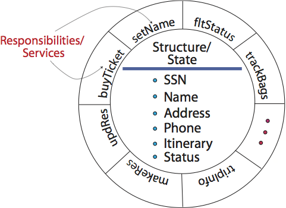

(\#fig:PassClass)Passenger Class

The way we live our daily lives is a perfect example of OO way of
problem solving. We interact with and seek services of other
objects --- teachers, doctors, banks, Real estate agents, travel
agents, to name a few. We only need to express what services we
need from an object to receive them. We are not concerned with the
techniques or procedures employed by the object to fulfill the
requested service. Each object specializes in what it does and
provides services in a transparent manner to the requester.

Organizing a solution to a problem around classes contributes to
containing the complexity of the problem through suitable
*domain abstractions* ^[Abstraction is a mechanism
which emphasizes the relevant aspects of a problem domain while
intentionally suppresses the irrelevant and insignificant ones.]
(e.g., Teacher, Doctor), *encapsulation* (i.e., the process
of packaging data and code that manipulates the data into an
integrated element) and *information hiding* (i.e., hiding
implementation details), and *separation of concerns*
(e.g., a teacher neither need to know nor worry about how a travel
agent does her job). If a travel agent comes up with a better
technique to perform her job, the rest of the world need not
change their ways of interacting with the travel agent. The only
change that this may have on the requester is a better or faster
service.

To appreciate the value of OO way of  developing applications,
consider shopping in a retail store such as Wal-Mart vs. a
pharmacy. If an item in a retail store is moved to a different
location from the location you usually find it at, then you may go
around the aisles to locate the item yourself. If you don't find
the item before your patience wears off, you may seek the
assistance of a sales associate. In some cases, the sales
associate herself may have to engage in the same process that you
went through unsuccessfully. Contrast this with buying
prescription medicines in a pharmacy. You are not concerned about
where the medicine is shelved, whether it is pre-prepared or made
after your request, or even brought from another pharmacy. Except
for the waiting time, you don't care about how the prescription is
filled.

Analogically speaking, shopping in Wal-Mart is akin to traditional
programming, whereas buying a prescription medicine is akin to OO
way of developing software. Each item relocated in Wal-Mart
corresponds to one software change request (to fix a defect or to
add a new feature). What would your shopping experience be like if
the items are relocated often and too many of them at a time?
Wal-Mart effectively controls the relocation of items, but
unfortunately in software development changes are a fact of life.
Using encapsulation and information hiding principles in OO way,
the effect of the changes to a piece of code are localized and are
transparent to other programs that use this piece of code. A
caution is in order. OO techniques are not a silver bullet for all
the problems plaguing the software development. Its effectiveness
lies in mastery of the techniques, which enable you to decide
when, where, and how to use them; mere pedagogy may do more harm
than good.

### Objects and Classes
An object is an *abstraction* of a real-world entity, or a
concept. Recall that abstraction principle emphasizes those
aspects of a problem (domain) relevant to the task at hand while
deliberately suppressing the irrelevant details. Abstraction helps
in understanding of the problem and hence facilitates coming up
with a solution. It is possible to have multiple abstractions of a
domain, each one emphasizing certain aspect of the domain. For
example, consider the human body. It is one of the most complex in
terms of both structure and function. To understand its form and
function, several abstractions have been developed: nervous
system, circulatory system, digestive system, respiratory system,
among others.

Objects are self-contained units, have crisp boundaries, and
provide a well-defined set of services. An object has
*structure* (or state), *behavior* (or
functions/responsibilities), and a unique *identity*.
Objects abound in our daily lives. For example, consider passenger
cars. Regardless of which car we look at, the fundamental
abstractions are the same --- steering wheel, gear control,
speedometer, turn indicators, window controls, door locks, to name
a few. The implementation of these abstractions may vary, for
example, electrical vs. mechanical. However, the purpose of these
fundamental abstractions remain the same. This is why it doesn't
require any additional training or effort to drive a new or
unfamiliar car. The same thing can be said about household
appliances such as ovens, dish washers, and washing machines. The
*interface* --- controls available to the users to operate
the appliance (e.g., cycle selection, load size)
--- is specified and implemented at a level of abstraction which
is meaningful to the users. They need not know anything about how
the interface has been implemented.

As noted earlier, a *class* denotes a group of objects that
have same responsibilities, structure, and relationships (with
other classes). It specifies a *template* or a
*blueprint* for objects. An object is a specific instance
of a class obtained by assigning values to the class attributes
which characterize the object state. Right hand side of
Figure \@ref(fig:PassengerClassInstances) depicts two instances of
the Passenger class. The process of creating an instance of a
class is referred to as *instantiating* the class. It
involves allocating memory to represent the attributes of the
object and initializing them.

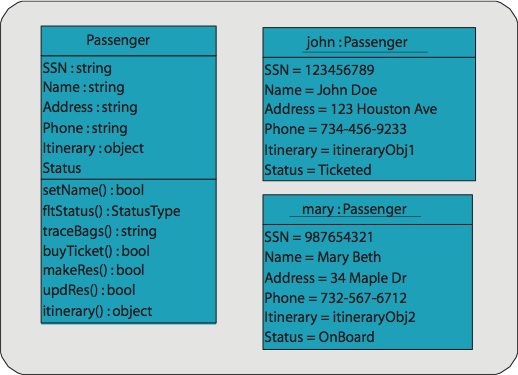

(\#fig:PassengerClassInstances)Passenger Class and its Instance

The notation for objects is: **objectName:className**
(i.e., the object name followed by a colon and the class name)
 or simply :**className**. Also, notice that
the schematic for representing classes used in
Figure \@ref(fig:PassengerClassInstances) is different from the one
shown in Figure \@ref(fig:PassClass). The latter form is used to
emphasize that access to the attributes of a class is guarded.
However, the graphical notation used in
Figure \@ref(fig:PassengerClassInstances) is more convenient to
depict class attributes and responsibilities. The schematic for
class is divided into three regions: class name is indicated in
the top region, the middle region shows attributes, and the lower
region enumerates responsibilities.

A class has certain responsibilities or functional obligations.
All instances of the class have the same responsibilities. This is
why the responsibilities are not shown for object instances in
Figure \@ref(fig:PassengerClassInstances). Responsibilities are
manifested in the form of *services*. For instance, the
Passenger class's responsibilities include making and updating
reservations for trips, buying tickets, retrieving itinerary for a
given trip, tracking baggage, finding flight status, and
changing/setting passenger name. In other words, services fulfill
the responsibilities of a class.

An *abstract class* is one which cannot be instantiated. It
is created solely for organizational purposes --- to specify
common structure and behavior, which other classes can inherit
from.

### Class Structure and Responsibilities
Structure or state of a class is specified by a set of attributes.
For example, the Passenger class shown in
Figure \@ref(fig:PassClass) has SSN, Name, Address, Phone,
Itinerary, and Status attributes. Some of these attributes assume
atomic values (e.g., Name is a character string) whereas, others
represent more complex values (e.g., Itinerary is a collection of
trips, each trip may consists of multiple flight segments). The
Itinerary attribute itself is an instance of some other class.
Attribute values collectively manifest the *state* of an
object at a point in time. Transition of an object to a new state
is reflected by changing the values of one or more attributes. For
example, a Passenger object can be in one of the following states:
holding reservation, ticketed, boarding pass issued, on board,
trip completed. *Status* attribute value indicates the
current state of the Passenger object. However, in the general
case, object state transition may result from several attribute
value changes. State transition is typically caused by events
occurring within or outside the object.

We reemphasize that in Figure \@ref(fig:PassClass), services are
shown as encircling the attributes to underscore the fact that the
services carefully guard access to the attributes. In other words,
the only way to get access to the attribute values is to channel
the requests through the services. They promote the view that you
need to know only the services of a class (i.e., what does a class
do?, and how to invoke a service?) to make use of its services and
that the attributes are internal to the class. This enables a
class to change its state representation techniques as well as the
algorithms to implement its services without affecting the users
of the class. In the OO literature, a class is also referred to as
a *type*. It is preferred by some in that it is not tied to
any implementation aspects. On the other hand, the term
*class* is less precise in that it refers to both a domain
concept and its corresponding implementation in a programming
language.

### Class Diagrams
A *class diagram* depicts classes and static relationships
(associations, generalization/specialization, aggregation, and
composition) between the classes (discussed later, see
Figure \@ref(fig:InvMgmtAtt1) for an example). Classes in a class
diagram are interpreted from three different perspectives:
conceptual, specification, and implementation.

#### Conceptual Perspective
From a conceptual perspective, classes in the class diagram
represent domain concepts and various relationships between them.
For example, a Passenger object has name, phone number, and
address. Though attributes characterize the concepts, we don't
focus on them at this point. Services indicate the
responsibilities of the class. Initial class diagrams should be
developed from a conceptual perspective. Issues related to the
programming language or other software that will be used to
implement the classes should not be considered at this stage.
Therefore, conceptual-level class diagram is language-independent.
It should depict only responsibilities of classes and
relationships between them. Figure \@ref(fig:InvMgmtCls) is an
example of a conceptual-level class diagram. It doesn't show
responsibilities for space reasons.

#### Specification Perspective
The focus under this perspective is on rigorously specifying
software interfaces (discussed in
Section \@ref(IntroInterfaces) so that other classes can
request the services of the class under consideration. There
should be no implementation considerations at this stage. A
Passenger object is viewed as having capabilities to retrieve its
name, change its name, for example. Attributes have unique names
and are associated with types (e.g., integer, float, string,
class). Default values, rage of values (e.g., minimum and
maximum), and edit and validate checks (e.g., what type of strings
are considered as valid dates?) are associated with the
attributes. Relationships between the classes are considered as
responsibilities of the classes.

From the specification perspective, services are referred to as
*operations*. Operations that are meant for consumption by
other classes only are shown. UML (discussed in
Section \@ref(UMLIntro) syntax (simplified) for specifying
operations is: *visibility operation\_name*
*(parameter\_list): return\_type*. This is referred to as
*operation signature*. Visibility specifies access
restriction: *public*  --- can be invoked by any class;
*protected* --- operation can be invoked by only those
classes which are more specialized versions of the class;
*private* --- operations are for private use of the class
only. Operation name is unique within the class and requires zero
or more parameters. For example, invoking *fltStatus*
operation requires flight number and date as parameters.

Multiple parameters are specified using comma as a delimiter. The
order of parameters is important. The syntax for specifying a
parameter is: *direction name: type [= default\_value]*,
where *direction* can assume one of the three values:
*in*, *out*, *inout*; *name* refers to
the parameter name; *type* indicates parameter's type;
finally, the *default\_value* is used when the parameter
value is not supplied. If direction is not specified, *in*
is assumed and the *default\_value* is optional. For
example, ``in fltNumber: string`` and ``in date: DateType = today,``
specify two parameters named *fltNumber* and *date*.
Both have *in* direction (i.e., the invoker need to provide
values for these parameters), the first is of string type and the
second is of DateType. Today's date is used as default for the
second parameter in case that the invoker doesn't provide a value.
The value returned by an operation is specified by
*return\_type*.

#### Implementation Perspective
This is a widely used perspective. It specifies a class from an
implementation view point. Often this perspective is tightly
associated with an object-oriented programming language.
Attributes are referred to as *fields* or *data
members*. Operations are referred to as *methods* or
*member functions*. Private and protected methods are also
shown in addition to the public ones. Corresponding to every
operation at the specification level, there is a method which
implements the operation. There are three general categories of
methods: modifiers, query, and utility. *Modifier* methods
alter attribute values. Typically, they don't return values with
the exception that boolean values may be returned to indicate
success or failure of the method. Modifier methods are also known
as *set* methods. *Query* methods simply return
values of attributes (i.e., they don't alter attribute values).
The returned value may be that of an attribute, or may involve an
elaborate computation involving other attributes. The query
methods are also referred to as *get* methods.
*Utility methods* are helpers in implementing *set*
and *get* methods.

A method has two parts: signature and body. *Method
signature* specification is identical to the specification of
operation signature. In some OO programming languages, a
distinction is made between method signature and *method
header*. The former doesn't include the method return type, while
the latter does. *Method body* is the actual code which
implements the method. A class can change the implementation of
its methods without affecting the users of the method provided
that the method signature remains intact. Method signatures
collectively specify the class's *interface* to the outside
world. Interfaces should reveal as little as possible about
internal workings of a class. The three perspectives are
summarized in Table \@ref(tab:MPViewOfClass).

Class diagrams from the conceptual perspective are developed
first. They are evolved into class diagrams from the specification
perspective by formalizing operation signatures. Finally,
implementation-level class diagrams are obtained from the ones at
the specification-level by considering implementation details.
This distinction is important for OO development. Unfortunately,
it is often overlooked in practice by mixing specification and
implementation.

<?xml version="1.0" encoding="UTF-8"?>
<table class="table table-striped table-hover" style="margin-left: auto; margin-right: auto;">
<caption>(\#tab:MPViewOfClass)Multi-perspective view of a class</caption>
 <thead>
  <tr>
   <th style="text-align:left;"> Perspective </th>
   <th style="text-align:left;"> Focus </th>
   <th style="text-align:left;"> Structure </th>
   <th style="text-align:left;"> Functionality </th>
  </tr>
 </thead>
<tbody>
  <tr>
   <td style="text-align:left;"> Conceptual </td>
   <td style="text-align:left;"> Conceptual understanding of the domain in an implementation independent context. Classes are viewed as *domain concepts* and relationships between the concepts. </td>
   <td style="text-align:left;"> *Attributes* characterize domain concepts. </td>
   <td style="text-align:left;"> Class functionality is specified in terms of *responsibilities* or services. </td>
  </tr>
  <tr>
   <td style="text-align:left;"> Specification </td>
   <td style="text-align:left;"> Rigorously specifying class *interfaces* in an implementation-independent way. </td>
   <td style="text-align:left;"> *Attributes* characterize class state. Attributes have unique names and are associated with types, default values, a range of allowable values, edit and validate checks. </td>
   <td style="text-align:left;"> Class functionality is specified in terms of *operations*. Only those operations meant for consumption by other classes are shown. Operations are specified with complete *signature*. </td>
  </tr>
  <tr>
   <td style="text-align:left;"> Implementation </td>
   <td style="text-align:left;"> Implementation-oriented specification of a class targeting class implementors. </td>
   <td style="text-align:left;"> *Fields* or *data members* characterize class state. </td>
   <td style="text-align:left;"> *Methods* or *member functions* specify class functionality. </td>
  </tr>
</tbody>
</table>

#### Modeling Classes
A good starting point for modeling classes is to start with their
responsibilities. Each class has one or more responsibilities. A
responsibility is a contract or an obligation of a class. The
attributes and operations of the class are means to fulfilling the
class's responsibilities. CRC (Class, Responsibility,
Collaboration) is a technique for identifying the initial set of
classes. CRC cards are discussed in Section \@ref(OOAnalysis).

### Fiels and Methods: Instance vs Static
There are two types of fields: instance and static. Values of
*instance fields* are specific to each object. In the case
of *Passenger* class discussed earlier, fields such as
social security number, name, and address are specific to each
object and hence they are instance fields of the Passenger class
(Figure \@ref(fig:PassClass). *Static fields*, on the other
hand, are at the class-level and are shared by all instances of a
class. For example, we can have a static field called
*numPassengers* to keep track of the number of instances of
the *Passenger* class. Like fields, there are two types of
methods: instance and static. *Instance methods* are
invoked on an object instance. They can access both instance and
static fields. Static methods, on the other hand, are invoked
using the class name and can only operate on the static fields.

### Class Contraints
Classes can also specify *constraints* --- conditions that
the class or users of the class should satisfy. If class
*A* is associated with two other classes *B* and
*C*, and this association is mutually exclusive (i.e., an
instance of *A* can only be associated with either an
instance of *B* or an instance of *C*, but not with
both of them simultaneously) is indicated by a condition. More
complex conditions are expressed using UML's *OCL* (Object
Constraint Language). Often constraints are specified as
*assertions* --- statements that should always hold true.

There are three types of assertions: pre-condition,
post-condition, and invariants. *Pre-conditions* specify
constraints that must be satisfied before invoking an operation.
For example, for *fltStatus* operation, the parameter
fltNumber must be a positive integer is a pre-condition. Likewise,
for a division operation, the divisor should be a non-zero number
is a pre-condition. A *post-condition* specifies what the
object state should be after executing an operation. Suppose an
operation performed the division $a = b \div c$, then $b=c \times
a$ is a post-condition. Exceptions or error conditions are then
the result of an operation for which one or more post-conditions
are violated.

An invariant is something that doesn't change over the life cycle
of an object. Assume CreditCard class, which has the attributes:
beginningBalance, endingBalance, creditsAndPayments,
purchasesAndCashAdvances. The expression endingBalance =
beginningBalance + purchasesAndCashAdvances - creditsAndPayments
is an invariant. This is a typical formula used for reconciling
credit card accounts. Relevant post- and pre-conditions, and
invariants should be associated with all public operations.

### Messages {#Messages}
Regardless of how powerful a class functionally is, it has limited
use in isolation. A typical software application will have several
classes. A class may fulfill its responsibilities by invoking its
own methods, invoking the methods of other classes, or a
combination of both. The act of a class/object invoking the method
of another class is referred to as *sending a message*. In
other words, messages are the communication mechanism for objects
to invoke each other's methods in cooperatively solving a problem.

The object which sends the message is called the *sender*,
and the object that receives the message is called the
*receiver*. A message has three parts: *receiving
object* name, a *method name* in the receiving object, and
*parameter values* for the method invocation. Parameters
are used to pass values from one object to another. As discussed
earlier, the method signature specifies the direction, name,
return type, parameters and default value (if any) for the
parameters. For example, to assign ``123456789`` as social security
number for an object whose identifier is
**jim:Passenger**, the message syntax is:
**jim:Passenger**.setSSN (``123456789``). Here
**jim:Passenger** is the receiving object,
*setSSN* is the method name in the receiving object, and
*``123456789``* is the parameter value. Period $(\cdot)$ is
used to separate the receiving object name from its method name.
Every public method of a class has an associated message. Message
syntax varies from one OO programming language to another.

Processing a message involves insuring that the message conforms
to the method signature and then executing the associated method
body. The value returned to the sender object depends on the
return value type of the method. It can be as simple as an
elementary data type such as an integer, an instance of a class,
or even a collection of instances from the same or different
classes, or none. Messages can be sent in synchronous or
asynchronous mode. In the *synchronous* mode, the message
sender doesn't perform any action until the receiving object has
executed the method corresponding to the message. In contrast, in
*asynchronous* mode, the sender initiates the message and
continues to perform some other action. When the method execution
is completed by the receiver, the sender is notified. Which mode
is suitable for sending a message is dependent on the problem
context. Asynchronous mode helps in making programs more
responsive, but also requires additional logic to recognize
message completion.

### Relationships {#IntroAssociation}
Typically, classes don’t stand in isolation. They are related to each other via: association,
aggregation, composition, and generalization/specialization.

#### Association
*Association* is a type of relationship between (instances
of) classes. There can be multiple associations between the same
set of classes. The classes play different roles in each
association. For example, if *Girl* and *Boy* are
two classes, an association named *oppositeGenderClassmate*
relates boys (i.e., instances of *Boy* class) with girls
(i.e., the instances of *Girl* class) who are classmates.
Another association named *oppositeGenderFriend* between
the same two classes relates boys and girls who are friends.
Typically *cardinality* (or *multiplicity*) as well
as *optionality* are specified for associations.
Cardinality factor specifies how many instances of *Girl*
class can be associated with an instance of *Boy* class;
conversely, how many instances of *Boy* class can be
associated with an instance of *Girl* class. Optionality
factor specifies whether or not instances can exist without
participating in any association. For example, can a girl exist
without being participating in either of the associations? The
following example further illustrates cardinality and optionality
aspects of an association.

People who have money to invest may seek the services of a
professional. Such professionals are called investment managers.
In this context, people who are investing money are referred to as
clients. Figure \@ref(fig:Associations) shows different types of
association between the instances of *Investment Manager*
and *Client* classes. We use uppercase, singular nouns for
class names. In Figure \@ref(fig:Associations)(a), there are three
instances of *Investment Manager* class (Windfall Joe,
Flashy John, and Miracle Sue) and three instances of
*Client* class (Ordinary Joe, Average Smith, and
Millionaire Bob). In Figure \@ref(fig:Associations)(b) --
Figure \@ref(fig:Associations)(d), there is one more instance of
*Client* class (Billionaire Janet).

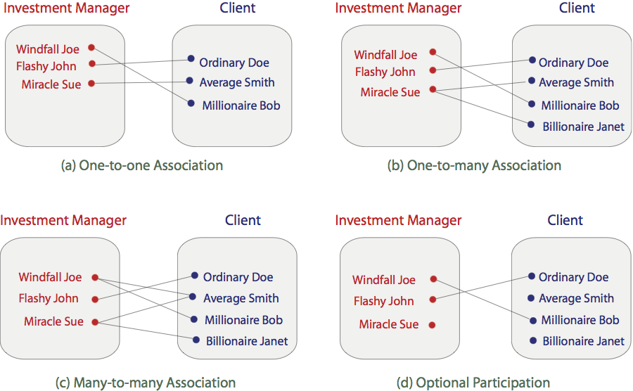

(\#fig:Associations)Cadinality and Optionality aspects of association

Figure \@ref(fig:Associations)(a) depicts a *one-to-one*
association between the instances of *Investment Manager*
and *Client* classes. For example, the line connecting
Windfall Joe and Millionaire Bob represents an association:
Windfall Joe is an investment manager of Millionaire Bob (or,
equivalently, Millionaire Bob's investment manager is Windfall
Joe). Notice that any instance of *Investment Manager*
class is associated with one and only one instance of
*Client* class and vice versa. Furthermore, no instances of
either class can exist without participating in the association
--- mandatory participation. Figure \@ref(fig:Associations)(b)
represents a *one-to-many* association with mandatory
participation for the instances of both classes. An instance of
*Investment Manager* is associated with one or more
instances of *Client* --- Miracle Sue has two clients:
Average Smith and Billionaire Janet. However, an instance of
*Client* is associated with one and only one instance of
*Investment Manager*. Instances of neither class can exist
without participating in the association. In a one-to-many
association, it is important that we make the distinction between
the class on the ``one" side and the class on the many side.`` In
other words, you need to recognize the direction of the
association in a *one-to-many* association.

Figure \@ref(fig:Associations)(c) represents a
*many-to-many* association with mandatory participation. An
instance of *Investment Manager* is associated with one or
more instances of *Client* and vice versa. For example,
Average Smith's *investment managers* are: Windfall Joe and
Miracle Sue; Windfall Joe's *clients* are: Average Smith
and Millionaire Bob. Thus the association plays a different role
in each direction --- *has investment mangers* and
*has clients*. Instances of neither class can exist without
participating in the association. Figure \@ref(fig:Associations)(d)
represents a *one-to-one* association with optional
participation. An instance of *Investment Manager* is
associated with one and only one instance of *Client* and
vice versa. Instances of either class can exist without
participating in the association --- Miracle Sue has no clients
and Billionaire Janet has no investment manager. It shouldn't be
difficult for you to visualize optional participation with
*one-to-many* and *many-to-many* associations.

*Dependency* is a type of association between two classes
indicating dependency of one class on another class. For instance,
in a personnel application of a company, there exists a dependency
relationship from *Child* class to *Employee* class
as shown in Figure \@ref(fig:DependentAssoc). Conceptually,
*Child* class has no independent existence (or its
existence is tied to the existence of *Employee*) --- no
company keeps track of children information without the
corresponding employee information. From a specification (or
implementation) view point, if a class $A$ uses another class $B$
in its method signature, there is a dependency association from
$A$ to $B$. In Figure \@ref(fig:DependentAssoc) example,
*Child* class will typically use *Employee* in one
of its method signature. Any changes made to *Employee*
class will affect the *Child* class.

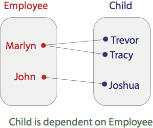

(\#fig:DependentAssoc)Dependency association between classes

An association between two classes is called *binary*,
between three classes it is called *ternary*, and between
$n$ classes it is termed $n$-ary. An association between instances
of the same class is referred to as *recursive association*.
Often the terms association and relationship are
used synonymously.

#### Aggregation and Composition
Classes in general have independent existence (except those
related to other classes via dependency as discussed above) and
render services by executing messages sent to them. In this sense,
they are autonomous. Sometimes there is a need to bring two or
more classes together to work under a protocol which may diminish
the autonomy of some classes. This gives raise to a concept known
as *aggregation*, which is a special kind of association.
One class represents a ``larger thing`` (or container class) and
others constitute ``smaller things`` (or contained classes). For
example, if we think of a *Home* as a *container*
class, *contained* classes include *Dish Washer*,
*Dryer*, *Water Heater*, and *Room*, among
others.

Though the contained classes are themselves useful in isolation,
their utility is enhanced in the aggregation scenario. Practical
applications such as airlines reservation and air traffic control
systems contain hundreds or even thousands of classes. Developing
or enhancing such applications requires mastery of these classes
from a functional perspective. Aggregation provides an effective
mechanism for building higher-level abstractions by encapsulating
the functionality of several contained classes. Typically these
higher-level abstractions are akin to domain tasks thus making
them natural and easier to use. This also promotes reuse ---
ability to use these domain-level container classes in other
applications. In other cases, aggregation simply provides an
integrated and consolidated functionality --- instead of learning
the functionality of several classes, you learn the functionality
of just one class (i.e., the container class). This alternative
lays the foundation for a mechanism called *delegation*, in
which the *container* object delegates work to the
*contained* objects.

There are two variations of aggregation depending on whether or
not the *contained* classes have independent existence from
the *container* class. If the contained classes don't have
independent existence, the relationship is referred to as
*composite aggregation* or simply *composition*. On
the other hand, if contained classes have independent existence,
the relationship is referred to as *shared aggregation* or
simply *aggregation*. To avoid confusion, we consistently
use the terms composition and aggregation to refer to composite
aggregation and shared aggregation.

In composition, the container class *owns* the contained
class. Consider the following classes in a university setting:
*Course* and *Section*. The class *Section*
doesn't exist without the *Course*. Therefore, the
relationship between *Course* and *Section* is
*composition* (i.e., Course *has* or *owns*
Section). Another example is the relationship between a book and
its constituent chapters. Chapters have no independent existence
without the book. In aggregation, classes are brought together to
form larger and more complex classes; yet the participating
classes retain their individuality. There is no existential
dependency between the classes participating in the aggregation.
In other words, parts can exist without the whole. Consider the
classes *Man* and *Woman* and an aggregation called
*Marriage*. An instance of *Marriage* class consists
of an instance of *Man* and an instance of *Woman*.
However, instances of *Man* and *Woman* classes have
independent existence outside of *Marriage* aggregation.
Instances of *Man* and *Woman* classes can continue
to exist even after ceasing their participation in
*Marriage*.

#### Generalization/Specialization {#CHP}
*Inheritance* is a core aspect of OO techniques. Through
inheritance mechanism, more specialized classes are produced from
an existing class. The latter is referred to as the *base
class*, *parent class*, or *superclass* and the
former is known as the *derived class*, *child
class*, or *subclass*. If we use the term *type* for
class, the derived class is called *subtype*. Let us
confine to the terms base class and derived class in our
discussion. Specialization can be carried to multiple levels.
However, the need for more than three levels needs to be
questioned in practice. The resulting structure is known as
*class hierarchy*. At the top of this hierarchy is the
*root class* from which all other classes are derived
either directly or indirectly. For example, in the .NET Framework
Class Library (FCL), all classes are derived from *Object*
class including the ones that you develop (which are implicitly
derived). The classes from which no classes are derived are called
*leaf classes*.

Consider the two *class diagrams* shown in
Figure \@ref(fig:ClassHierarchy). The first one
(Figure \@ref(fig:ClassHierarchy)(a)) is rooted at *Person*
class. *Client* and  *InvMgr* classes are derived
from the *Person* class. Both clients and investment
managers are people and this commonality in structure and behavior
is captured in the *Person* class. The structure and
behavior which is specific to clients and investment managers are
captured in *Client* and  *InvMgr* classes, which
are also leaf classes. The other hierarchy
(Figure \@ref(fig:ClassHierarchy)(b)) is rooted at
*FinInstr* class, from which two specialized classes
*Stock* and *Bond* are derived. The Bond class is
further specialized into: *CorpBond*, *MuniBond*,
and *GovtBond*. They correspond to corporate, municipal,
and government bonds. *Stock*, *CorpBond*,
*MuniBond*, and *GovtBond* are all leaf classes. Note
that the graphical symbol $\uparrow$ from the derived class to the
base class to denote generalization/specialization relationship
--- the base class is a *generalization* of the derived
class; conversely, the derived class is a *specialization*
of the base class.

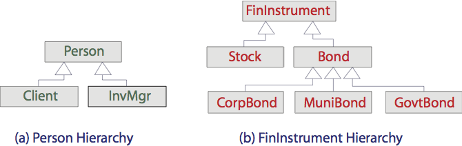

(\#fig:ClassHierarchy)Two Class hierarchies

A class hierarchy is a manifestation of the
generalization/specialization principle. Just as classes are
viewed from three different perspectives, the
generalization/specialization hierarchy can also be interpreted
from those three perspectives. From a conceptual view point, class
$B$ is a derived class of $A$ if all instances of $B$ are also
instances of $A$. Everything that holds true in the context of $A$
also holds true for $B$. From a specification perspective,
interface of $B$ must include all interface elements of $A$. That
is, interface $B$ conforms to interface $A$. Finally, from an
implementation perspective, class $B$ inherits all the fields and
methods of class $A$.

As we traverse down the class hierarchy, classes become more and
more specialized. Likewise, as we go up from the leaf classes
towards the root class, they become more and more generalized.
When designing class hierarchies, you can start with a set of leaf
classes and create a base class that abstracts structure and
behavior shared by all the leaf classes. The base classes
resulting from generalizing different sets of leaf classes can be
further generalized to create the next higher level base classes
and so on. Alternatively, you can start with the most general
class (i.e., the root class), and look for variations to create
specialized classes. The common structure and behavior is retained
in the root class and the variations are pushed down into the
derived classes. This is repeated to the desired number of levels
provided we can find variations on the structure and behavior of
the class under consideration.

The derived class inherits both the structure and behavior of the
base class. Also, the derived class can add additional structure
and behavior to the inherited ones. Furthermore, the derived class
can *override* the inherited behavior by reimplementing the
corresponding methods. This redefinition of a method locally is
needed to address exceptions or special cases addressed by the
derived class. Therefore, an operation can be implemented by
multiple methods, each method implementation differs to suit the
local context of classes in the hierarchy.

There are two types of inheritance: single and multiple. Under
*single inheritance*, a derived class is based on only one
base class. Under *multiple inheritance*, a derived class
is based on multiple base classes. C\# programming language
doesn't provide multiple inheritance feature since there are
certain problems associated with multiple inheritance. More
specifically, the semantics of multiple inheritance are not
clearly defined in the general case. What happens when both base
classes feature the same method? From which base class is the
method inherited? Worse yet, what happens when base classes
conflict in their definition of the same method?

When we consider a class hierarchy from a conceptual or
specification perspective, inheritance is referred to as
*interface inheritance*. This is because what is inherited
by the derived class is the specification of the operations.
Interface inheritance is supported in C\# using interfaces.
On the other hand, when a class hierarchy is viewed from an 
implementation perspective, the inheritance is referred to as
*implementation inheritance*. The derived class inherits
implementation aspects from the base class.

### Polymorphism {#IntroPoly}
In OO programming, the term *polymorphism* refers to the
ability of the language to process objects differently based on
their data type or class, yet treating them equivalently within
the program. This feature is best explained using an example.
Consider the class hierarchy rooted at *FinInstr* class in
Figure \@ref(fig:ClassHierarchy)(b). Typically instances of this
class are not created. The class exists solely for organizational
purpose. It generalizes fields and methods that are common to all
its derived classes. Such classes have one or more methods
designated as *polymorphic* or *virtual* methods
--- those that can be reimplemented by the derived classes (if
they choose to) keeping the method signature intact.

Assume that there is a method called *valueFinInstr*
defined in *FinInstr* class as a *virtual* method.
Then the derived classes *Stock* and *Bond* may
choose to reimplement this method under the same name but in a way
that reflects the semantics of *Stock* and *Bond*
classes. The derived classes of *Bond* ---
*CorpBond*, *MuniBond*, and *GovtBond* ---
can also reimplement the *valueFinInstr* method.

Polymorphism feature allows the derived classes to reimplement the
*valueFinInstr* method in a way that reflects the desired
semantics of the class. This is important since the way stocks are
valued is quite different from the way the bonds are valued.
Furthermore, corporate bonds are valued differently from those of
the municipal and government bonds. Polymorphism enables you to
treat corporate bonds, municipal bonds, and government bonds as
instances of the *Bond* class (substitution principle) and
process them in a uniform way. For example, invoking the
*valueFinInstr* method in *Bond* class will value
each bond correctly. If an instance is of type corporate bond, the
language runtime will execute the *valueFinInstr* method
implemented in the *CorpBond* class to value the instance;
if the instance is of type municipal bond, *valueFinInstr*
method implemented in the *MuniBond* class is executed; and
so on. The same mechanism will work on any new derived classes of
*Bond* class (e.g., agency bond) which we may create in
future; all this without changing any part of the source code used
for valuing the bonds. For this to work, it should be possible to
substitute derived class instances for the base class instance.
This is known as *substitution* principle.

The primary benefits of inheritance are: abstraction manifested in
the class hierarchy, code reuse (derived classes get the base
class's methods implementation for free), and facilitating
polymorphic behavior (simplifies code development and minimizes
code changes). In passing it should be noted that for reasons
which are discussed in Chapter \@ref(AdvObjProbSolv),
inheritance should be used with caution and in moderation.
*Composition* should be explored as an alternative to
inheritance. Invariants and post-conditions should be satisfied by
all the derived classes. The derived classes may strengthen these
assertions, but weakening them is prohibited. On the other hand,
pre-conditions cannot be strengthened but may be weakened by the
derived classes; otherwise, the polymorphism feature will fail.

### Interfaces {#IntroInteraces}
An interface is an abstract specification of software
functionality in the form of services or operations. It is
specified without implementation related considerations. In other
words, its specification is free from operating system and
programming language related issues. Typically one or more classes
implement an interface. Conversely, a class may implement multiple
interfaces. Multiple inheritance is achieved by having a class
implement two or more interfaces.

We need to revisit the message structure to appreciate the need
for interfaces. A message has three parts: receiving object name,
a method name in the receiving object, and parameters. Note that
message parameter types must match the corresponding types in the
method signature that implements the message. Parameter types can
be basic data types such as integer, or a class type. When objects
are passed as parameters, they are checked against their class or
interface. The language runtime will insure that the corresponding
parameter type in the message is of that class or any of that
class's descendants (substitutability principle). Since the
derived classes are required to implement the message interface of
the base class, the derived class and the base class are
functionally equivalent. Therefore, a base class can be used to
specify an entire subtree of classes under it for a method
parameter (including those which may be defined under the base
class in future). Though this provides ample flexibility,
experience with large scale systems has shown its limitations.

Any object which is not an instance of a derived class of the base
class will not qualify as valid parameter type in the message.
However, in real-world applications there will be multiple class
hierarchies. To enable classes that are not necessarily within the
same class hierarchy to match a method parameter type, interfaces
are used instead of classes for method parameter types. Any object
of a class which implements the interface can be used as a method
parameter. In effect, this eliminates the single hierarchy
restriction by capturing similarities among unrelated classes
without artificially forcing a base class/derived class
relationship.

Interfaces have other advantages as well. Opportunities for
interface reuse exist since they are specified independent of any
class. A class can choose to implement a number of interfaces that
are relevant to fulfill its responsibilities. Interface based
segmenting or partitioning of the methods of a class provides
benefits. Each partition corresponds to an interface. It helps to
promote information hiding. The user of a class is exposed only
the interface that features messages of interest to the user. The
same feature also contributes to *security*. The user of a
class is provided access to just the needed messages; no more and
no less. An object's programming interface is revealed without
revealing its class.

Security master is a core application found in financial services
industry. It provides descriptive and pricing information on
various securities or financial instruments. The universe of
instruments is large and exceeds five million. About 800
attributes are required to completely describe an instrument.
However, a given application requires only a small subset of
attributes. Figure \@ref(fig:Interface) shows a composite interface
found in a security master application. The four interfaces are
designed to meet the needs of four different applications:
corporate action processing, stock record, global custody, and
trading. The users of stock record application, for example, are
exposed to only the stock record interface. In other words, they
are not required to understand the entire security master class.

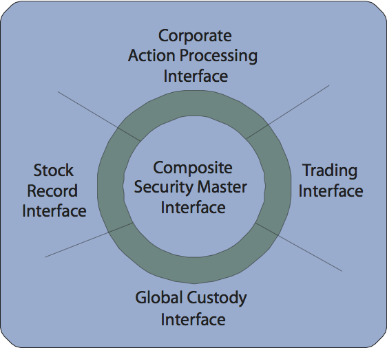

(\#fig:Interface)Composite security master interface

## Unified modeling Languages {#UMLIntro}
Unified Modeling Language (UML) is an industry standard language
for specifying, constructing, visualizing, and documenting
software-intensive systems. It is
standardized by the Object Management Group (OMG). Its genesis
lies in the confluence of several OO analysis and design
techniques, and other system development methodologies. Primary
intent of UML is to help effectively communicate system
requirements, specifications, design decisions, and various design
artifacts including system structure and behavior, and
architecture.

It also helps to minimize project risk, and expose opportunities
for simplifying the system design and construction. It is only a
modeling language and doesn't prescribe a process. A process
details what steps to be taken in performing software analysis,
design, and construction. UML has been shown useful in a software
process which is *use-case driven*,
*architecture-centric*, and is *iterative* and
*incremental*. There are two processes that have gained
recognition: Rational Unified Process
(RUP) and Enterprise Unified Process
(EUP).

UML provides nine different types of diagrams: use case, class,
object, component, deployment, sequence, collaboration, state, and
activity. Some of these depict the *static* aspects of a
system whereas, others model the *dynamic* aspects. Not all
diagrams are needed for every software system. We briefly describe
the diagrams in the following.  You should focus on gaining a
conceptual understanding of the diagrams, rather than worrying
about the nitty-gritty details. Mastery comes with hands-on
practice. Certain diagrams (component and deployment) are not
discussed in detail and are included only to make the brief
introduction to the UML complete.

### Use Cases and Use Case Diagrams {#UCAndUCD}
*Use cases* specify what a system does without saying
anything about how it is done. In other words, it captures the
system behavior without addressing how the behavior is
implemented. It is important that the problem analysis phase be
carried out without undue influence of the implementation
concerns. A use case is specified by describing flow of events in
text clearly enough for others to understand easily. The
description should include: how and when a use case starts and
ends; pre- and post-conditions, and invariants; when it interacts
with actors; what objects are exchanged; and basic and alternative
flows of behavior.

Actor represents a set of roles that users of use cases play when
interacting with the system. Actors can be human users or other
systems. Each flow corresponds to a *scenario* and a use
case actually represents several scenarios (corresponding to the
main and alternative flows). A scenario is an instance of a use
case just as an object is an instance of a class. Just like
classes, a use case can *generalize* another use case, and
can be included in other use cases. A use case can also
*extend* another use case.

Use case scenarios are best illustrated using an actor's
interaction with an automated teller machine (ATM) for cash
withdrawal. A normal scenario corresponds to: user inserts the ATM
card and enters a valid pin followed by withdrawal amount
correctly; the withdrawal amount is less than the current account
balance, and the cash in the ATM machine is equal to more than the
withdrawal amount; and the machine's cash dispensing mechanism is
working. This is a best case scenario in that every step ran
smoothly without any glitches. However, lot of things can go
wrong: user enters an invalid pin; withdrawal amount is greater
than the current account balance; cash on the ATM machine is less
than the withdrawal amount; and the machine's cash dispensing
mechanism is dysfunctional.

Think of withdrawing cash from the ATM as a user task, whose
execution is carried out by performing a number of mini-tasks. The
execution of each mini-task may be successful or unsuccessful. The
task is complete only if all of the mini-tasks are executed
successfully. This corresponds to the normal or main scenario (or
flow). There are several other scenarios in which some steps are
executed successfully and other steps have failed. An
*alternative scenario* (or an alternative flow) corresponds
to some such combination of steps. A use case is a set of
scenarios corresponding to realizing a user task or goal. The best
case scenario is the *main flow* and others are
*alternative flows* (or alternative scenarios). Both the
main and alternative flows correspond to the successful execution
of a user task. *Exceptional flows* correspond to execution
scenarios resulting in error conditions. In general, it may not be
necessary to execute all the mini-steps; they may even be executed
conditionally.

Use cases are related to each other via *include*,
*generalization*, and *extend* relationships.
Certain tasks (such as validating an ATM card in banking
applications) are abstracted to form a use case. Such use cases
are meant for inclusion in other use cases; by themselves they are
of no value. For example, if *ValidateCard* is a use case
for validating ATM cards in a banking application, it can be used
in other use cases such as cash withdrawal, and transferring money
between accounts. Cash withdrawal use case is said to include
*ValidateCard* use case. A use case may
generalize/specialize other use cases to accommodate variations or
specialization. In such cases, they are related by the
*generalization* relationship. Finally, an use case may
*extend* another use case. Extend relationship is similar
to the generalization, but there are additional rules governing
the extension. The use case that is being extended (called base
use case) should have already defined extension points. The
extending use case extends one or more of the extension points in
the base use case.

In the investment management (IM) application discussed in
Section \@ref(IMAppDomain), computing unrealized gain/loss is a
use case. Computing market unrealized gain/loss is another use
case which extends the unrealized gain/loss use case. Likewise,
computing currency unrealized gain/loss for multi-currency
accounts is another use case which extends unrealized gain/loss. A
use case labelled ``Create Account`` for creating an account is
shown in Figure \@ref(fig:CreateAccountUC). Actor is an investment
manager. Use cases are denoted by solid ovals (with the use case
name written inside the oval) and actors are represented by stick
figures. Figure \@ref(fig:CreateAccountUC) depicts the interaction
between the use case ``Create Account`` and the actor ``Investment Manager.``
Such diagrams are known as *use case diagrams*.
An actor may interact with multiple use cases, and a use case may
have multiple actors. An actor interacting with multiple use cases
is shown in Figure \@ref(fig:IMUseCaseDiagram).

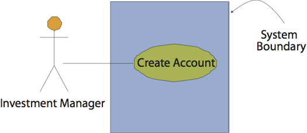

(\#fig:CreateAccountUC)A use case diagram

*Use case diagrams* are central to modeling the context of
a system, subsystem, or even a class. Context depicts the boundary
of an element and its interaction with the outside world. They are
used to visualize the behavior of a system, subsystem, or class.
Use case diagrams depict static use case view of a system. They
help developers of the system to get a conceptual understanding of
how these elements interact with each other so that they can
implement them.

There are two basic complementary approaches to discovering the
use cases: actor-based and event-based. Relatively, it is easier
to start with the actor-based approach. As stated earlier, an
actor corresponds to a human user or other systems. An actor may
play multiple roles. For example, a senior investment manager may
manage other investment mangers as well as manage client accounts.
By examining each role, you can come up with a set of use cases.
They correspond to the domain tasks that users perform regularly.
In the event-based approach, use cases are discovered by carefully
examining the events that occur in the system. For example,
period-end is an event. It may correspond to end of business day;
end of calendar month, quarter, and year; end of fiscal quarter,
and year. In banking applications, period-end activities include
computing trial balance, reconciling account balances, and
generating monthly statements, and mailing calendar year tax
statements. Use cases typically correspond to these types of
activities. Use cases for the IM application are discussed in
Section \@ref(IMAppUseCases).

Use cases have other uses as well. They form the basis for
developing *test cases*. Use cases applied to a subsystem
are an excellent source for *regression testing*. When
applied to an entire system, use cases are a good source for
designing *integration* and *system tests*.
Eventually use cases need to be implemented or realized. Classes
and other elements are modeled as a *collaboration* to
realize a use case. Collaboration diagrams are discussed in
Section \@ref(CollaDiagrams).

### Class Diagrams
Class diagrams show important abstractions present in the system.
They convey static design view of a system. As discussed in
Section \@ref(FundObjCon), classes have structure and behavior,
participate in relationships with other classes
(generalization/specialization, association, aggregation, and
dependency), and implement interfaces. A class diagram captures
all these semantics. We have already seen in
Figure \@ref(fig:ClassHierarchy) two simple class diagrams.
Figure \@ref(fig:InvMgmtCls) shows the class diagram for the
Investment Management application. Class diagrams should reflect
domain concepts and the vocabulary of the users. Therefore, the
initial class diagrams must be developed from a conceptual
perspective.

### Object Diagrams
Object diagrams model instances of elements contained in a class
diagram. They show a set of objects and their relationships at a
point of time. They express static part of interaction among
objects without any messages passed among them. Object diagram is
simply a graph of nodes and links. Nodes correspond to specific
objects and *links* denote static interactions among the
objects. Object diagrams help in visualizing a snapshot of a
complex interaction involving specific objects. Object diagrams
are also called *instance diagrams*.

### Sequence and Collaboration Diagrams {#CollaDiagrams}
equence and collaboration diagrams are used to depict dynamic
aspects of an OO system and are called *interaction*
*diagrams*. They depict interaction among a set of objects
including message passing. Typically, they capture the behavior of
a single use case.*Sequence diagrams* emphasize the time
ordering of messages. They are used to illustrate the chain of
messages generated and executed (in time sequence order) in
response to a domain task. Hence, they convey dynamic view of a
system by depicting the overall flow of control.

We illustrate a sequence diagram for a telesales application. You
as a customer call a telesales operator and place an order for
items of interest. For each item you want to purchase, you provide
the operator item name (or an identifier such as product number)
and quantity. In essence your order consists of one or more
*line items* --- a line item corresponds to each product
you have ordered. Through a GUI, the operator submits the order to
the system. Figure \@ref(fig:SequenceDiagram) depicts a sequence
diagram for processing such orders.

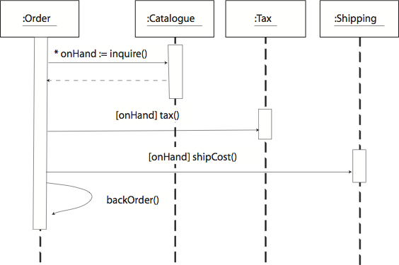

(\#fig:SequenceDiagram)A sequence diagram

The diagram has four objects: *:Order*,
*:Catalogue*, *:Tax*, and
*:Shipping*. The *:Order* object has overall
responsibility for processing an order. The *:Catalogue*
object maintains complete product information (e.g., name,
description, identifiers such as Universal Product Code (UPC),
price, discount schedule based on volume, availability --- in
stock or not, status if back-ordered). *:Tax* object
specializes in computing applicable taxes for a line item. You
should recognize that, in reality, computing tax is not just
multiplying total cost of products ordered with sales tax rate ---
requires consideration of tax exempt status based on customer
type, geographic location, among others. Finally,
*:Shipping* object specializes in computing shipping costs
by considering parameters such as warehouse geographic location,
shipping address zip code, mode of shipment (e.g., air, ground,
sea), urgency (e.g., overnight, two-day, normal), type and amount
of insurance desired to protect against transit damage.

Each object is represented by its lifeline --- *object
lifeline*. As shown in Figure \@ref(fig:SequenceDiagram), the
object name is written inside a rectangle and the lifeline is the
dotted line going downwards from the rectangle. An object's
lifeline indicates the time interval of its existence at a
particular time. However, it may not be performing actions during
this entire time interval. The time interval during which an
object is performing an action is indicated by *activation*
(or *focus of control*), which is indicated by placing a
rectangle on an object's lifeline. Notice in the figure that
*:Order* object has a longer activation relative to the
other objects.

An arrow represents a message between two objects. The arrow is
labeled with message name, control (e.g., conditional, iteration
marker), and other information (e.g., method parameters). For
example, the arrow from *:Order* to
*:Catalogue* represents the *:Order* object
invoking *inquire* method of the *:Catalogue*
object. The value returned by this message is indicated by
*onHand* --- whether or not the item inquired is in
inventory. The symbol $\ast$ before *onHand* represents
*repetition* --- send the message for each line item in the
order. Message return is indicated by a dotted arrow as shown in
the figure from *:Catalogue* to *:Order*.
Typically message returns are not shown as they tend to clutter
the diagram. They are understood implicitly. They should be
included only if they contribute clarity to the diagram in some
way. Time ordering of messages is implicitly indicated by the
order of their physical placement across the object lifelines.
Time dimension increases as we go downwards from the rectangles.

The message call from *:Order* to *:Tax*
illustrates another feature of sequence diagrams ---
*conditional* method call. It denotes that tax for a line
item should be computed only if the item is in the inventory.
Conditional message is indicated by prefixing the condition (which
is enclosed in [ and ]) to the message as in ``[onHand] tax().``
Another feature shown in the diagram is *self-call*
--- an object sending a message to itself. The *:Order*
object does a self-call by invoking its own method: backOrder().
This method takes care of back-ordering those items that are not
in the inventory.

As you might have understood by now, sequence diagrams are good
for time-ordered depiction of message passing among a group of
objects. This is very helpful to figure out which methods are
invoked by what classes and in which order. If a method doesn't
appear in any sequence diagram, it must then be an utility method.
Otherwise, the method simply exists without any purpose.

*Collaboration diagrams* emphasize the *structural organization*
of objects that communicate using messages. They are
useful in showing how objects collaborate in realizing a domain
task (e.g., a use case). Objects are shown as icons. Message
ordering is indicated by numbering the messages.
Figure \@ref(fig:CollaborationDiagram) shows the collaboration
diagram corresponding to the sequence diagram of
Figure \@ref(fig:SequenceDiagram).  In contrast with sequence
diagrams, time ordering of messages is explicit in collaboration
diagrams --- decimal numbers prefixed to message labels indicate
message ordering. Sequence and collaboration diagrams are
semantically equivalent meaning that one can be derived from the
other. As you can see from Figures \@ref(fig:SequenceDiagram)
and \@ref(fig:CollaborationDiagram) that one can be constructed
from the other.

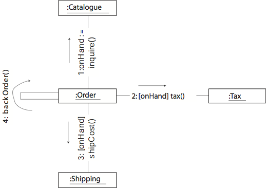

(\#fig:CollaborationDiagram)A collaboration diagram

### State Diagrams
Like interaction diagrams, state diagrams illustrate the dynamic
view of a system. They are central to modeling the behavior of an
interface, class, or collaboration. They emphasize event-driven
behavior of an on object. You use a state diagram to depict the
behavior of an object over its lifetime. An object's lifetime may
span across multiple use cases. State diagram is a state machine
consisting of a set of states, transitions, events, and actions.
One of the states is designated as the start state and the machine
contains one or more terminal states. Each state may be associated
with one or more actions. When control moves into a state upon the
occurrence of a designated event, the corresponding action is
executed. State transitions are triggered by events. State
diagrams can be attached to classes and other elements to show
their dynamic behavior. Interaction dynamics found in vending and
ATM machines are modeled very effectively using state machines.

Figure \@ref(fig:StateChart) depicts a highly simplified version of
a state machine for train tickets vending machine. The start state
is designated by Black Dot. It has only one end state, which is designated by
black dot with circle on it. In addition, it has five other states:
WaitForOriginationStation, WaitForDestinationStation,
WaitForCreditCardAuthorization, WaitForCashPayment, and
IssueTicket. When the state machine starts, it enters into
WaitForOriginationStation state. The user is prompted to choose a
origination station (station/stop at which the journey begins).
The machine will continue to remain in this state until the user
has successfully selected origination station. The latter
constitutes an event and the machine transitions to
WaitForDestinationStation. In this state, the user enters a
destination station (station/stop at which the journey ends).
Successful entry of this information triggers an event and the
machine moves into WaitForCreditCardAuthorization or
WaitForCashPayment. Which one of these two states is entered is
based on the user's response to method of payment decision. The
latter is modeled by *fork*, shown below the
WaitForDestinationStation state. A fork has one input and two or
more outputs. In our example, outputs correspond to the number of
choices the user has for ticket payment: credit card or cash. Once
the payment is received by one of these methods, the state machine
enters IssueTicket state via a *join*. The latter is shown
just above the IssueTicket state. Its function is just the
opposite of fork: merges multiple inputs into one output. Once the
ticket is issued, the machine enters the end state.

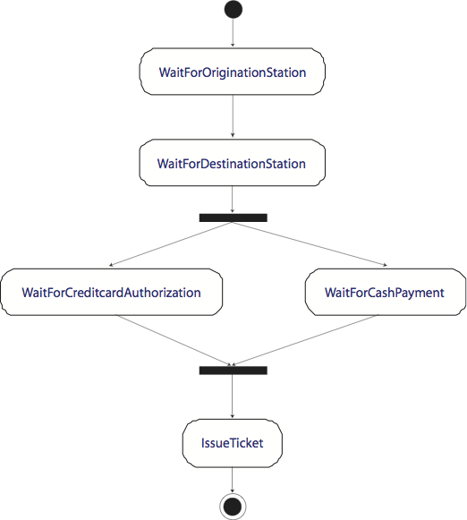

(\#fig:StateChart)Statechart diagram of train ticket vending machine

You are reminded that state machine in Figure \@ref(fig:StateChart)
is a highly simplified one. In reality, it will have several
additional states and transitions. We haven't addressed several
issues including: what happens when you want to change either the
origination or destination station? What if the credit card
authorization fails? What if you insert more cash than than the
ticket price? Does the machine allow you to terminate your session
without buying a ticket?

### Activity Diagrams
Activity diagrams are used to model dynamic aspects of a system,
especially in describing *workflow* and behavior that is
characterized by parallelism. They depict sequencing of activities
with provision for both conditional and parallel behavior. Just as
sequence diagrams model flow of control from one object to
another, activity diagrams model flow of control from one activity
to another.

Figure \@ref(fig:ChapDepend) is an example of an activity diagram.
It describes the sequence in which the chapters in a hypothetical
C\# book should be read. There are three activities: Object
Emphasis, Common, and Optional Topics. The vertical columns
corresponding to these activities are referred to as *swim
lanes*. Just like a state diagram, the activity diagram has states
including a start state and an end state. There are several states
for each activity. In other words, an activity transitions through
several states as an activity is carried out. After you read
Chapter 1, you can move on to either Chapter 2 or return to
Chapter 2 after reading Chapters 17 and 18. Next you read Chapters
3, 4, and 5. Now you have reached a *fork*, which offers
three parallel activities: Object Emphasis (Object-Oriented
Analysis and Design, Classes, Inheritance and Polymorphism, and
Interfaces chapters); Conventional Topics (Arrays, Strings, and
Input and Output chapters); and Optional Topics (Windows
Applications, Algorithmic Problem Solving, Basic Data Structures,
and Advanced C\# Constructs). There are dependencies within a
parallel activity (e.g., you need to study Classes chapter before
you can begin Class Inheritance and Polymorphism chapter).
However, the chapters from different parallel activities can be
sequenced in arbitrary ways. For example, after reading
Object-Oriented Analysis and Design chapter you may read Arrays
chapter and then return to Object Emphasis activity to read
Classes chapter. The three parallel activities are merged using
*join* construct as shown in the figure. The flow
terminates at the end node. You can also include conditional
branching in activity diagrams.

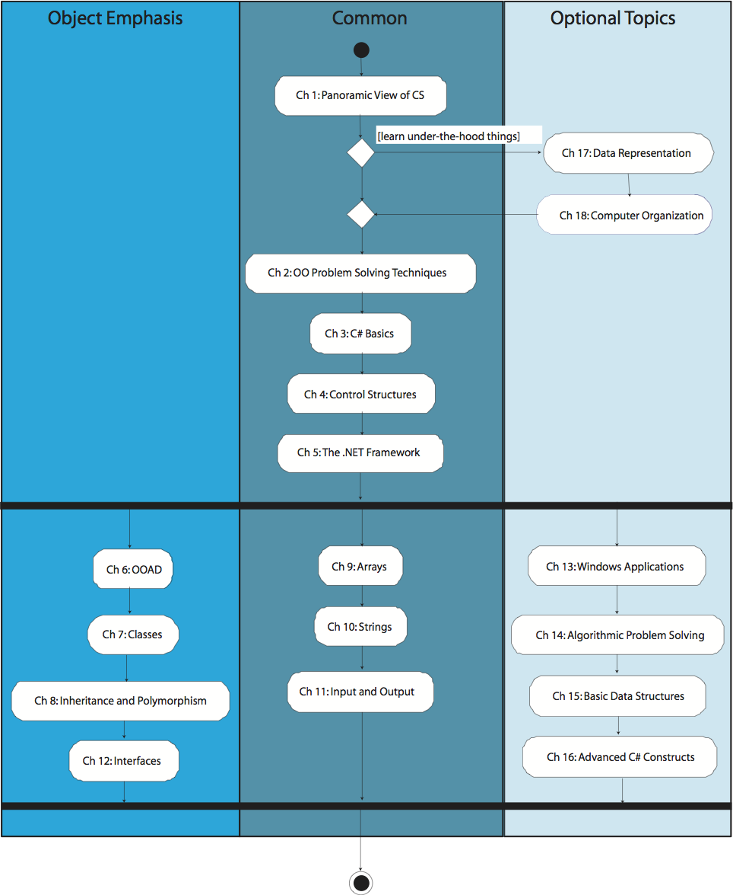

(\#fig:ChapDepend)An activity diagram

### Component Diagrams
*Component diagrams* are one of the two diagrams (other
being deployment diagrams) for modeling physical aspects of OO
systems. They illustrate static implementation view of a system.
Component diagrams show organization and dependencies among a set
of components. Components include executables, libraries,
documents, database tables, initialization and configuration
files. The scope of components is limited to those that exist on a
node (a computer or a set of computers acting as integrated
assembly).

### Deployment Diagrams
A *deployment diagram* complements component diagrams in
modelling physical aspects of OO systems. It depicts static
deployment view of a system architecture --- configuration of
runtime processing nodes and components that reside on them. It
shows the nodes and networks, and dependency and other
associations between the nodes. Deployment diagrams are also used
to model embedded systems and distributed systems.

## Investment Management Application Domain {#ImAppDomain}
We introduce an application domain called Investment Management (IM) which will be used
as a running example to demonstrate various aspects of OO problem solving. IM domain
is chosen since its characteristics provide the necessary depth and breadth. However, the
domain is simplified a great deal without sacrificing the salient characteristics in the interest
of space and classroom time. The exposition of the domain is made easy and effective by
making the reader play an investment manager role.

### Application Domain Structure {#AppDomStruct}
The IM application domain is characterized by: investment managers
and clients, client accounts, account groups, financial
instruments, instrument prices, issuers of financial instruments,
client account transactions, account positions and lots, stocks
and bonds, realized and unrealized gain/loss, acquisition and
disposition schedules. In the following, they are described in
some detail.

#### Investment Managers and Clients
As an investment manager your principal job function is to manage
client investments. Your specialty is in and are licensed to
market two types of investments to clients: *stocks* and
*bonds*. Furthermore, your expertise in bonds is limited to
three kinds: *corporate*, *municipal*, and
*government*. Stocks and bonds are investment vehicles and
are referred to as *financial instruments*. Your license
type determines what type of financial instruments you can include
in your client accounts. You have plans to acquire an additional
license to offer another type of financial instrument called
*derivatives* to clients next year. Licenses are
administered by state government agencies and a license is valid
only in the state which issued it. Licenses have expiration dates.
Since your business has grown tremendously in the last few years,
you have employed several investment managers. You need an
application to effectively manage your business and to provide
on-line access and other services to your clients.

There is a need to keep track of name, address, identifier,
marital status (single or married) of both investment managers and
clients. Identifiers uniquely identify investment mangers and
clients. Identifiers can be of any type, for example,
*taxid*, *social security number*.  However, only
one identifier is recorded for person. Additional information
about clients such as client type (retail or institutional),
annual household income, number of children, date of birth, and
status (active, inactive, or suspended) is also maintained.

#### Accounts
Clients have one or more accounts. Each account is managed by an
investment manger. Account information includes unique identifier,
name, type (401K, cash management, investment, IRA), investment
objective (capital preservation, growth, income, growth and
income), whether or not the account is *margin enabled*
(yes/no), restrictions (e.g., account should not hold investments
related to alcohol and tobacco), lot option indicator (explained
later, assumes yes/no values), lot disposition method (first in
first out (FIFO), last in first out (LIFO), high cost, low cost,
average cost), open date, close date, status (active, inactive,
suspended), and service level (platinum, gold, silver, nominal).
Margin enabled accounts can purchase new financial instruments by
pledging the existing instruments in the account as collateral.

#### Accounts Groups
Accounts are grouped to form account groups. Grouping is based on
various criteria such as investment objective, and account
restrictions. Primary purpose of grouping is to control exposure,
diversification, and other risk management strategies at the group
level instead of at the account level. Information for this
purpose include group unique identifier, name, description,
purpose, start and end dates. Investment managers create and
manage account groups.

#### Financial Instruments
Anything that can be owned by an account as an investment is a
financial instrument. Stocks and bonds are two examples.  Cash is
also treated as one type of instrument. Information about
instruments include name (e.g., Cisco Systems common stock),
identifier type (ticker symbol, CUSIP, ISIN), identifier value,
description, issue date (i.e., when came into market), unit size
(e.g. stocks are sold in units of 1, and bonds in units of 10),
unit of measure (how the instrument is measured, e.g., stocks,
bonds, options, gallons, bushels), denominated currency code (ISO
currency codes for US Dollars, Indian Rupees, etc.), trading
activity status (active, inactive, suspended), rating value
(strong buy, buy, hold, sell), name of the institution which
assigned the rating, date of rating, price quote method
(percentage or yield for bonds, monetary value for stocks), and
price multiplier (e.g., for stocks it is 1, and is 0.01 for
bonds)

#### Prices
In order to value accounts, you need to keep track of current
prices of instruments as well as price history. This allows you to
compute account value for a past date. Information about price
includes unique identifier, unit price, price source (JJ Kenny,
Bloomberg, ILX, Reuters, Telekurs), date and time, price type
(open, close, low, high), price quote method, and price
multiplier.

#### Issuers
Financial instruments are issued by private corporations,
government and its agencies, and municipalities. These are called
issuers of financial instruments. Information about issuers
includes name (e.g., IBM Corporation), description, type
(corporation, government, municipality), state of domicile,
address, and rating value, source, and date. Issuers are rated by
institutions such as S\&P and Moody's. The rating is intended to
reflect the issuer's credit worthiness. The rating is an important
criteria in bond trading.

#### Transactions
An investment manager buys and sells (i.e., trades) financial
instruments for his client accounts. These types of actions
against an account are called *transactions*. Specification
of a transaction encompasses unique trasaction identifier,
transaction date and time, account for which the transaction is
made, transaction type (buy, sell, add cash, withdraw cash),
financial instrument traded (instrument identifier type and
identifier value) and quantity, and which manager initiated the
transaction. We assume that all transactions get executed
correctly and immediately. Buy and sell transactions affect
positions and lots.

#### Positions and Lots
Each instrument owned by an account corresponds to a
*position*. Thus, an account can have multiple positions.
Position is a cumulative quantity, which grows and shrinks as
quantities of an instrument are acquired or disposed. Positions of
an account comprise the account's *portfolio*. Position
information includes unique position identifier, cumulative
quantity, cost basis (how much did the position cost), cost basis
method (what method is used to compute the cost basis of the
position), encumbrance indicator (yes/no), and encumbrance reason.
*Encumbrance* is any type of restriction on the position
which is used to prevent the position from being disposed.

The position doesn't say anything about its acquisition history
--- how much quantity was acquired on what date. The acquisition
history has implications for *capital gains tax* which
comes into play when a position is disposed (partially or in
full). *Lot* is a mechanism for keeping track of position
history. Whether or not to maintain lots for an account is an
account level option. If lot option is chosen, every position
owned by the account has one or more lots. Information about a lot
includes unique lot identifier, lot number (a monotonically
increasing integer number starting at 1), acquisition date,
acquisition code (how a lot was acquired (e.g., purchase, result
of a distribution), and cost basis (how much did the lot cost
including commissions and fees).

#### Stocks
Your universe of instruments is confined to stocks and bonds
(corporate, municipal, and government), which are two different
types of financial instruments. There are two general categories
of stock --- common and preferred. Given the scope of our
application domain, there is no need to delve further into this
aspect. Information about a stock includes denominated currency
code (which is an ISO currency code), stock type
(common/preferred), and dividend indicator (whether or not the
stock pays dividend).

#### BOnds
Information about bonds include maturity date (date on which the
principal will be returned by the issuer to the bond holder),
coupon rate (interest rate the bond pays), coupon type (indicates
whether or not the coupon rate is fixed), zero coupon indicator
(yes/no; if yes, interest is paid in lump sum when the bond
matures), and month and day on which the coupon/interest is paid.
Additional information for corporate bonds includes whether the
issuer of the bond has defaulted on payment, and if so, when.
Additional information about a municipal bond includes purpose for
which the bond was issued, collateral amount set aside by the
issuer of the bond, collateral terms, how frequently collateral
sufficiency is reviewed, when was the last time it was reviewed,
and when is the next collateral review date. Note that collateral
value changes with market conditions and hence it needs to be
assessed periodically to assure liquidity of the bonds. Because of
good faith in the government, government bonds need only one
additional piece of information: bond status (current,
on-the-run).

#### Realized and Unrealized Gain/Loss {#GainLoss}
Before going into the details of application users and their
roles, and functional aspects of the application, the following
terms need explanation: realized gain/loss, unrealized gain/loss,
acquisition schedule, and disposition schedule. *Realized
gain/loss* for a *sell* transaction is the difference
between the net proceeds from the sale of the instrument and its
cost basis. Then realized gain/loss for an account is the sum of
individual realized gain/losses of all the transactions related to
the account during a time period. Time period can be year to date
(YTD), quarter to date (QTD), month to date (MTD), or a specified
date range. For example, in YTD all the sell transactions from the
beginning of the current year through *to date* are
included. Sometimes it is desired to calculate realized gain/loss
only for transactions which involve financial instruments of
certain type (e.g., stocks, municipal bonds), or a specific
financial instrument (e.g., GE Common Stock).

*Unrealized gain/loss* is similar to realized gain/loss
except that we calculate it assuming that an account position in
its enterity is sold at current market price. This is a ``what if scenario.``
Unrealized gain/loss for an account is the summation of
unrealized gain/losses across all positions of an account.
Sometimes it is desired to calculate unrealized gain/loss only for
transactions which involve financial instruments of certain type
(e.g., stocks, municipal bonds), or a specific financial
instrument (e.g., GE Common Stock).

#### Acquisition and Disposition Schedule
*Acquisition schedule* for an account is a listing of all
*buy* transactions of the account over a time period (e.g.,
YTD, QTD, MTD, specified date range) sorted by date (most recent
date first). Details shown include transaction identifier, date
and time, instrument identifier type and value, instrument type,
quantity, cost basis, unrealized gain/loss. Acquisition schedule
can be filtered based on instrument type. *Disposition
schedule* is similar to acquisition schedule except that it deals
with *sell* transactions and excludes unrealized gain/loss
but includes three additional pieces of information: sell date,
net proceeds from the sale, and realized gain/loss. Disposition
schedule can be filtered based on instrument type.

### Application Users and Functionality {#AppUsersAndFunctionality}
Investment Managers (IMs) and clients are the users of the system.
Investment managers create and maintain clients, accounts, and
account groups. They also execute transactions for their client
accounts. IMs with special privileges can create IM users,
issuers, financial instruments and their prices. We enumerate IM
functions with prefix IM and client functions with CL for cross
referencing and requirements traceability purpose.

#### Investment Management Functions
IM 1 Create an investment manager. Only
     IMs with appropriate privileges can execute this function.

IM 2 Terminate an investment manager,
change address and marital status.

IM 3 Retrieve information about all
IMs.

IM 4 Create a client.

IM 5 Change status, address, and marital
status of a client.

IM 6 Create an account,  associate the
account with a client and an investment manager.

IM 7 Change account status and
restrictions, investment manager, lot disposition method if
applicable; enable and disable an account for margin.

IM 8 Close an account.

IM 9 List account summary for each of the
accounts administered by an investment manager.

IM 10 Create an account group.

IM 11 Update account group information.

IM 12 Associate and disassociate accounts
with account groups.

IM 13 Generate account group summary.

IM 14 List all account groups administered
by an investment manager.

IM 15 Create a financial instrument.

IM 16 Change an instrument's activity
status and rating.

IM 17 Create a price for a financial instrument.

IM 18 Update a price of a financial
instrument.

IM 19 Create an issuer.

IM 20 Change an issuer's rating.

IM 21 Investment managers create and execute
transactions for their client accounts. If it is a buy
transaction, it should be possible for them to place an
encumbrance. If the account maintains lots, encumbrance is placed
on just the lot resulting from this transaction. If the account is
not lotted and the account already has a position in the
instrument that is being acquired, encumbrance is placed on the
entire position. Otherwise, a new position is created and
encumbrance is placed on the position. Investment managers need
access to information related to financial instruments, their
issuers and prices in creating and executing a transaction.

IM 22 Retrieve portfolio for a
specific account.

IM 23 Retrieve portfolio for all
accounts managed by an investment manager.

IM 24 Retrieve portfolio of all
accounts belonging to a specified account group of an investment
manager.

IM 25 Retrieve transactions for a
specific account managed by an investment manager. It should be
possible to make the retrieval more constrained by specifying
transactions involving only certain instrument type (e.g.,
corporate bonds), a specific instrument (e.g., GE Common Stock), a
date range (e.g., March 10, 2003 through April 10, 2004). Specific
cases of data range include YTD, QTD, and MTD.

IM 26 Retrieve transactions for
all accounts managed by an investment manager. It should be
possible to make the retrieval more constrained as in item
IM 25

IM 27 Retrieve transactions for
all accounts under a specified account group for an investment
manager. It should be possible to make the retrieval more
constrained as in item IM 25

IM 28 Compute realized gain/loss
for a specific account managed by an investment manager. It should
be possible to make realized gain/loss computation constrained to
sell transactions involving only certain instrument type, a
specific instrument, over a date range, YTD, QTD, and MTD.

IM 29 Compute realized gain/loss
for all accounts managed by an investment manager. It should be
possible to make the computation of realized gain/loss more
constrained as in item IM 28

IM 30 Compute realized
gain/loss for all accounts under a specified account group for an
investment manager. It should be possible to make the computation
of realized gain/loss more constrained as in item
IM 28.

IM 31 Compute unrealized
gain/loss for a specific account managed by an investment manager.
It should be possible to make the computation of unrealized
gain/loss more constrained by specifying buy transactions
involving only certain instrument type, a specific instrument,
over a date range, YTD, QTD, and MTD.

IM 32 Compute unrealized
gain/loss for all accounts managed by an investment manager. It
should be possible to make the computation of unrealized gain/loss
more constrained as in item IM 31.

IM 33 Compute unrealized
gain/loss for all accounts under a specified account group for an
investment manager. It should be possible to make the computation
of unrealized gain/loss more constrained as in item
IM 31.

IM 34 Produce month-end account
statement for a specific account managed by an investment manager.
The statement includes account information, details about the
client who owns the account, investment manager information,
account portfolio (including realized and unrealized gain/loss),
and account transactions (buy, sell, add cash, withdraw cash).

#### Client User Function
CL 1 View and change personal
information: address, marital status, annual household income,
number of children.

CL 2 List account summary for all
accounts of a client.

CL 3 View portfolio.

CL 4 View account transactions
corresponding to one or more of client's accounts. For additional
details, see IM 25  and
IM 26 above.

CL 5 Compute realized gain/loss
for transactions of a client account. It should be possible to
make realized gain/loss computation constrained to sell
transactions involving only certain instrument type (e.g.,
corporate bonds), a specific instrument (e.g., GE Common Stock),
over a date range, YTD, QTD, and MTD. For additional details, see
IM 28  and
IM 29 above.

CL 6 Compute unrealized
gain/loss for a client account. It should be possible to make
unrealized gain/loss computation constrained positions
corresponding to certain instrument type (e.g., corporate bonds),
and a specific instrument (e.g., GE Common Stock). For additional
details, see IM 31 and
IM 32 above.

CL 7 Generate month-end account
statement. Same as IM 34 above.

## Investment Management Application {#ObjAppInvMgmt}

In this section we explore and examine the completed investment
management (IM) application. We have two objectives for this
activity. The first one is to obtain a deeper understanding of the
IM domain by interacting with the application in three different
roles: administrator, investment manager, and client. The second
goal (left to the reader) is to make an assessment of to what
extent the requirements of the application informally described in
Section \@ref(IMAppDomain) have been actually implemented.

The IM application comes with three built-in login ids/passwords:
admin/admin, jmaxwell/jmaxwell, and jhamilton/jhamilton. The admin
login is a *privileged* one. This login id allows creating
and viewing financial instruments and their prices, investment
managers, and issuers of financial instruments. It also allows
changing the password for the admin login id. The last two are
login ids for investment managers John Maxwell and Janet Hamilton.
Built into the application are 6 clients for John Maxwell and 4
clients for Janet Hamilton.

Start the IM application by double-clicking on the corresponding
executable file. The startup window of the application shown in
Figure \@ref(fig:StartupWindow) appears. Only two items are active
on the menu bar (*Login* and *Exit*) and others are
disabled or grayed. Clicking on the *login* menu item pops
up a login dialog box. Type in *admin* for both the
username and the password. Successful login results in a window as
shown in Figure \@ref(fig:LoginWindow). Notice that only
*Admin*, *Logout*, and *Exit* are enabled on
the menu bar.

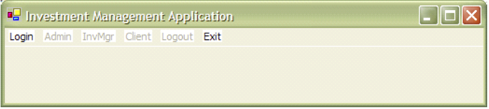

(\#fig:StartupWindow)Startup window of IM application

(\#fig:LoginWindow)Login window of IM application

Selecting the *FinInstrument* menu item from the
*Admin* displays another dropdown menu with two items:
*Create* and *View*. Selecting *Create*
entails another dropdown menu with four menu items
(*Stock*, *Corp Bond*, *Govt Bond*, and
*Muni Bond*) as shown in
Figure \@ref(fig:AdminFunctionsMenu). Such menus are called
*cascading menus*. If you select *Stock*, the window
shown in Figure \@ref(fig:InstrumentCreation) is displayed for
creating a financial instrument of type stock. Notice the various
fields ^[In the context of forms, the term *field*
is widely used for an attribute.], of which some require typing a
value in a *textbox* (e.g., Name and InstrumentID fields),
whereas others require selecting a pre-defined value from a
*dropdown listbox* (e.g., ID Type, Denominated Currency).
The latter is a standard practice for those fields that can only
admit values from a pre-determined set --- an enumeration. The
notation **Admin** $\vert$ **FinInstrument** $\vert$
**Create** $\vert$ **Stock** is used to refer to the
sequence of menu selections: Admin followed by FinInstrument,
Create, and Stock. For all the fields, specify values by typing in
the textboxes or by selecting values for dropdown listboxes and
click OK button to create a financial instrument. Verify that the
instrument has been created by selecting the menu sequence:
**Admin** $\vert$ **FinInstrument** $\vert$
**View** $\vert$ **Stock**.

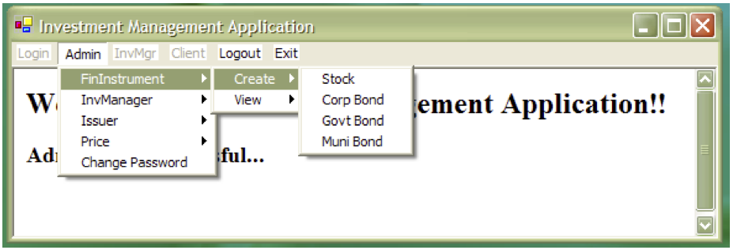

(\#fig:AdminFunctionsMenu)Admin functions menu

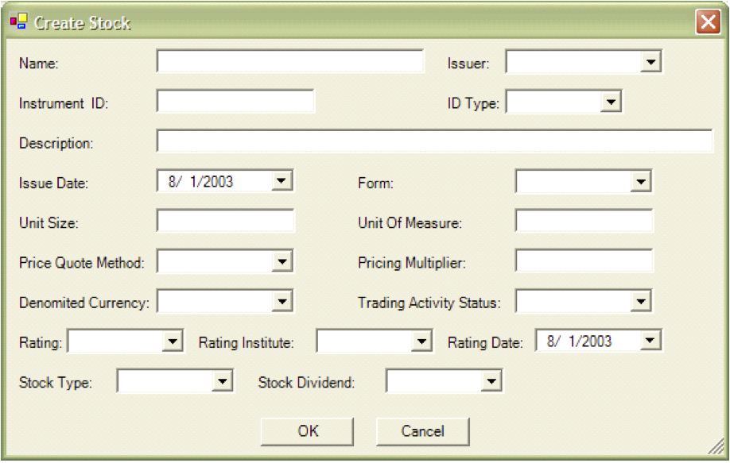

(\#fig:InstrumentCreation)Creating a financial instrument

In practice, not all field values are required for creating an
instrument. A distinction is made between *required* and
*optional* fields. Required fields are indicated by color
coding or by placing a special icon adjacent to the field's
textbox under the field name. You should now create and view
investment managers, issuers, and prices of financial instruments.
Verify their creation by choosing an appropriate menu sequence
(e.g., **Admin** $\vert$ **Issuer** $\vert$
**View** for viewing issuers). Figure \@ref(fig:IMCreation)
shows the window for creating an investment manager.

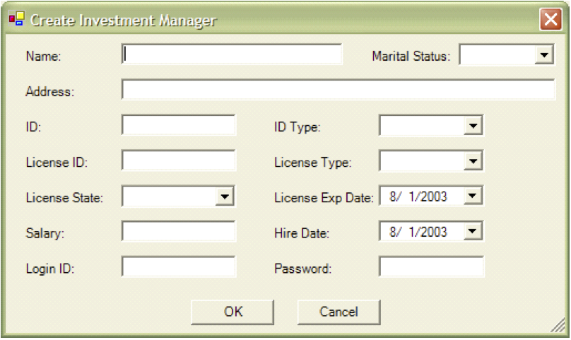

(\#fig:IMCreation)Creating an investment manager

Exit from the application by clicking on *Logout* on the
menu bar. Login again as an investment manager by using jmaxwell
for username and password. IM functions are shown in
Figure \@ref(fig:AccountCreationMenu). They include creating,
viewing, and updating clients (Figure \@ref(fig:ViewingClients)),
accounts, account groups; executing and viewing account
transactions (Figure \@ref(fig:ViewingTransactions)); computing
realized and un-realized gain/loss (Figure \@ref(fig:ViewingUGL);
viewing client account summary, portfolio, and statements; and
updating IM's personal information.

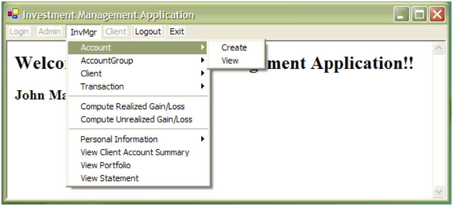

(\#fig:AccountCreationMenu)Investment manager functions

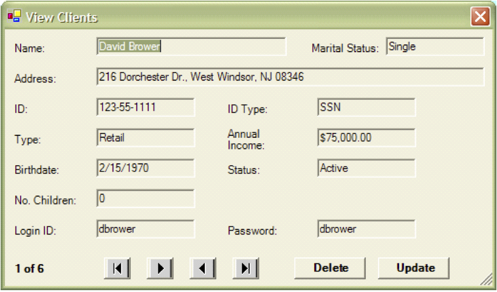

(\#fig:ViewingClients)Viewing and updating clients

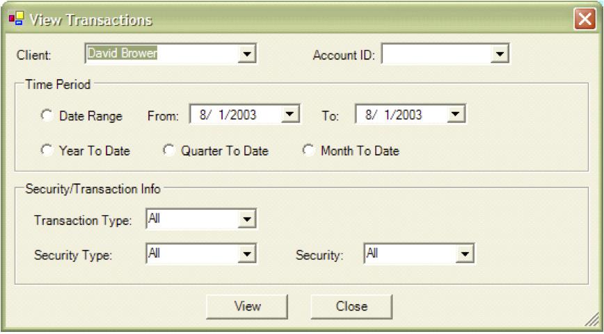

(\#fig:ViewingTransactions)Viewing account transactions

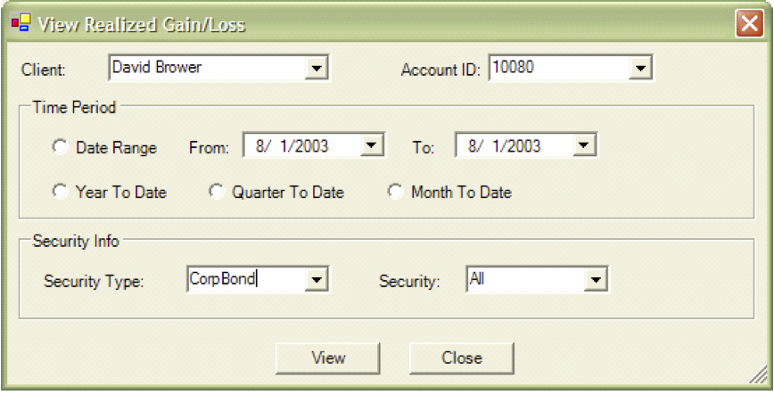

(\#fig:ViewingUGL)Viewing unrealized gain/loss

We urge you to take time to familiarize with the IM application
domain by deeply exploring the program. In
Chapter [AdvObjProbSolv](AdvObjProbSolv) we discuss OO analysis and design
techniques. We then revisit the IM application domain and come up
with a class diagram, and various relationships between the
classes (generalization/specialization, dependency, associations,
aggregation). We document our design artifacts using the relevant
UML diagrams. We incrementally learn how the application has been
implemented as we progress learning features of the C\#
programming language in the chapters ahead.

## Chapter Summary
Object-Oriented (OO) techniques offer means to analyzing,
designing, and constructing software-intensive systems.
*Abstraction*, *information hiding*,
*encapsulation*, and *polymorphism* are the
cornerstones of the OO approach. The first three are realized by
the notions of interface, objects, and classes. Class hierarchy
and inheritance features help realize the polymorphism feature.

A class represents a collection of objects that have identical
structural and behavioral characteristics. An object is created by
instantiating the class. In other words, objects are class
instances created by assigning values to the class fields. Objects
and classes model the structure and behavior of entities of
interest in the application domain naturally and effectively.
Association and class hierarchy capture various types of semantic
relationships between the classes. Method signatures (or message
interface) of an object are essentially its interface to the
outside world. Objects communicate with each other using messages.
An abstract class is one which cannot be instantiated. They are
created solely for organizational purposes --- to specify common
structure and behavior, which other classes can inherit from.
Interface is another way to specify a collection of methods. Under
this scenario, a class can implement one or more interfaces.
Polymorphism feature enables subclasses (direct and indirect
descendants) of a parent class be processed uniformly, yet
allowing subclasses to exhibit their specialized behavior to suit
the local context. Any of the subclass instances can be
substituted for the parent class instance.

Unified Modelling Language (UML) is an industry standard graphical
language for visualizing, specifying, constructing, and deploying
software-intensive systems. It has nine types of diagrams. They
include use case diagrams, class diagrams, object diagrams,
sequence diagrams, collaboration diagrams, statechart diagrams,
activity diagrams, component diagrams, and deployment diagrams.
Some of these diagrams depict the static aspects of a system,
whereas the others model the dynamic aspects.

*Use case diagrams* specify the system functionality in
terms of how users interact with the system. *Class
diagrams* reveal key abstractions present in the system. An
*object diagram* indicates a snapshot of a complex
interaction among a set of objects without any reference to the
messages. A *sequence diagram* indicates time-ordered flow
of messages between classes in solving a domain task. How various
classes collaborate in solving a domain task is depicted by a
*collaboration diagram*.

Both sequence and collaboration diagrams reveal key behavioral
abstractions of the system. They render message structures
explicit and can reveal *over centralized designs* ---
designs in which all the application domain responsibilities are
assigned to a few classes. A *component diagram* shows how
various physical elements --- executables, libraries, database
tables, configuration and initialization files --- relate to each
other and exist on a computer. Finally, the *deployment
diagram* shows the roadmap of a large system by depicting
computers, networks, and their interdependencies.

We introduced an application domain called Investment Management.
This domain is used as a running example to illustrate the OO
techniques and the C\# language features. The reader is also
introduced to a completed investment management application.

## Exercises
1.  OO Terminology -- Determine if each of the following
    statements is true or false:

    1. A class is a template for a group of objects with identical
       structure and behavior.
    1. A class encapsulates attributes and operations.
    1. A class is a runtime instance of an object.
    1. Objects have state, behavior, and identity.
    1. Objects communicate with each other via messages.
    1. A message is transmitted from attribute to attribute.
    1. Preconditions, post conditions, and invariants are
       assertions.
    1. Static methods can only access static fields.
    1. Instance methods can be invoked on a class.
    1. A derived class is a generalization of a base class.
    1. A static method is also called a class method.
    1. An abstract class can be instantiated.	

1.  O Terminology -- In Table \@ref(tab:IOOMatch), match each
    item on the left with an item on the right.

  
<?xml version="1.0" encoding="UTF-8"?>
<table class="table table-striped" style="margin-left: auto; margin-right: auto;">
<caption>(\#tab:IOOMatch)Exercise to test OO terminology</caption>
 <thead>
  <tr>
   <th style="text-align:left;"> Terminology </th>
   <th style="text-align:left;"> Explanations </th>
  </tr>
 </thead>
<tbody>
  <tr>
   <td style="text-align:left;"> Class </td>
   <td style="text-align:left;"> Also Known as set method. </td>
  </tr>
  <tr>
   <td style="text-align:left;"> Object </td>
   <td style="text-align:left;"> Helps implement get and set methods. </td>
  </tr>
  <tr>
   <td style="text-align:left;"> Modifier method </td>
   <td style="text-align:left;"> Runtime instance of a class. </td>
  </tr>
  <tr>
   <td style="text-align:left;"> Query Method </td>
   <td style="text-align:left;"> Class-level field. </td>
  </tr>
  <tr>
   <td style="text-align:left;"> Instance field </td>
   <td style="text-align:left;"> Objects of the same kind.Objects of the same kind. </td>
  </tr>
  <tr>
   <td style="text-align:left;"> Utility method </td>
   <td style="text-align:left;"> Also known as a get method. </td>
  </tr>
  <tr>
   <td style="text-align:left;"> Static field </td>
   <td style="text-align:left;"> Field contained in each object instance. </td>
  </tr>
  <tr>
   <td style="text-align:left;"> Instance method </td>
   <td style="text-align:left;"> Bundling of related data and code. </td>
  </tr>
  <tr>
   <td style="text-align:left;"> Superclass </td>
   <td style="text-align:left;"> Derived class. </td>
  </tr>
  <tr>
   <td style="text-align:left;"> Static method </td>
   <td style="text-align:left;"> Method invocation requires an object instance. </td>
  </tr>
  <tr>
   <td style="text-align:left;"> Subclass </td>
   <td style="text-align:left;"> Showing relevant details while hiding irrelevant details. </td>
  </tr>
  <tr>
   <td style="text-align:left;"> Encapsulation </td>
   <td style="text-align:left;"> Ability of a single variable to reference a variety of different
objects. </td>
  </tr>
  <tr>
   <td style="text-align:left;"> Abstraction </td>
   <td style="text-align:left;"> Method invoked on class itself. </td>
  </tr>
  <tr>
   <td style="text-align:left;"> Polymorphism </td>
   <td style="text-align:left;"> Parent class. </td>
  </tr>
</tbody>
</table>

\caption{Table \@ref(tab:IOOMatch): Excercise to test OO terminology}

  
1. Class Relationships -- In Table \@ref(tab:ClassRelMatch),
   match each item on the left with an item on the right.
   
<?xml version="1.0" encoding="UTF-8"?>
<table class="table table-striped" style="margin-left: auto; margin-right: auto;">
<caption>(\#tab:ClassRelMatch)Exercise to test class relationship terminology</caption>
 <thead>
  <tr>
   <th style="text-align:left;"> Terminology </th>
   <th style="text-align:left;"> Explanations </th>
  </tr>
 </thead>
<tbody>
  <tr>
   <td style="text-align:left;"> Specialization </td>
   <td style="text-align:left;"> An association between two classes. </td>
  </tr>
  <tr>
   <td style="text-align:left;"> Aggregation </td>
   <td style="text-align:left;"> A superclass is less specific than a sub class. </td>
  </tr>
  <tr>
   <td style="text-align:left;"> Binary Association </td>
   <td style="text-align:left;"> A class can have only one immediate superclass. </td>
  </tr>
  <tr>
   <td style="text-align:left;"> Composition </td>
   <td style="text-align:left;"> Inverse of Has-A relationship. </td>
  </tr>
  <tr>
   <td style="text-align:left;"> Recursive association </td>
   <td style="text-align:left;"> A class can inherit from multiple immediate classes. </td>
  </tr>
  <tr>
   <td style="text-align:left;"> Generalization </td>
   <td style="text-align:left;"> The contained class has no independence existence. </td>
  </tr>
  <tr>
   <td style="text-align:left;"> Single Inheritance </td>
   <td style="text-align:left;"> An association between instances of the same class. </td>
  </tr>
  <tr>
   <td style="text-align:left;"> Multiple Inheritance </td>
   <td style="text-align:left;"> A sub class is derived through this process. </td>
  </tr>
  <tr>
   <td style="text-align:left;"> Part-of-relationship </td>
   <td style="text-align:left;"> The contained class has independent existence. </td>
  </tr>
</tbody>
</table>
   

1. Unified Modeling Language  -- In Table \@ref(tab:UMLMatch),
   match each item on the left with an item on the right. 
   
<?xml version="1.0" encoding="UTF-8"?>
<table class="table table-striped" style="margin-left: auto; margin-right: auto;">
<caption>(\#tab:UMLMatch)Exercise to UML terminology</caption>
 <thead>
  <tr>
   <th style="text-align:left;"> Terminology </th>
   <th style="text-align:left;"> Explanations </th>
  </tr>
 </thead>
<tbody>
  <tr>
   <td style="text-align:left;"> UML </td>
   <td style="text-align:left;"> Represents a thing (living or otherwise) that interacts
with a system in a specific way. </td>
  </tr>
  <tr>
   <td style="text-align:left;"> Use Case </td>
   <td style="text-align:left;"> An iterative software development process </td>
  </tr>
  <tr>
   <td style="text-align:left;"> Actor </td>
   <td style="text-align:left;"> A process independent language for visualizing;
specifying; constructing and documenting the artifacts
of a software-intensive system. </td>
  </tr>
  <tr>
   <td style="text-align:left;"> Class Diagram </td>
   <td style="text-align:left;"> Shows a set of objects and their relationships at a
point in time. Also called instance diagrams. </td>
  </tr>
  <tr>
   <td style="text-align:left;"> Sequence diagram </td>
   <td style="text-align:left;"> State machine modeling the dynamic aspects of a
system. </td>
  </tr>
  <tr>
   <td style="text-align:left;"> Rational Unified Process </td>
   <td style="text-align:left;"> Specifies what a system does without specifying
implementation details. </td>
  </tr>
  <tr>
   <td style="text-align:left;"> Collabration diagram </td>
   <td style="text-align:left;"> Used to model the static design view of a system. </td>
  </tr>
  <tr>
   <td style="text-align:left;"> Object diagram </td>
   <td style="text-align:left;"> Emphasizes the time-ordering of messages. </td>
  </tr>
  <tr>
   <td style="text-align:left;"> State diagram </td>
   <td style="text-align:left;"> Illustrates the static implementation view of a system. </td>
  </tr>
  <tr>
   <td style="text-align:left;"> Component diagram </td>
   <td style="text-align:left;"> An interaction diagram that emphasizes the structural
organization of objects communicating via
messages. </td>
  </tr>
</tbody>
</table>

1. A class may represent software things, hardware things, and conceptual things. List some classes
   (things) that are part of your day-to-day world.     
   
1. List the various parts of a message.

1. What is the difference between a synchronous and an asynchronous message?

1. From a conceptual perspective, list some attributes and services of a class named BankAccount.

1. From a specification perspective, list some attributes and operations of a class named BankAccount.

1. From a conceptual perspective, list some attributes and services of a class named Rectangle.

1. From a specification perspective, list some attributes and operations of a class named Rectangle.

1. From a conceptual perspective, list some attributes and services of a class named Employee.

1. From a specification perspective, list some attributes and operations of a class named Employee.

1. List some modifier and query methods for a class named Automobile.

1. Specify a pre-condition and a post-condition for an
   operation called $\mbox{Factorial}(n)$. Mathematical definition of
   $\mbox{Factorial}$ function is given by: 
   \begin{equation*}
   \mbox{ factorial}(n) = \left \{ \begin{array}{ll}
        1 & \mbox{ if } n =0 \\
        1 \times 2 \times 3 \times \cdots (n-2) \times (n-1) \times n & \mbox{ if }  n \geq 1
        \end{array}
   \right.
   \end{equation*}
   
1. Arrange the following objects into an inheritance hierarchy:
   *Shape*, *Polygon*, *Oval*,
   *Triangle*, *Rectangle*, *Square*, and
   *Circle*. Make necessary assumptions.
   
1. Arrange the following objects into an inheritance hierarchy:
   *BankAccount*, *SavingsAccount*,
   *CheckingAccount*, *MoneyMarketAccount*,
   *InterestCheckingAccount*, *StudentCheckingAccount*,
   and *SeniorCheckingAccount*. Make necessary assumptions.
   
1. Arrange the following objects into an inheritance hierarchy:
   *Person*, *Student*, *Employee*,
   *Faculty*, *TenuredFaculty*,
   *NonTenuredFaculty*, *VisitingFaculty*,
   *Staff*, *SalariedStaff*, *HourlyStaff*,
   *UndergraduateStudent*, *GraduateStudent*,
   *PhDStudent*, *MSStudent*, and
   *NonDegreeSeekingStudent*. Make necessary assumptions.

1. Arrange the following objects into an inheritance hierarchy:
   *LivingBeing*, *Animal*, *Plant*, 
   *VascularPlant*, *NonvascularPlant*,
   *Vertebrate*, *Invertebrate*, *Mammal*,
   *Bird*, *Human*, *Reptile*,
   *JellyFish*, *Octopus*, and *Snail*. Make
   necessary assumptions. 
   
1. Arrange the following objects into an inheritance hierarchy:
   *Vehicle*, *Automobile*, *Bus*,
   *SchoolBus*, *CityBus*, *Motorcycle*,
   *Sedan*, *SportsCar*, *MiniVan*,
   *StationWagon*, *StreetMotorCycle*,
   *OffRoadMotorCycle*, *DualPurposeMotorCycle*, and
   *HarleyDavidson*. Make necessary assumptions.    
   
1. List some problems associated with multiple inheritance.

1. Define *interface inheritance* and
   *implementation inheritance*?
   
1. What is *delegation*?  

1. Suggest one or more polymorphic methods which might be
   included in the design of these classes --- *Shape*,
   *Rectangle*, *Triangle*, and *Circle*.
   
1. Suggest one or more polymorphic methods which might be
   included in the design of these classes --- *Employee*,
   *SalariedEmployee*, and *HourlyEmployee*.   
   
1. Suggest one or more polymorphic methods which might be
   included in the design of these classes --- *Automobile*,
   *Sedan*, *SportsCar*, *MiniVan*, and
   *StationWagon*.
   
1. What are the building blocks of UML?

The following four exercises require the execution of Investment
Management Application (IMApp) discussed in
Section \@ref(ObjAppInvMgmt).

1. Start the IMApp and login as Admin user
   (use admin/admin for username/password) and perform the following
   tasks in the sequence specified below:

    - Create an issuer for a corporation named Hewlett-Packard.

    - Create a common stock for Hewlett-Packard with ticker symbol
      HPC.

    - Create a open price for stock HPC with the value \$20.75.

    - Create an investment manager named Roger Presscott with
      license to market equities in the State of Ohio.

    - Make sure that the tasks in this exercise have been
      accomplished correctly by using the appropriate *View* menu
      item.

    - Logout and exit the application.

1. Start the IMApp and login as the
   investment manager Roger Presscott. If you don't remember Mr.
   Presscott's username and password, login as admin to view his
   details. Now perform the following tasks in the sequence specified
   below:

    - Create a client named Chris Williams.

    - Create an account for Chris Williams with an account balance
      of \$6500.00.

    - Execute a buy transaction for the above account to buy 100
      shares of DELL common stock.

    - Create a client named Alex Cross.

    - Create an account for Alex Cross with an account balance of
      \$5000.00. 

    - Execute a buy transaction for the above account to buy 200
      shares of GE common stock.

    - View client account summary.

    - View portfolio for client Chris Williams.

    - View portfolio for client Alex Cross.

    - View monthly account statement for client Chris Williams.

    - View monthly account statement for client Alex Cross.

    - Change the password for investment manager Roger Presscott.

    - Logout and exit the application.

1. Start the IMApp and login as Admin user (use admin/admin for
   username/password) and auto update the prices for financial
   instruments.
   
1. Start the IMApp and login as the client Alex Cross.If you don't
   remember Mr.Cross's username and password, login as his investment manager
   (Mr. Presscott) to view his details. Now perform the following
   tasks in the sequence specified below:

    - View account summary.

    - View account portfolio.

    - View monthly statement.

    - View account transactions.

    - Compute unrealized gain/loss.

    - Change the password for the client Alex Cross.

    - View client’s personal information to observe the change in
      password.

    - Logout and exit the application.
    
1. Section \@ref(IMAppDomain) enumerated the functional
   requirements for the Investment Management Application. Perform
   requirements traceability assessment of the supplied IMApp system.
   Test drive the system and assess to what degree the IMApp
   implemented the listed requirements (IM and CL functions) by
   providing the following information:
     
  
     - List the requirements that have been fully implemented.

     - List the requirements that were partially implemented.

     - List the requirements that were not implemented at all.

     - List the features, if any, provided by IMApp that were not
       part of the requirements.

     - Comment on usability of the application and suggest any
       recommendations for improvement.

1.  Assume that you want to operate an Internet based on-line
    store for selling flowers. Customers browse your store for the
    types of flower bouquets available and order them on-line. Because
    freshness is everything in flowers business, your business model
    is based on working with local flower vendors in the region of
    customers to fulfill orders. You are simply acting as an
    intermediary by fetching orders to the local flower shops. Your
    store showcases an integrated catalog of flower bouquets from
    various vendors across the regions you serve. Write an informal
    statement of the application domain requirements.

1.  You are the president of a temporary employment agency. Your
    business model is supplying workers on a temporary basis to
    various clients. You maintain information about employees, their
    skill sets, and experience. You also maintain information about
    clients (who are employers) and their need for temporary
    employees. Write an informal statement of the application domain
    requirements.
    
1. Your professor has asked you to develop a system to help her
   with academic advising activities. Typically students go to an
   academic advisor to plan their course of study with the ultimate
   goal of earning a degree. What courses to take, when to take,
   prerequisite courses, required courses, elective courses, number
   of credit hours completed, number of credit hours required for the
   degree are some of the issues that are of interest to an academic
   advisor and advisee. Required and elective course requirements are
   further categorized into courses in the major, biological
   sciences, physical sciences, mathematics, language arts, music,
   and sports. Your academic advisor narrated the requirements of the
   system to you. You also had a couple of follow up and
   clarification discussions with the advisor. Write a summary of the
   application requirements for the academic advisor system.
